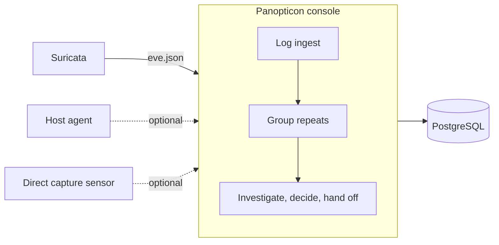

<p align="center"></p>

# Panopticon

Panopticon is a security console for investigating Suricata alerts and recording decisions. It targets small offices, labs, and development networks.

It reads the EVE log that Suricata writes, groups repeated alerts, and puts device roles, work schedules, and traffic evidence side by side. An analyst decides whether a transfer is a known backup or contact with an unfamiliar peer, then records the evidence, owner, and expiry. Records stay in PostgreSQL on your own server.

## Architecture



The default installation is the solid path only. The console reads a log file and needs no capture privileges. Dotted paths are optional deployments.

| Deployment | Input | Privileges |
| --- | --- | --- |
| EVE (default) | Suricata `eve.json` | Read access to the log |
| native | Packets captured directly | `CAP_NET_RAW` for the sensor only; console runs unprivileged |
| Host agent | Linux TCP sockets and load | root on the target host (install only) |

## Quick start

See the console with a bundled sample log, no Suricata required:

```bash
./install.sh demo
```

Connect a real Suricata log:

```bash
PANOPTICON_EVE_FILE=/var/log/suricata/eve.json ./install.sh eve
```

The console opens at `http://127.0.0.1:38585`. The [installation guide](docs/INSTALL.md) covers every path. Detailed guides are in Korean.

## Features

| Feature | What it does |
| --- | --- |
| Grouped repeats | Groups alerts sharing sensor, rule, source, destination, and service per hour. Originals are kept |
| Business context | Registers device roles, owners, expected traffic, and work schedules for comparison with alerts |
| Decisions and handoff | Tracks owner, case status, handoff notes, and decision history. Admin, analyst, and viewer roles |
| Priorities | Lists unclosed, unassigned, undecided, and expired-decision cases separately |
| Evidence | Traces the original EVE record. Direct capture deployments offer PCAP download |
| Tuning review | Compares a proposed change against normal and attack samples before administrator approval |
| Host agent | Rust executable (about 1.6 MiB) sends TCP connections, load, and memory with HMAC signatures |
| Audit trail | Stores administrative changes in a SHA-256 hash chain |
| Visualization | Topology, NIST CSF and PCI DSS coverage, MITRE ATT&CK heatmap with Navigator export |

The console supports Korean and English. Press `Ctrl+K` (`Cmd+K` on macOS) to search screens.

## What it does not do

- A decision never creates detection exceptions or firewall rules.
- AI explains and proposes. Administrators approve configuration changes.
- It does not decrypt HTTPS payloads or judge traffic the sensor cannot see.
- Supported scope is one sensor and one worker. Multi-worker and high availability are not supported.

## Requirements

- Linux
- Docker Compose, or Python 3.12+
- PostgreSQL (bundled with the Docker Compose installation)
- Disk space sized for retention and traffic volume

## Documentation

- [Installation and upgrades](docs/INSTALL.md)
- [Suricata EVE connection](docs/EVE.md)
- [Console and investigations](docs/USER-GUIDE.md)
- [Configuration](docs/CONFIGURATION.md)
- [Operations and recovery](docs/OPERATIONS-GUIDE.md)
- [API integration](docs/API.md)
- [Release verification](docs/RELEASE-VERIFICATION.md)
- [Development](docs/DEVELOPMENT.md)
- [Release notes](CHANGELOG.md)
- [Security policy](SECURITY.md)

[한국어](README.md) · [MIT License](LICENSE)

---

<p align="center">
  Made by <a href="mailto:jinho.von.choi@nerdvana.kr">Jinho Choi</a> &nbsp;|&nbsp;
  <a href="https://buymeacoffee.com/jinho.von.choi">Buy me a coffee</a>
</p>
