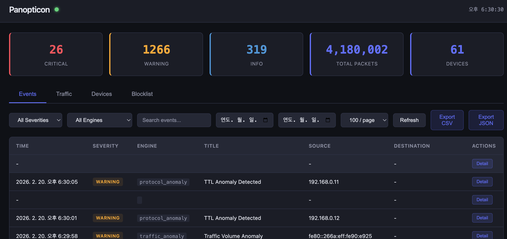
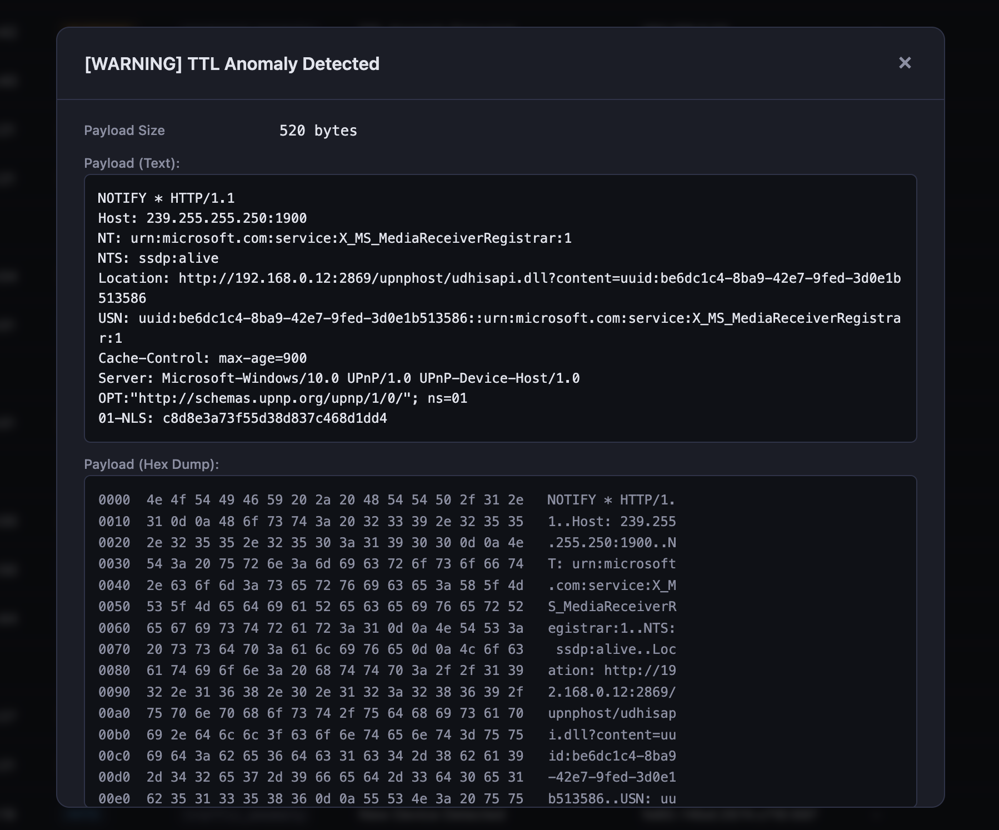
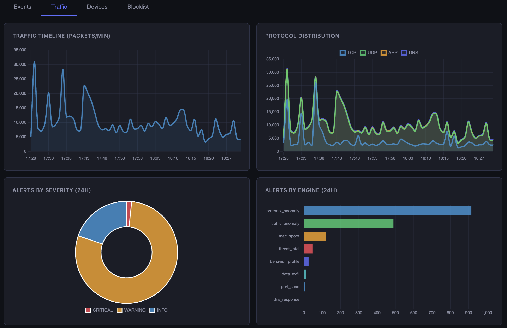
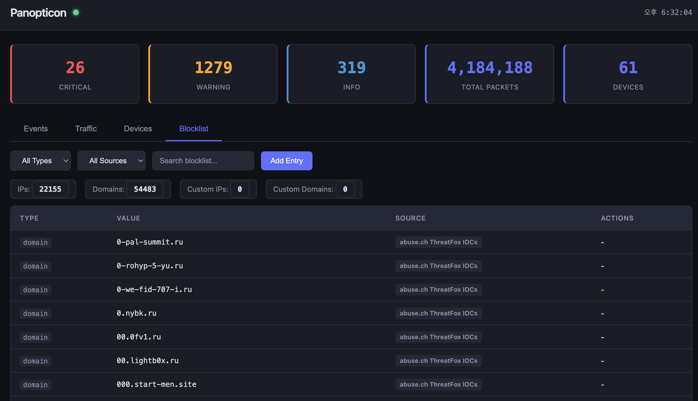
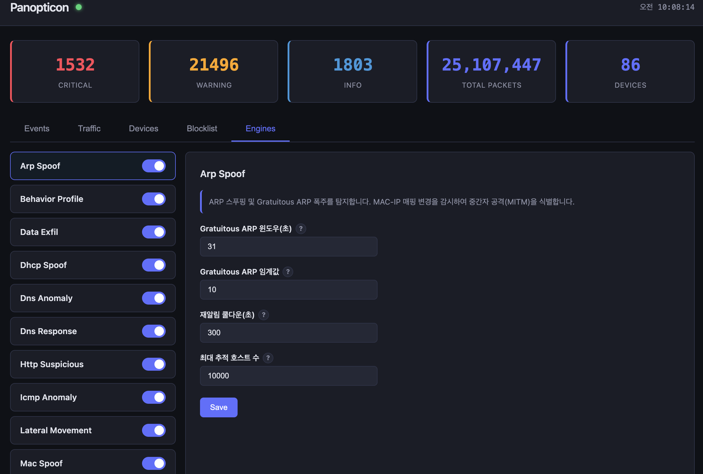

<p align="center">
  
</p>

<p align="center">
  <strong>로컬 네트워크 패킷 모니터링 및 실시간 위협 탐지 시스템</strong>
</p>

<p align="center">
  
  
  
  
  
  
  
</p>

---

## 목차

- [개요](#개요)
- [주요 기능](#주요-기능)
- [시스템 아키텍처](#시스템-아키텍처)
- [탐지 엔진 상세](#탐지-엔진-상세)
- [웹 대시보드](#웹-대시보드)
- [스크린샷](#스크린샷)
- [빠른 시작](#빠른-시작)
- [설정 가이드](#설정-가이드)
- [Docker 배포](#docker-배포)
- [운용 고려사항](#운용-고려사항)
- [외부 데이터 의존성](#외부-데이터-의존성)
- [API 레퍼런스](#api-레퍼런스)
- [확장 가이드](#확장-가이드)
- [기술 스택 및 코드 품질](#기술-스택-및-코드-품질)

---

## 개요

**Panopticon**은 소규모~중규모 네트워크 환경을 위한 올인원 네트워크 보안 모니터링 시스템이다. Scapy 기반의 실시간 패킷 캡처부터 18개의 독립적인 탐지 엔진, 킬체인 기반 인시던트 상관분석, 자동 IP 차단(IRS), 위협 인텔리전스 피드 통합, 그리고 실시간 웹 대시보드까지 — 네트워크 보안 모니터링에 필요한 모든 것을 단일 바이너리로 제공한다.

### 제작 동기

사무실 개발망은 VPC와 VPN으로 분리되어 있다. 그러나 같은 세그먼트 안에는 바탕화면에 아이콘을 오조 오억 개 쌓아두고 USB를 꽂는 족족 악성코드가 묻어나오는 할저씨들도 함께 존재한다. 방화벽이 외부를 막아줘도 내부는 막아주지 않는다. 그 불안감에서 이 프로젝트가 시작됐다.

### 핵심 설계 철학

| 원칙 | 설명 |
|------|------|
| **단일 배포** | Python 단일 프로세스로 캡처-탐지-알림-대시보드를 모두 처리. 별도 메시지 큐나 분산 시스템 불필요 |
| **플러그인 아키텍처** | 탐지 엔진은 `DetectionEngine` 기본 클래스를 상속하기만 하면 자동 발견 및 등록 |
| **런타임 설정** | 모든 엔진의 파라미터를 웹 UI에서 실시간으로 변경 가능. YAML 영속화 + 핫 리로드 |
| **방어 종심** | 패킷-프로토콜-행위-위협정보 4계층 탐지로 단일 엔진 우회 시에도 다른 계층이 포착 |
| **제로 의존성 탐지** | 외부 시그니처 DB나 클라우드 연결 없이도 행위 기반 탐지가 독립 동작 |

---

## 주요 기능

### 실시간 패킷 분석

- Scapy `AsyncSniffer`를 통한 무손실 패킷 캡처 (promiscuous 모드)
- BPF 필터 지원으로 캡처 범위 제한 가능
- 스레드 안전한 asyncio 브릿지: 캡처 스레드 -> 이벤트 루프 -> 탐지 엔진
- 패킷당 OS 핑거프린팅 (TTL/윈도우 크기 기반), MAC 벤더 자동 식별
- 비동기 역방향 DNS 조회 (LRU 캐시 4,096개)

### 18개 탐지 엔진

패킷 계층(L2~L7), 통계 이상, 행위 프로파일, 위협 인텔리전스, 사용자 정의 시그니처까지 네트워크 보안의 전 영역을 커버한다. 각 엔진은 독립적으로 활성화/비활성화 및 파라미터 조정이 가능하다.

### 킬체인 인시던트 상관분석

개별 알림을 시간순으로 연결하여 공격 시나리오를 자동 구성한다. 정찰(Reconnaissance) -> 초기 침투(Initial Access) -> C2 통신(Command & Control) -> 횡이동(Lateral Movement) -> 방어 회피(Defense Evasion) -> 데이터 유출(Exfiltration) 6단계 킬체인에 매핑하여 공격 진행도를 시각화한다.

### 자동 응답 시스템 (IRS)

위협이 탐지되면 `iptables` 또는 `nftables`를 통해 공격 IP를 자동 차단한다. 화이트리스트, 최대 차단 수, 차단 지속 시간을 설정할 수 있으며, 만료된 차단은 자동으로 해제된다.

### 위협 인텔리전스 통합

외부 위협 피드(IP/도메인/JA3 차단 목록)를 주기적으로 다운로드하여 실시간 트래픽과 교차 검증한다. 커스텀 차단 목록 추가/관리도 웹 UI에서 가능하다.

### 실시간 웹 대시보드

Chart.js 기반 트래픽 시각화, WebSocket 실시간 이벤트 스트리밍, 장치 관리, 엔진 설정, 차단 목록 관리를 통합한 단일 페이지 대시보드를 제공한다.

### 다채널 알림

Slack, Telegram, Discord 웹훅을 통한 즉시 알림과 일일 보안 리포트를 지원한다. 슬라이딩 윈도우 기반 속도 제한으로 알림 폭주를 방지한다.

### Prometheus 메트릭

패킷 처리율, 알림 생성 수, 웹훅 지연시간, DB 쿼리 성능, 엔진별 분석 시간 등의 운영 메트릭을 `/metrics` 엔드포인트로 노출한다.

---

## 시스템 아키텍처

```
                                    ┌─────────────────────────────────────┐
                                    │         Panopticon Dashboard        │
                                    │    (FastAPI + WebSocket + Chart.js) │
                                    └──────────────┬──────────────────────┘
                                                   │ REST API / WebSocket
                                                   │
┌──────────────┐    call_soon_threadsafe    ┌───────┴───────┐
│    Scapy     │ ────────────────────────> │  PacketProcessor│
│ AsyncSniffer │   스레드-안전 브릿지       │  (이벤트 루프)  │
│ (캡처 스레드) │                           └───────┬───────┘
└──────────────┘                                   │
                                      ┌────────────┼────────────┐
                                      │            │            │
                                      v            v            v
                              ┌──────────┐ ┌────────────┐ ┌──────────┐
                              │  Engine  │ │   Engine   │ │  Engine  │
                              │ Registry │ │  Registry  │ │ Registry │
                              │ (18개)   │ │  (18개)    │ │  (18개)  │
                              └────┬─────┘ └─────┬──────┘ └────┬─────┘
                                   │             │             │
                                   └─────────────┼─────────────┘
                                                 │ Alert
                                                 v
                              ┌──────────────────────────────────┐
                              │        AlertDispatcher           │
                              │  Rate Limit → DB → WebSocket →  │
                              │  Correlator → Webhooks → IRS    │
                              └──────────┬───────────────────────┘
                                         │
                          ┌──────────────┼──────────────┐
                          v              v              v
                    ┌──────────┐  ┌──────────┐  ┌──────────┐
                    │PostgreSQL│  │  Slack/   │  │ iptables │
                    │  (저장)  │  │ Telegram/ │  │ /nftables│
                    │          │  │ Discord   │  │  (차단)  │
                    └──────────┘  └──────────┘  └──────────┘
```

### 패킷 처리 파이프라인

1. **캡처**: Scapy `AsyncSniffer`가 백그라운드 스레드에서 원시 패킷을 캡처한다
2. **브릿지**: `call_soon_threadsafe`를 통해 캡처 스레드에서 asyncio 이벤트 루프로 전달한다
3. **분석**: `PacketProcessor`가 패킷 정보를 추출하고, `EngineRegistry`를 통해 모든 활성 엔진의 `analyze()` 메서드를 호출한다
4. **디스패치**: 탐지된 `Alert`는 `AlertDispatcher`로 전달되어 속도 제한 -> DB 저장 -> 로그 -> WebSocket 브로드캐스트 -> 웹훅 전송 순으로 처리된다
5. **상관분석**: `AlertCorrelator`가 관련 알림을 킬체인 단계에 매핑하여 인시던트를 생성/업데이트한다
6. **응답**: IRS가 활성화된 경우, 특정 엔진의 탐지 결과에 따라 자동 IP 차단을 수행한다

### 백그라운드 서비스

| 서비스 | 주기 | 역할 |
|--------|------|------|
| `TickService` | 1초 | 엔진 `on_tick()` 호출 (시간 윈도우 기반 탐지), 스니퍼 워치독 |
| `StatsFlushService` | 60초 | 트래픽 카운터/디바이스 버퍼를 DB에 배치 플러시, Prometheus 메트릭 업데이트 |
| `MaintenanceService` | 6시간 | 데이터 보존 정책 적용, 위협 피드 갱신, 만료 차단 정리 |

---

## 탐지 엔진 상세

### Layer 2 — 데이터 링크 계층

#### ARP Spoof (`arp_spoof`)
> ARP 캐시 포이즈닝 공격과 Gratuitous ARP 폭주를 탐지한다.

**탐지 원리**: 네트워크의 모든 ARP 응답을 모니터링하여 MAC-IP 바인딩 테이블을 유지한다. 기존에 학습된 IP 주소가 갑자기 다른 MAC 주소로 응답하면 ARP 스푸핑으로 판정한다. 추가로, `src_ip == dst_ip`인 Gratuitous ARP 응답이 슬라이딩 윈도우 내에서 임계값을 초과하면 ARP 폭주 공격으로 탐지한다.

| 파라미터 | 기본값 | 설명 |
|----------|--------|------|
| `gratuitous_window_seconds` | 31 | Gratuitous ARP 집계 윈도우 |
| `gratuitous_threshold` | 10 | 윈도우 내 Gratuitous ARP 임계값 |
| `cooldown_seconds` | 300 | 동일 알림 재발생 쿨다운 |

#### DHCP Spoof (`dhcp_spoof`)
> 비인가 DHCP 서버와 DHCP 고갈(Starvation) 공격을 탐지한다.

**탐지 원리**: DHCP OFFER/ACK 패킷의 서버 IP를 추적하여 정상 서버 목록(자동 학습 또는 수동 지정)과 비교한다. 알 수 없는 서버에서 DHCP 응답이 오면 로그 DHCP 서버로 탐지한다. 동시에, 짧은 시간 내 대량의 DHCP DISCOVER가 서로 다른 MAC에서 발생하면 주소 풀 고갈 공격으로 판정한다.

| 파라미터 | 기본값 | 설명 |
|----------|--------|------|
| `known_servers` | `[]` (자동 학습) | 정상 DHCP 서버 IP 목록 |
| `starvation_threshold` | 50 | DISCOVER 고유 MAC 임계값 |
| `starvation_window_seconds` | 60 | 고갈 공격 탐지 윈도우 |

#### MAC Spoof (`mac_spoof`)
> MAC 주소 클로닝과 스푸핑을 탐지한다.

**탐지 원리**: 각 MAC 주소가 사용하는 IP 집합을 슬라이딩 윈도우로 추적한다. 단일 MAC이 짧은 시간 내에 비정상적으로 많은 IP를 사용하면 MAC 클로닝으로 판정한다. 또한 로컬 관리 비트(0x02)가 설정된 MAC 중 VM/컨테이너 OUI(VMware, VirtualBox, Docker 등)에 해당하지 않는 것을 MAC 스푸핑 의심으로 탐지한다.

| 파라미터 | 기본값 | 설명 |
|----------|--------|------|
| `max_ips_per_mac` | 5 | MAC당 허용 최대 IP 수 |
| `ip_window_seconds` | 300 | IP-MAC 바인딩 추적 윈도우 |

---

### Layer 3~4 — 네트워크/전송 계층

#### Port Scan (`port_scan`)
> TCP SYN/FIN/NULL/XMAS/ACK 스캔을 분류하고 탐지한다.

**탐지 원리**: TCP 패킷의 플래그 조합을 분석하여 스캔 유형을 자동 분류한다. `(src_ip, dst_ip)` 쌍별로 접근한 고유 목적지 포트 수를 슬라이딩 윈도우로 추적하며, 임계값 초과 시 포트 스캔으로 탐지한다.

| 스캔 유형 | TCP 플래그 | 설명 |
|-----------|-----------|------|
| SYN Scan | `SYN` only | 가장 일반적인 스텔스 스캔 (Nmap -sS) |
| FIN Scan | `FIN` only | 방화벽 우회용 스캔 |
| NULL Scan | 플래그 없음 | 모든 플래그가 0인 비정상 패킷 |
| XMAS Scan | `FIN+PSH+URG` | 크리스마스 트리 스캔 |
| ACK Scan | `ACK` only | 방화벽 규칙 맵핑용 |

| 파라미터 | 기본값 | 설명 |
|----------|--------|------|
| `threshold` | 15 | 고유 포트 수 임계값 |
| `window_seconds` | 60 | 추적 윈도우 |

#### ICMP Anomaly (`icmp_anomaly`)
> Ping 스위프, ICMP 플러드, 비정상 ICMP 타입을 탐지한다.

**탐지 원리**: 단일 출발지에서 다수의 고유 목적지로 Echo Request를 보내면 네트워크 정찰(Ping Sweep)로 판정한다. 초당 ICMP 패킷이 임계값을 초과하면 ICMP 플러드(DoS)로 탐지한다. Redirect(Type 5), Timestamp Request(Type 13) 등 의심스러운 ICMP 타입도 감지한다.

| 파라미터 | 기본값 | 설명 |
|----------|--------|------|
| `ping_sweep_threshold` | 20 | 고유 목적지 IP 임계값 |
| `flood_threshold` | 100 | 초당 ICMP 패킷 임계값 |

#### Protocol Anomaly (`protocol_anomaly`)
> TTL 변조, 비정상 TCP 플래그, IP 스푸핑 지표를 탐지한다.

**탐지 원리**: 동일 출발지의 TTL 이력을 추적하여 기준선에서 급격히 변화하면(10 이상) 중간자 공격(MITM)을 의심한다. `SYN+FIN` 동시 설정 등 정상적으로 불가능한 TCP 플래그 조합을 탐지하며, 멀티캐스트/예약 IP 대역에서의 트래픽 발신은 IP 스푸핑 가능성으로 판정한다.

| 파라미터 | 기본값 | 설명 |
|----------|--------|------|
| `ttl_change_threshold` | 10 | TTL 변화 임계값 |
| `min_ttl_samples` | 5 | TTL 이상 판정 전 최소 샘플 수 |

#### Lateral Movement (`lateral_movement`)
> 내부 네트워크 횡이동과 피벗 체인을 탐지한다.

**탐지 원리**: 내부 호스트 간 감시 대상 포트(SSH, SMB, RDP, WinRM, DB 포트 등) 접근을 추적한다. 단일 호스트가 짧은 시간 내에 다수의 내부 호스트에 이러한 포트로 접근하면 횡이동으로 판정한다. 추가로, A->B->C->D 형태의 연결 체인(피벗)을 DFS로 탐색하여 다단계 침투 확산을 탐지한다.

| 파라미터 | 기본값 | 설명 |
|----------|--------|------|
| `lateral_ports` | `[22, 445, 3389, ...]` | 감시 대상 포트 |
| `unique_host_threshold` | 5 | 고유 내부 호스트 접근 임계값 |
| `chain_depth_threshold` | 3 | 피벗 체인 깊이 임계값 |

#### Ransomware Lateral (`ransomware_lateral`)
> WannaCry/EternalBlue형 SMB 워드 스캔, RDP 무차별 대입, 허니팟 접근을 탐지한다.

**탐지 원리**: 세 가지 독립적인 시나리오를 탐지한다.

- **SMB 워드 스캔**: 내부 호스트가 슬라이딩 윈도우 내에 다수의 내부 IP의 TCP/445 포트로 SYN 패킷을 전송하면 WannaCry/EternalBlue류 웜 확산 패턴으로 판정한다. 고유 목적지 IP 수가 임계값을 초과할 때 WARNING 알림을 발생시킨다.
- **RDP 무차별 대입**: 동일한 `src_ip → dst_ip` 쌍으로 TCP/3389 SYN이 윈도우 내에서 임계값 이상 반복되면 RDP 자격증명 무차별 대입으로 판정한다.
- **허니팟 접근**: 설정된 허니팟 IP에 대한 모든 접근(송신 또는 수신)을 즉시 CRITICAL 알림으로 처리한다. 쿨다운이 적용되며, 정상적인 내부 트래픽에서는 절대 도달하지 않아야 하는 주소이므로 신뢰도 1.0으로 처리한다.

| 파라미터 | 기본값 | 설명 |
|----------|--------|------|
| `smb_scan_window_seconds` | 30 | SMB 스캔 탐지 슬라이딩 윈도우 |
| `smb_scan_threshold` | 15 | 윈도우 내 고유 445 목적지 IP 수 임계값 |
| `rdp_brute_window_seconds` | 60 | RDP 반복 시도 탐지 슬라이딩 윈도우 |
| `rdp_brute_threshold` | 10 | 윈도우 내 동일 src→dst 쌍의 3389 SYN 수 임계값 |
| `alert_cooldown_seconds` | 300 | 동일 소스 재알림 쿨다운 |
| `honeypot_ips` | `[]` | 접근 시 즉시 CRITICAL을 발생시킬 허니팟 IP 목록 |
| `max_tracked_sources` | 10000 | 메모리에 유지하는 추적 소스 수 상한 |

---

### Layer 7 — 애플리케이션 계층

#### DNS Anomaly (`dns_anomaly`)
> DGA 도메인, DNS 터널링, 대량 DNS 쿼리를 탐지한다.

**탐지 원리**: DNS 쿼리의 도메인명을 다차원으로 분석한다.
- **DGA 탐지**: Shannon 엔트로피, 자음/모음 비율, 바이그램 기반 발음 가능성, 숫자 비율을 가중 합산한 복합 점수로 기계 생성 도메인을 식별한다
- **터널링 탐지**: 비정상적으로 긴 라벨(>50자)이나 깊은 서브도메인(>7단계)은 DNS 터널을 통한 데이터 인코딩의 전형적 패턴이다
- **볼륨 탐지**: 단일 호스트의 초당 DNS 쿼리가 임계값을 초과하면 DNS 터널링 또는 악성코드 활동을 의심한다

#### DNS Response (`dns_response`)
> Fast-flux 봇넷과 DGA NXDOMAIN 버스트를 탐지한다.

**탐지 원리**: DNS 응답(A 레코드)을 분석하여 낮은 TTL로 다수의 고유 IP에 매핑되는 도메인을 Fast-flux 봇넷으로 판정한다. 짧은 시간 내 다수의 NXDOMAIN 응답은 DGA 악성코드가 C2 서버를 찾기 위해 랜덤 도메인을 순회하는 패턴이다.

| 파라미터 | 기본값 | 설명 |
|----------|--------|------|
| `flux_min_ips` | 10 | Fast-flux 최소 고유 IP 수 |
| `flux_max_ttl` | 300 | Fast-flux 최대 TTL |
| `nxdomain_threshold` | 10 | NXDOMAIN 버스트 임계값 |

#### HTTP Suspicious (`http_suspicious`)
> 의심스러운 HTTP 접근과 C2 비컨 패턴을 탐지한다.

**탐지 원리**: HTTP 요청의 User-Agent를 검사하여 보안 스캐닝 도구(Nmap, sqlmap, Nikto, Hydra 등)를 식별한다. 또한 동일 `(src_ip, host)` 쌍의 접속 시간 간격을 분석하여, 균일한 주기성(분산계수 < 15%)이 감지되면 C2 비컨 통신으로 판정한다. OS 업데이트, NTP 동기화 등 정상적인 주기 서비스는 화이트리스트로 제외한다.

#### Protocol Inspect (`protocol_inspect`)
> HTTP, SMTP, FTP, SSH 프로토콜의 심층 패킷 검사(DPI)를 수행한다.

다중 프로토콜 DPI 엔진으로, 각 프로토콜에 특화된 위협을 탐지한다:

| 프로토콜 | 탐지 항목 |
|----------|----------|
| **HTTP** | 의심 User-Agent, 민감 경로 접근(`/admin`, `/.env`, `/.git`), 비표준 메서드(`TRACE`, `DEBUG`), 취약 서버 배너 |
| **SMTP** | VRFY/EXPN 사용자 열거, 오픈 릴레이 시도, AUTH 무차별 대입 |
| **FTP** | 익명 로그인, 민감 파일 접근(`passwd`, `id_rsa`), 로그인 무차별 대입 |
| **SSH** | 구버전 프로토콜(<2.0), 취약 SSH 소프트웨어(OpenSSH 3.x~6.2) |

---

### TLS/암호화 분석

#### TLS Fingerprint (`tls_fingerprint`)
> JA3/JA4/JA3S 핑거프린트, SNI 분석, 인증서 이상을 탐지한다.

**탐지 원리**: TLS ClientHello 패킷의 구조적 특징(암호 스위트, 확장, 타원 곡선 등)을 해시하여 JA3/JA4 핑거프린트를 생성한다. 이를 알려진 악성 핑거프린트 DB(Abuse.ch SSLBL)와 대조한다. GREASE 값은 필터링하여 브라우저 버전 차이로 인한 오탐을 방지한다.

| 분석 항목 | 설명 |
|-----------|------|
| **JA3** | ClientHello의 `TLS버전 + 암호스위트 + 확장 + EC곡선 + EC포인트포맷`의 MD5 해시 |
| **JA4** | 차세대 핑거프린트: TLS 버전 코드 + SNI + ALPN + 암호 + 확장 해시 + 서명알고리즘 해시 |
| **JA3S** | ServerHello의 `TLS버전 + 선택암호 + 확장`의 MD5 해시 |
| **SNI 검증** | 평문 서버 이름 추출 후 차단 목록 대조, 인증서 CN/SAN 불일치 탐지 |
| **인증서 분석** | 만료, 자체서명, 단기 유효기간(<30일), SNI-인증서 불일치 |
| **터널 탐지** | 패킷 크기 변동계수(CV) < 0.05면 VPN/터널 트래픽으로 의심 |
| **ESNI/ECH** | 서버 이름 암호화 사용 감지 (TLS 확장 65281/0xfe0d) |

---

### 통계/행위 기반 탐지

#### Traffic Anomaly (`traffic_anomaly`)
> 호스트별 트래픽 볼륨 이상과 새 장치 출현을 탐지한다.

**탐지 원리**: Welford 온라인 알고리즘으로 호스트별 트래픽 평균/분산을 점진적으로 계산한다. 워밍업 완료 후 Z-score가 임계값을 초과하면 이상으로 판정하고, 워밍업 중에는 EMA(지수이동평균) 대비 배율 검사를 사용한다. 네트워크에 처음 등장하는 MAC 주소도 탐지한다.

| 파라미터 | 기본값 | 설명 |
|----------|--------|------|
| `z_score_threshold` | 3.0 | Z-score 이상 임계값 |
| `volume_threshold_multiplier` | 3.0 | EMA 대비 배율 임계값 |
| `warmup_ticks` | 30 | 통계 안정화 대기 틱 |

#### Behavior Profile (`behavior_profile`)
> 호스트의 다차원 행위 프로파일을 학습하고 이상 행동을 탐지한다.

**탐지 원리**: 호스트별로 6개 차원의 행위 기준선을 Welford 알고리즘으로 학습한다:
- 틱당 바이트, 패킷 수
- 고유 목적지 IP 수, 고유 목적지 포트 수
- 평균 패킷 크기, DNS 쿼리 수

각 차원에서 Z-score가 임계값을 초과하면 해당 호스트의 행위 이상으로 탐지한다. 워밍업 기간(기본 300틱 = 5분) 동안은 기준선을 학습하며 알림을 발생시키지 않는다.

#### Data Exfiltration (`data_exfil`)
> 대용량 외부 전송과 DNS 기반 데이터 유출을 탐지한다.

**탐지 원리**: `(src_ip, dst_ip)` 쌍별로 외부 전송 바이트를 시간 윈도우 내에서 누적하며, 임계값(기본 100MB/시간) 초과 시 데이터 유출 의심으로 탐지한다. DNS TXT 레코드 응답의 크기가 임계값을 초과하면 DNS 터널링을 통한 데이터 유출로 판정한다.

---

### 위협 인텔리전스

#### Threat Intel (`threat_intel`)
> 외부 위협 피드의 IP/도메인 차단 목록과 실시간 트래픽을 대조한다.

**탐지 원리**: FeedManager가 주기적(6시간)으로 외부 위협 인텔리전스 피드를 다운로드하여 in-memory 집합(`blocked_ips`, `blocked_domains`, `blocked_ja3`)을 구축한다. 모든 패킷의 출발지/목적지 IP, DNS 쿼리 도메인, TLS JA3 핑거프린트를 이 집합과 대조하여 일치 시 알림을 발생시킨다.

- 목적지 IP 일치: 알려진 C2/봇넷 서버 접근 (WARNING)
- 출발지 IP 일치: 알려진 공격자 인프라에서의 접근 (SYN-only: INFO, 연결 수립: WARNING)
- DNS 도메인 일치: 피싱/악성 도메인 조회 (WARNING)

#### Signature (`signature`)
> YAML 기반 사용자 정의 규칙으로 패킷을 매칭한다.

**탐지 원리**: `config/rules/*.yaml`에 정의된 규칙을 프로토콜, IP, 포트, TCP 플래그, Content(문자열), Regex(정규식) 조건으로 패킷과 매칭한다. 규칙 파일 변경 시 자동으로 핫 리로드된다. ReDoS(정규식 서비스 거부) 방지를 위해 중첩 수량자 패턴을 거부하고 정규식 길이를 1,024바이트로 제한한다.

**규칙 예시:**
```yaml
rules:
  - id: "suspicious_binary_transfer"
    name: "Suspicious Binary Transfer"
    severity: "WARNING"
    protocol: "tcp"
    dst_port: 80
    content: ["MZ", "This program cannot"]
    threshold:
      count: 3
      seconds: 300
      by: "src_ip"
```

---

## 웹 대시보드

### SPAN 포트 없이 동작하는 기능

> **SPAN/포트 미러링이란?** 스위치의 특정 포트로 모든 트래픽을 복사하는 기능이다. 이것 없이는 모니터링 호스트가 자신의 트래픽 + 브로드캐스트(ARP·DHCP)만 볼 수 있다.

| 엔진 / 기능 | SPAN 없이 동작 | SPAN 필요 |
|-------------|:--------------:|:---------:|
| ARP Spoof (`arp_spoof`) | O | |
| DHCP Spoof (`dhcp_spoof`) | O | |
| MAC Spoof (`mac_spoof`) | O | |
| Port Scan (`port_scan`) | | O |
| ICMP Anomaly (`icmp_anomaly`) | | O |
| Protocol Anomaly (`protocol_anomaly`) | | O |
| Lateral Movement (`lateral_movement`) | | O |
| Ransomware Lateral (`ransomware_lateral`) | | O |
| DNS Anomaly (`dns_anomaly`) | | O |
| DNS Response (`dns_response`) | | O |
| HTTP Suspicious (`http_suspicious`) | | O |
| Protocol Inspect (`protocol_inspect`) | | O |
| TLS Fingerprint (`tls_fingerprint`) | | O |
| Traffic Anomaly (`traffic_anomaly`) | | O |
| Behavior Profile (`behavior_profile`) | | O |
| Data Exfiltration (`data_exfil`) | | O |
| Threat Intel (`threat_intel`) | | O |
| Signature (`signature`) | | O |

SPAN 없이 운용할 경우 ARP·DHCP 계층 탐지와 자산 인벤토리 기능은 정상 동작한다. 대시보드 **Hosts Visible** 카드가 가시성 수준을 실시간으로 표시한다.

#### SPAN 설정 방법 (주요 벤더)

| 벤더 | 설정 키워드 |
|------|------------|
| Cisco IOS / Catalyst | `monitor session` (SPAN) |
| Cisco Nexus | `monitor session` (SPAN / ERSPAN) |
| Netgear 관리형 | Port Mirroring |
| TP-Link 관리형 | Port Mirroring |
| Ubiquiti EdgeSwitch | Port Mirror |
| MikroTik | `/interface ethernet switch mirror` |
| OpenWrt | 브리지 모드 직접 설치 권장 |

비관리형(Unmanaged) 스위치는 포트 미러링을 지원하지 않는다. 네트워크 경로상의 라우터(OpenWrt·pfSense)에 직접 설치하는 것이 가장 효과적인 대안이다.

---

### 탭 구성

| 탭 | 기능 |
|----|------|
| **Events** | 탐지 이벤트 목록 (심각도/엔진/날짜/키워드 필터, 페이지네이션, CSV/JSON 내보내기) |
| **Traffic** | 분당 패킷 타임라인, 프로토콜 분포 파이차트, 심각도별/엔진별 알림 차트 |
| **Devices** | 네트워크 장치 목록 (MAC, IP, 벤더, OS, 패킷 수), 장치 등록/편집 |
| **Blocklist** | 커스텀 IP/도메인 차단 목록 관리, 피드 통계 |
| **Engines** | 18개 탐지 엔진 활성화/비활성화 토글, 파라미터 실시간 편집 |

### 실시간 기능

- **WebSocket** (`/ws/events`): 새 이벤트 발생 시 즉시 브라우저에 푸시
- **연결 상태 표시**: 헤더의 상태 인디케이터로 WebSocket 연결 상태 확인
- **자동 새로고침**: 통계 카드(Critical/Warning/Info/Packets/Devices) 실시간 업데이트

### 보안

- **JWT 인증**: 로그인 필수 (토큰 유효기간 24시간)
- **CSP**: 인라인 스크립트 차단, CDN 화이트리스트
- **CORS**: 허용 오리진 제한
- **Rate Limiting**: 인증 엔드포인트 속도 제한
- **Security Headers**: X-Content-Type-Options, X-Frame-Options, X-XSS-Protection

---

## 스크린샷

### Events — 탐지 이벤트 목록

<p align="center">
  
</p>

심각도(CRITICAL/WARNING/INFO) 별 요약 카드와 엔진/날짜/키워드 필터를 갖춘 이벤트 목록. 각 이벤트를 클릭하면 탐지 근거, 네트워크 정보, 원시 패킷 페이로드를 확인할 수 있다.

<p align="center">
  
</p>

<p align="center">
  
</p>

### Traffic — 트래픽 분석 차트

<p align="center">
  
</p>

분당 패킷 타임라인, TCP/UDP/ARP/DNS 프로토콜 분포, 심각도별 도넛 차트, 엔진별 알림 수 막대 그래프.

### Blocklist — 위협 차단 목록

<p align="center">
  
</p>

외부 위협 피드에서 자동 수집된 22,000+ IP / 54,000+ 도메인 차단 목록. 커스텀 항목 수동 추가도 지원한다.

### Engines — 탐지 엔진 관리

<p align="center">
  
</p>

18개 탐지 엔진의 활성화/비활성화 토글과 파라미터 실시간 편집. 변경 사항은 재시작 없이 즉시 반영된다.

---

## 빠른 시작

### 사전 요구 사항

- Python 3.12+
- PostgreSQL 16+ (또는 Docker)
- libpcap (패킷 캡처용)
- root 권한 (raw socket 접근)

### 로컬 설치

```bash
# 1. 의존성 설치
python -m venv .venv
.venv/bin/pip install -r requirements.txt

# 2. 환경 변수 설정
cp .env.example .env
# .env 파일을 편집하여 DB 자격증명, JWT 시크릿 등을 설정

# 3. 데이터베이스 마이그레이션
.venv/bin/python -m alembic upgrade head

# 4. 실행 (root 권한 필요)
sudo .venv/bin/python -m netwatcher

# 5. 대시보드 접속
# http://localhost:38585
```

### systemd 서비스로 설치 (상시 구동)

`netwatcher.service`는 설치 경로를 `/opt/netwatcher`로 가정한다. 다른 경로에 클론했다면 서비스 등록 전에 복사하거나 서비스 파일의 경로를 수정해야 한다.

```bash
# 1. /opt/netwatcher 에 소스 배치
sudo cp -r . /opt/netwatcher
cd /opt/netwatcher

# 2. 가상환경 구성
python -m venv .venv
.venv/bin/pip install -r requirements.txt

# 3. 환경 변수 설정
sudo cp .env.example /opt/netwatcher/.env
sudo nano /opt/netwatcher/.env   # DB 자격증명, JWT 시크릿 등 편집

# 4. 서비스 등록 및 시작
sudo bash install-service.sh

# 5. 부팅 후 자동 시작 확인
sudo systemctl status netwatcher
```

서비스 파일의 주요 경로 (`WorkingDirectory`, `EnvironmentFile`, `ExecStart`) 가 모두 `/opt/netwatcher` 기준이므로 경로를 바꾸려면 `netwatcher.service`를 직접 수정한 뒤 `sudo systemctl daemon-reload`를 실행해야 한다.

### Docker 배포

```bash
# 1. 환경 변수 설정
cp .env.example .env
# .env 파일 편집

# 2. 빌드 및 실행 (PostgreSQL 포함)
docker compose --profile db up -d

# 3. DB 마이그레이션
docker compose --profile migrate run --rm db-migrate

# 4. 대시보드 접속
# http://localhost:38585
```

---

## 설정 가이드

모든 설정은 `config/default.yaml`에서 관리한다. 환경 변수로 민감 정보를 오버라이드할 수 있다.

### 네트워크 캡처

```yaml
netwatcher:
  interface: null          # null = 자동 감지, "eth0" 등 명시 가능
  bpf_filter: ""           # 추가 BPF 필터 (예: "not port 22")
  promiscuous: true        # 프로미스큐어스 모드 활성화
```

### 데이터베이스

```yaml
  postgresql:
    enabled: true
    host: "localhost"
    port: 5432
    database: "netwatcher"
    username: "home"        # 환경변수 NETWATCHER_DB_USER로 오버라이드
    password: ""            # 환경변수 NETWATCHER_DB_PASSWORD로 오버라이드
    pool_size: 20           # 연결 풀 크기
    max_overflow: 40        # 최대 오버플로 연결
    ssl_mode: "disable"     # PostgreSQL SSL 모드
```

### 웹 서버 및 TLS

```yaml
  web:
    host: "0.0.0.0"
    port: 38585
    tls:
      enabled: false                  # true 시 HTTPS 활성화
      certfile: ""                    # PEM 인증서 경로
      keyfile: ""                     # PEM 개인키 경로
    trusted_proxies:                  # X-Forwarded-For 신뢰 프록시
      - "127.0.0.1"
      - "::1"
```

### 인증

```yaml
  auth:
    enabled: true
    username: "admin"
    password: ""            # 환경변수 NETWATCHER_LOGIN_PASSWORD로 설정
    token_expire_hours: 24
```

### 알림 채널

```yaml
  alerts:
    rate_limit:
      window_seconds: 300    # 5분 슬라이딩 윈도우
      max_per_key: 5         # 윈도우당 동일 유형 최대 알림

    channels:
      slack:
        enabled: true
        webhook_url: ""      # 환경변수 NETWATCHER_SLACK_WEBHOOK_URL
        min_severity: "CRITICAL"
        dashboard_url: ""    # 알림 메시지에 포함할 대시보드 URL

      telegram:
        enabled: false
        bot_token: ""
        chat_id: ""
        min_severity: "WARNING"

      discord:
        enabled: false
        webhook_url: ""
        min_severity: "WARNING"
```

### 자동 응답 (IRS)

```yaml
  response:
    enabled: false            # 프로덕션에서 신중히 활성화
    backend: "iptables"       # "iptables" 또는 "nftables"
    chain_name: "NETWATCHER_BLOCK"
    default_duration: 3600    # 기본 차단 시간 (초)
    max_blocks: 1000          # 최대 동시 차단 수
    whitelist: []             # 자동 차단 제외 IP
    auto_block_engines:       # 자동 차단을 트리거하는 엔진
      - "threat_intel"
      - "port_scan"
      - "arp_spoof"
```

### 데이터 보존

```yaml
  retention:
    events_days: 90           # 이벤트 보존 일수
    traffic_stats_days: 365   # 트래픽 통계 보존 일수
    incidents_days: 180       # 인시던트 보존 일수
    cleanup_interval_hours: 6 # 정리 주기
```

### 환경 변수

| 변수명 | 설명 | 필수 |
|--------|------|------|
| `NETWATCHER_DB_HOST` | PostgreSQL 호스트 | O |
| `NETWATCHER_DB_PORT` | PostgreSQL 포트 | |
| `NETWATCHER_DB_NAME` | 데이터베이스명 | |
| `NETWATCHER_DB_USER` | DB 사용자명 | O |
| `NETWATCHER_DB_PASSWORD` | DB 비밀번호 | O |
| `NETWATCHER_LOGIN_PASSWORD` | 대시보드 로그인 비밀번호 | O |
| `NETWATCHER_JWT_SECRET` | JWT 서명 시크릿 | O |
| `NETWATCHER_SLACK_WEBHOOK_URL` | Slack 웹훅 URL | |
| `NETWATCHER_SLACK_DASHBOARD_URL` | 대시보드 URL (알림용) | |
| `NETWATCHER_DISCORD_WEBHOOK_URL` | Discord 웹훅 URL | |
| `NETWATCHER_TELEGRAM_BOT_TOKEN` | Telegram 봇 토큰 | |
| `NETWATCHER_TELEGRAM_CHAT_ID` | Telegram 채팅 ID | |

---

## Docker 배포

### 아키텍처

```yaml
services:
  netwatcher:          # 메인 애플리케이션
    network_mode: host # 패킷 캡처를 위한 호스트 네트워크
    cap_add:
      - NET_ADMIN      # iptables 자동 차단용
      - NET_RAW         # 원시 소켓 캡처용

  db:                  # PostgreSQL 16 (선택, --profile db)
    profiles: [db]

  db-migrate:          # Alembic 마이그레이션 (일회성, --profile migrate)
    profiles: [migrate]
```

### 헬스체크

```dockerfile
HEALTHCHECK --interval=30s --timeout=5s --start-period=10s --retries=3 \
    CMD curl -sf http://localhost:38585/health || exit 1
```

### TLS 설정 (리버스 프록시 권장)

```yaml
# docker-compose.yml에서 인증서 마운트
volumes:
  - /etc/ssl/certs/netwatcher.pem:/app/certs/cert.pem:ro
  - /etc/ssl/private/netwatcher.key:/app/certs/key.pem:ro
```

```yaml
# config/default.yaml
web:
  tls:
    enabled: true
    certfile: "/app/certs/cert.pem"
    keyfile: "/app/certs/key.pem"
```

> Nginx 등 리버스 프록시 뒤에서 운영할 경우 `tls.enabled: false`로 유지하고 프록시에서 TLS 종료를 처리하는 것을 권장한다.

---

## 운용 고려사항

### 성능 및 용량 기준

Panopticon은 단일 Python 프로세스로 동작하므로 처리 한계가 있다. 아래는 일반적인 환경 기준 가이드라인이다.

| 환경 | 권장 구성 | 비고 |
|------|-----------|------|
| 가정/소규모 사무실 (< 50 devices) | 2 core, 4 GB RAM | 전체 엔진 활성화 가능 |
| 중규모 네트워크 (50~200 devices) | 4 core, 8 GB RAM | 트래픽 피크 시 BPF 필터 권장 |
| 고밀도 트래픽 (> 500 Mbps) | 8 core, 16 GB RAM | TLS, behavior_profile 등 고비용 엔진 선별 비활성화 권장 |

PostgreSQL 측면에서 이벤트 누적 시 체감 성능이 저하되는 임계점은 대략 **이벤트 100만 건 / 트래픽 통계 6개월치** 수준이다. 이 이상이라면 `retention.events_days`, `traffic_stats_days` 값을 낮추거나 PostgreSQL 파티셔닝을 검토한다.

### IRS(자동 차단) 단계적 활성화 권고

자동 차단은 오탐 시 정상 서비스 장애로 직결되므로, **다음 단계를 반드시 거칠 것을 강권한다.**

1. **관찰 단계 (최소 1~2주)**: `response.enabled: false` 상태로 운영하며 어떤 알림이 발생하는지 파악한다.
2. **화이트리스트 구성**: 내부 서버, 모니터링 에이전트, CI/CD 파이프라인 IP를 `response.whitelist`에 등록한다.
3. **단일 엔진 시범 적용**: `auto_block_engines`에 `threat_intel`만 먼저 포함하여 외부 위협 IP 차단부터 시작한다.
4. **전체 활성화**: 오탐율이 안정된 이후 `port_scan`, `arp_spoof` 등을 순차 추가한다.

> 현재 dry-run 모드(로깅만 하고 실제 iptables 미적용)는 별도 구현되어 있지 않다. 위 단계별 접근이 그 대안이다.

### 보안 솔루션 자체의 공격면

Panopticon은 보안 도구이지만 그 자체도 공격 대상이 될 수 있다.

| 항목 | 현재 동작 | 권고 사항 |
|------|----------|----------|
| 로그인 rate limit | IP당 10회/분 슬라이딩 윈도우 | 계정 락아웃은 없음. 외부 노출 시 Nginx 앞단 fail2ban 병행 권장 |
| 관리자 계정 | 단일 계정 (`username: admin` 기본값), 역할 모델 없음 | 배포 즉시 `username`과 `NETWATCHER_LOGIN_PASSWORD`를 변경할 것 |
| 권한 모델 | 로그인한 단일 사용자가 모든 권한 보유 | 다중 역할(읽기 전용/관리자 분리)은 미구현 |
| 대시보드 노출 범위 | 기본 포트 38585, `host: 0.0.0.0` | 인터넷 직접 노출 금지. VPN/리버스 프록시 뒤에서 운영 권장 |
| API 인증 우회 | `auth.enabled: false` 시 전체 무인증 | 테스트 외에는 반드시 `enabled: true` 유지 |

---

## 외부 데이터 의존성

### 위협 인텔리전스 피드

아래 피드는 모두 무료 공개 소스이며 **별도 계정 등록이나 API 키 없이** 사용 가능하다.

| 피드 | 제공처 | 데이터 유형 | 라이선스 |
|------|--------|-----------|---------|
| URLhaus | Abuse.ch | 악성 URL 호스트 IP | CC0 |
| Feodo Tracker | Abuse.ch | C2 서버 IP | CC0 |
| SSLBL IP | Abuse.ch | SSL 악성 서버 IP | CC0 |
| SSLBL JA3 | Abuse.ch | 악성 JA3 핑거프린트 | CC0 |
| ThreatFox | Abuse.ch | 다목적 IOC (IP/도메인) | CC0 |
| OpenPhish | OpenPhish | 피싱 URL 호스트 | 비상업적 무료 |
| Emerging Threats | ProofPoint | 침해 IP | 비상업적 무료 |
| Blocklist.de | Blocklist.de | SSH 공격 IP | 비상업적 무료 |
| CI BadGuys | CINS Score | 악성 IP | 비상업적 무료 |

> 상업적 목적 배포 시 OpenPhish, Emerging Threats, Blocklist.de, CINS Score의 라이선스 조건을 별도 확인해야 한다.

### GeoIP (선택)

GeoIP 기능을 사용하려면 MaxMind GeoLite2 데이터베이스(`GeoLite2-City.mmdb`, `GeoLite2-ASN.mmdb`)가 필요하다.

1. [MaxMind 계정 생성](https://www.maxmind.com/en/geolite2/signup) (무료)
2. GeoLite2 City / ASN 다운로드
3. `config/default.yaml`의 `geoip.path`에 경로 지정

GeoIP 파일이 없으면 IP 지리 정보 없이 정상 동작하며, 탐지 기능에는 영향이 없다.

---

## API 레퍼런스

모든 API는 JWT 인증이 필요하다 (`Authorization: Bearer <token>`).

### 인증

| 메서드 | 경로 | 설명 |
|--------|------|------|
| `POST` | `/api/auth/login` | 로그인 (username, password) → JWT 토큰 |
| `GET` | `/api/auth/check` | 토큰 유효성 검증 |
| `GET` | `/api/auth/status` | 인증 활성화 여부 |

### 이벤트

| 메서드 | 경로 | 설명 |
|--------|------|------|
| `GET` | `/api/events` | 이벤트 목록 (필터: severity, engine, since, until, search, limit, offset) |
| `GET` | `/api/events/{id}` | 이벤트 상세 |
| `GET` | `/api/events/export` | CSV/JSON 내보내기 |
| `GET` | `/api/events/{id}/pcap` | 관련 PCAP 다운로드 |
| `WebSocket` | `/ws/events` | 실시간 이벤트 스트리밍 |

### 장치

| 메서드 | 경로 | 설명 |
|--------|------|------|
| `GET` | `/api/devices` | 장치 목록 |
| `GET` | `/api/devices/{mac}` | 장치 상세 |
| `POST` | `/api/devices/register` | 장치 등록 |
| `PUT` | `/api/devices/{mac}` | 장치 정보 수정 |

### 통계

| 메서드 | 경로 | 설명 |
|--------|------|------|
| `GET` | `/api/stats` | 요약 통계 (심각도별, 엔진별, 상위 출발지) |
| `GET` | `/api/stats/traffic` | 분당 트래픽 타임라인 |
| `GET` | `/api/stats/trends` | 시간별 추이 |

### 탐지 엔진

| 메서드 | 경로 | 설명 |
|--------|------|------|
| `GET` | `/api/engines` | 전체 엔진 목록 및 상태 |
| `GET` | `/api/engines/{name}` | 엔진 상세 (설정 스키마 포함) |
| `PUT` | `/api/engines/{name}/config` | 엔진 설정 변경 (핫 리로드) |
| `PATCH` | `/api/engines/{name}/toggle` | 엔진 활성화/비활성화 |

### 차단 목록

| 메서드 | 경로 | 설명 |
|--------|------|------|
| `GET` | `/api/blocklist` | 차단 목록 조회 (필터: type, source, search) |
| `GET` | `/api/blocklist/stats` | 피드별 통계 |
| `POST` | `/api/blocklist/ip` | IP 차단 추가 |
| `POST` | `/api/blocklist/domain` | 도메인 차단 추가 |
| `DELETE` | `/api/blocklist/ip` | IP 차단 해제 |
| `DELETE` | `/api/blocklist/domain` | 도메인 차단 해제 |

### 인시던트

| 메서드 | 경로 | 설명 |
|--------|------|------|
| `GET` | `/api/incidents` | 인시던트 목록 |
| `GET` | `/api/incidents/{id}` | 인시던트 상세 (연관 알림, 킬체인 단계) |
| `POST` | `/api/incidents/{id}/resolve` | 인시던트 해결 처리 |

### 시그니처 규칙

| 메서드 | 경로 | 설명 |
|--------|------|------|
| `GET` | `/api/rules` | 규칙 목록 |
| `GET` | `/api/rules/{id}` | 규칙 상세 |
| `PUT` | `/api/rules/{id}/toggle` | 규칙 활성화/비활성화 |
| `POST` | `/api/rules/reload` | 규칙 수동 리로드 |

### 능동 IP 차단 (IRS)

| 메서드 | 경로 | 설명 |
|--------|------|------|
| `GET` | `/api/blocks` | 현재 차단 중인 IP 목록 |
| `POST` | `/api/blocks` | IP 수동 차단 (ip, reason, duration_seconds) |
| `DELETE` | `/api/blocks/{ip}` | IP 차단 해제 |

### 화이트리스트

| 메서드 | 경로 | 설명 |
|--------|------|------|
| `GET` | `/api/whitelist` | 화이트리스트 전체 조회 |
| `POST` | `/api/whitelist/ip` | IP 화이트리스트 추가 |
| `DELETE` | `/api/whitelist/ip` | IP 화이트리스트 제거 |
| `POST` | `/api/whitelist/mac` | MAC 화이트리스트 추가 |
| `DELETE` | `/api/whitelist/mac` | MAC 화이트리스트 제거 |
| `POST` | `/api/whitelist/domain` | 도메인 화이트리스트 추가 |
| `DELETE` | `/api/whitelist/domain` | 도메인 화이트리스트 제거 |
| `POST` | `/api/whitelist/ip_range` | IP 대역(CIDR) 화이트리스트 추가 |

### 운영

| 메서드 | 경로 | 설명 |
|--------|------|------|
| `GET` | `/health` | 헬스체크 |
| `GET` | `/metrics` | Prometheus 메트릭 |

---

## 확장 가이드

### 새 탐지 엔진 추가

`DetectionEngine` 기본 클래스를 상속하여 `netwatcher/detection/engines/` 디렉토리에 저장하면 자동으로 발견 및 등록된다.

```python
from netwatcher.detection.base import DetectionEngine
from netwatcher.detection.models import Alert, Severity

class MyEngine(DetectionEngine):
    name = "my_engine"
    description = "사용자 정의 탐지 엔진."
    config_schema = {
        "threshold": {
            "type": int, "default": 10, "min": 1, "max": 100,
            "label": "탐지 임계값",
            "description": "이 값을 초과하면 알림 발생.",
        },
    }

    def __init__(self, config: dict) -> None:
        super().__init__(config)
        self._threshold = config.get("threshold", 10)

    def analyze(self, packet) -> Alert | None:
        """패킷 분석. Alert 반환 시 알림 발생."""
        # 패킷 분석 로직
        return None

    def on_tick(self, timestamp: float) -> list[Alert]:
        """1초마다 호출. 시간 윈도우 기반 탐지에 사용."""
        return []

    def shutdown(self) -> None:
        """엔진 종료 시 리소스 해제."""
        pass
```

### 새 알림 채널 추가

```python
from netwatcher.alerts.channels.base import BaseChannel
from netwatcher.detection.models import Alert

class MyChannel(BaseChannel):
    async def send(self, alert: Alert) -> bool:
        """알림 전송. 성공 시 True 반환."""
        # 전송 로직
        return True
```

### 커스텀 시그니처 규칙

`config/rules/` 디렉토리에 `.yaml` 파일을 생성하면 자동 로드된다:

```yaml
rules:
  - id: "custom_001"
    name: "Cryptocurrency Mining Detection"
    severity: "CRITICAL"
    protocol: "tcp"
    dst_port: [3333, 8333, 8888, 9999]
    regex: "/stratum\\+tcp|mining\\.notify/"
    threshold:
      count: 5
      seconds: 60
      by: "src_ip"
```

---

## 기술 스택 및 코드 품질

### 기술 스택

| 구성 요소 | 기술 | 역할 |
|-----------|------|------|
| 패킷 캡처 | **Scapy 2.6** | AsyncSniffer 기반 실시간 패킷 캡처 |
| 웹 프레임워크 | **FastAPI 0.115** + **Uvicorn** | REST API, WebSocket, 정적 파일 서빙 |
| 데이터베이스 | **PostgreSQL 16** + **asyncpg** | 비동기 연결 풀, WAL 모드 |
| DB 마이그레이션 | **Alembic** | 스키마 버전 관리 |
| 비동기 HTTP | **aiohttp** | 웹훅 전송, 피드 다운로드 |
| 인증 | **PyJWT** + **bcrypt** | JWT 토큰, 비밀번호 해시 |
| 설정 관리 | **PyYAML** + **ruamel.yaml** | YAML 로드, 런타임 YAML 편집 (주석 보존) |
| 메트릭 | **prometheus-client** | 운영 메트릭 노출 |
| GeoIP | **geoip2** | IP 지리 정보 (MaxMind) |
| 프론트엔드 | **Chart.js 4.4** | 트래픽/알림 시각화 |
| 컨테이너 | **Docker** + **Docker Compose** | 프로덕션 배포 |

### 테스트 구조

853개 테스트는 다음 4개 레이어로 구성된다.

| 레이어 | 디렉토리 | 내용 |
|--------|----------|------|
| 엔진 단위 | `tests/test_detection/` | 엔진별 Scapy 패킷 직접 구성 → Alert 발생 검증 |
| 저장소/웹 API | `tests/test_storage/`, `tests/test_web/` | 임시 PostgreSQL DB + FastAPI TestClient |
| 통합 | `tests/test_integration/` | 전체 파이프라인 (캡처 → 탐지 → 디스패치) |
| 성능 | `tests/test_performance/` | 패킷 처리량(throughput) 기준선 검증 |

```bash
# 전체 실행
.venv/bin/python -m pytest tests/ -v

# 엔진 단위 테스트만
.venv/bin/python -m pytest tests/test_detection/ -v
```

### 코드 품질

전체 코드에 Python 타입 힌트가 적용되어 있다. 린터/포매터 설정 파일은 별도로 포함되어 있지 않으나 ruff + mypy 기준으로 점검 후 기여하는 것을 권장한다.

```bash
pip install ruff mypy
ruff check netwatcher/
mypy netwatcher/ --ignore-missing-imports
```

---

## 라이선스

MIT License

---

<p align="center">
  <sub>Crafted for network defenders who believe in seeing everything.</sub>
</p>

---

<p align="center">
  Made by <a href="mailto:jinho.von.choi@nerdvana.kr">Jinho Choi</a> &nbsp;|&nbsp;
  <a href="https://buymeacoffee.com/jinho.von.choi">Buy me a coffee</a>
</p>
