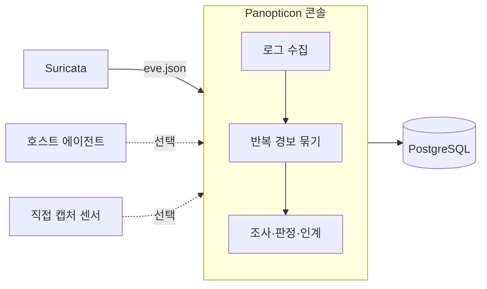

<p align="center"></p>

# Panopticon

Panopticon은 Suricata 경보를 조사하고 판정을 기록하는 보안 콘솔입니다. 소규모 사무실, 연구실, 개발망을 대상으로 합니다.

Suricata가 남긴 EVE 로그를 읽어 반복 경보를 묶고, 장치 역할·작업 일정·통신 근거를 한 화면에서 대조합니다. 분석가는 "정상 백업인가, 처음 보는 상대와의 통신인가"를 판단하고 근거·담당자·유효 기한과 함께 남깁니다. 기록은 자체 서버의 PostgreSQL에 저장합니다.

## 구성


```mermaid
flowchart LR
    S[Suricata] -->|eve.json| C
    subgraph C[Panopticon 콘솔]
        T[로그 수집] --> G[반복 경보 묶기]
        G --> R[조사·판정·인계]
    end
    C --> DB[(PostgreSQL)]
    A[호스트 에이전트] -.->|선택| C
    N[직접 캡처 센서] -.->|선택| C
```

기본 설치는 왼쪽 경로 하나입니다. 콘솔은 로그 파일만 읽으므로 패킷 캡처 권한이 필요 없습니다. 점선은 따로 켜는 선택 구성입니다.

| 실행 구성 | 입력 | 필요한 권한 |
| --- | --- | --- |
| EVE (기본) | Suricata `eve.json` | 로그 파일 읽기 |
| native | 직접 캡처한 패킷 | 센서만 `CAP_NET_RAW`, 콘솔은 일반 사용자 |
| 호스트 에이전트 | Linux TCP 소켓·부하 지표 | 대상 호스트 root (설치 시) |

## 빠른 시작

Suricata 없이 샘플 로그로 화면부터 확인할 수 있습니다.

```bash
./install.sh demo
```

실제 Suricata 로그를 연결할 때:

```bash
PANOPTICON_EVE_FILE=/var/log/suricata/eve.json ./install.sh eve
```

콘솔은 `http://127.0.0.1:38585`에서 열립니다. 설치 경로별 차이는 [설치 가이드](docs/INSTALL.md)에 있습니다.

## 주요 기능

| 기능 | 하는 일 |
| --- | --- |
| 반복 경보 묶음 | 같은 센서·규칙·출발지·목적지·서비스의 경보를 1시간 단위로 묶음. 원본은 그대로 보존 |
| 업무 맥락 | 장치 역할, 담당자, 기대 통신, 작업 일정을 등록해 경보와 대조 |
| 판정과 인계 | 담당자, 처리 상태, 인계 메모, 판정 이력 기록. 관리자·분석가·조회자 권한 |
| 처리 우선순위 | 미종결·미배정·판정 없음·정상 판정 만료 사건을 따로 모아 봄 |
| 증거 확인 | 원본 EVE 기록 위치 추적. 직접 캡처 구성은 PCAP 내려받기 |
| 탐지 설정 검토 | 변경 후보를 정상·공격 샘플로 비교한 뒤 관리자 승인 |
| 호스트 에이전트 | Rust 단일 바이너리(약 1.6MiB)가 TCP 연결·부하·메모리를 HMAC 서명으로 전송 |
| 감사 기록 | 관리 변경을 SHA-256 해시 체인으로 저장 |
| 관측 대시보드 | 경보·EVE 수집·트래픽·사건 처리·센서 상태 그래프 20종. 같은 기간·기준 시각, 그래프에서 사건 목록으로 이동 |
| 시각화 | 토폴로지, NIST CSF·PCI DSS 커버리지와 격차, MITRE ATT&CK 히트맵과 Navigator 내보내기 |

콘솔은 한국어와 영어를 지원합니다. `Ctrl+K`(macOS는 `Cmd+K`)로 화면을 검색합니다.

## 하지 않는 일

- 판정을 내려도 탐지 예외나 방화벽 규칙이 자동으로 생기지 않습니다.
- AI는 설명과 제안만 합니다. 설정 승인은 관리자가 합니다.
- HTTPS 본문을 복호화하지 않습니다. 센서가 보지 못한 구간은 판단하지 않습니다.
- 기본 지원 범위는 단일 센서·단일 워커입니다. 다중 워커와 고가용성(HA)은 지원하지 않습니다.

## 요구 사항

- Linux
- Docker Compose 또는 Python 3.12 이상
- PostgreSQL (Docker Compose 설치에는 포함)
- 보존 기간과 트래픽에 맞는 디스크 공간

## 문서

| 목적 | 문서 |
| --- | --- |
| 설치·업데이트 | [설치 가이드](docs/INSTALL.md) |
| Suricata 연결 | [EVE 연결](docs/EVE.md) |
| 화면 사용과 사건 조사 | [사용 가이드](docs/USER-GUIDE.md) |
| 설정값 | [설정 가이드](docs/CONFIGURATION.md) |
| 백업·장애 대응 | [운영 가이드](docs/OPERATIONS-GUIDE.md) |
| API 연동 | [API 가이드](docs/API.md) |
| 릴리스 파일 검증 | [릴리스 검증](docs/RELEASE-VERIFICATION.md) |
| 개발과 기여 | [개발 가이드](docs/DEVELOPMENT.md) |
| 변경 기록 | [릴리스 노트](CHANGELOG.md) |
| 취약점 제보 | [보안 정책](SECURITY.md) |

[English](README.en.md) · [MIT License](LICENSE)

---

<p align="center">
  Made by <a href="mailto:jinho.von.choi@nerdvana.kr">Jinho Choi</a> &nbsp;|&nbsp;
  <a href="https://buymeacoffee.com/jinho.von.choi">Buy me a coffee</a>
</p>
