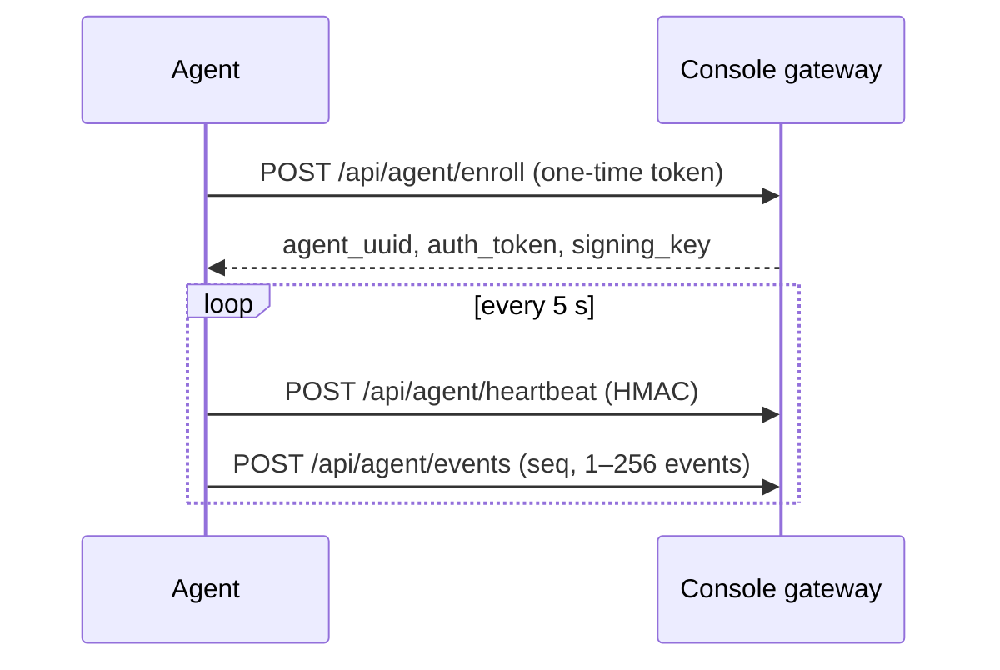

# Panopticon host agent

A Rust executable that reports Linux TCP connections, load, and memory to a Panopticon console. It reads `/proc/net/tcp` and `/proc/net/tcp6` and sends signed heartbeats and connection changes every five seconds. No Rust runtime is needed on the target host.



| Item | Value |
| --- | --- |
| Platforms | Linux x86_64, aarch64 with systemd |
| Interval | 5 seconds |
| Sampling limit | 256 connections per interval, listening sockets excluded |
| Transport | HTTPS verified by rustls. HTTP only for loopback development consoles |
| Memory target | Binary size and idle RSS below 15 MiB |

## Build

```sh
cargo build --release --manifest-path agent/Cargo.toml
```

The executable is `agent/target/release/panopticon-agent`.

## Install

Run as root from the repository directory with these variables:

| Variable | Value |
| --- | --- |
| `PANOPTICON_CONSOLE_URL` | Console origin, e.g. `https://console.example` |
| `PANOPTICON_ENROLLMENT_TOKEN` | Fresh URL-safe enrollment token |
| `PANOPTICON_AGENT_BINARY_URL` | HTTPS artifact URL for the host architecture |
| `PANOPTICON_AGENT_SHA256` | Artifact checksum from a trusted channel |
| `PANOPTICON_AGENT_BINARY` | Local executable path (replaces the two download variables) |

```sh
bash scripts/agent/install.sh
```

A hosted copy of the installer can be run with the same environment: `curl -fsSL https://<artifact-host>/install.sh | bash`. This repository does not host installers or binaries.

The installer creates a systemd service with a dynamic user, a private state directory, and `MemoryHigh=15M`. Credentials are stored in `/etc/panopticon-agent/agent.env` (0600).

```sh
systemctl status panopticon-agent
journalctl -u panopticon-agent
```

## Console side

Set `PANOPTICON_ENROLLMENT_TOKEN` in the console environment before starting it. A token is valid for 15 minutes after the gateway first sees it and enrolls one host. Restarting the console does not reset a consumed token; set a new token and restart for each host.

The gateway stores agent identities, resource snapshots, and event batches in a SQLite file set by `agent_gateway.database` (default `data/agent-gateway.sqlite3`, mode 0600). Keep it in a console-owned directory and retain it across restarts. Agent data is not added to the alert pipeline.

## Protocol

`POST /api/agent/enroll` takes `enrollment_token`, `hostname`, `platform` and returns `agent_uuid`, `auth_token`, `signing_key`, `heartbeat_interval_seconds`. Credentials are returned once.

Heartbeat and events require these headers:

| Header | Value |
| --- | --- |
| `Authorization` | `Bearer <auth_token>` |
| `X-Agent-UUID` | Enrolled UUID |
| `X-Agent-Timestamp` | Unix seconds, max skew 60 s |
| `X-Agent-Signature` | Hex HMAC-SHA256 of `timestamp + "\n" + body bytes`, keyed by the hex-decoded `signing_key` |

Agent credentials do not grant dashboard access.

- **Heartbeat:** `agent_uuid`, `latency_ms` (previous heartbeat round trip), `resources` (`load_1`, `memory_total_bytes`, `memory_available_bytes`, `agent_rss_bytes`). The gateway's receipt time sets `last_seen`.
- **Events:** `agent_uuid`, `seq` (starts at 1, consecutive), `events` (1–256). Each event has `kind` (`connection` or `anomaly`), `local_address`, `remote_address`, `state`, `inode`, `observed_at`, and optional `detail`. An identical retry returns `duplicate: true`. A conflicting or skipped sequence returns HTTP 409.

Full field limits are in [API.md](../docs/API.md#에이전트-게이트웨이).

## State and limits

Identity, sequence, and one pending batch are written atomically with fsync to `PANOPTICON_STATE_DIR` (default `/var/lib/panopticon-agent`). A process lock stops two agents from using one identity. A retry resends the same batch and sequence, and sampling pauses until it is delivered. History during an outage is not buffered.

Not provided: Netlink or eBPF collection, an on-disk history log, mTLS certificate issuance, and alerts for silent agents.
