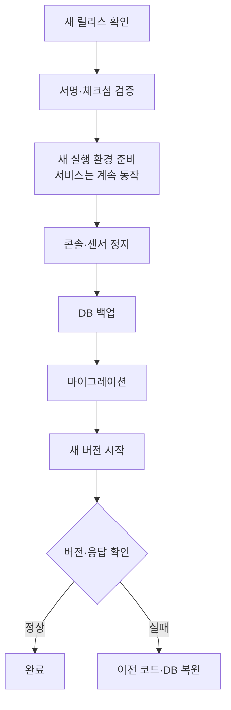

# 자동 업데이트

등록한 설치는 등록 직후와 매일 호스트 시간 새벽 4시에 GitHub의 최신 정식 릴리스를 확인합니다. 더 높은 버전이 있으면 서명과 체크섬을 검증한 뒤 적용합니다. 시험판과 낮은 버전은 설치하지 않습니다. 4시에 호스트가 꺼져 있었으면 다음 부팅 때 확인합니다.

업데이트는 호스트의 별도 systemd 실행기가 맡습니다. 컨테이너에는 업데이트 권한이 없습니다. 등록하지 않은 설치나 개발용 체크아웃은 바뀌지 않습니다.

## 적용 흐름



- 검증과 준비 중에는 기존 서비스가 계속 돕니다. 정지부터 새 버전 시작까지는 조사가 멈춥니다.
- 정전 등으로 중간에 끊기면 다음 실행 때 복구 기록을 보고 직전 버전으로 되돌립니다.
- 복원도 실패하면 서비스를 멈춘 채로 기록과 백업을 남깁니다.
- 적용 후 확인은 콘솔의 `/health` 응답과 버전만 봅니다. DB 저장이나 센서 동작은 확인하지 않으므로 업데이트 뒤 **운영 상태**를 직접 확인합니다.

## 준비물

- Linux, systemd
- `gh attestation verify`를 지원하는 GitHub CLI
- Compose 구성: Docker Compose
- 호스트 직접 실행 구성: Python 3.12 이상, DB 서버 버전 이상의 PostgreSQL 클라이언트(`pg_dump`, `pg_restore`, `createdb`, `dropdb`)

조건:

- 코드 디렉터리는 root 소유이고 다른 계정이 쓸 수 없어야 합니다.
- 설정·자격증명·로그·증거는 코드 디렉터리 밖에 둡니다.
- 자동 복원을 위해 Panopticon 전용 DB와 백업·복원 권한이 있는 관리 계정이 필요합니다. 다른 서비스와 DB를 같이 쓰는 환경에는 등록하지 않습니다.

## 등록하기

설치 형태에 맞는 `--mode`를 고릅니다.

| 모드 | 설치 형태 | 추가 인자 |
| --- | --- | --- |
| `compose-eve` | Docker Compose, EVE | `--env-file` |
| `compose-native` | Docker Compose, 분리 센서 | `--env-file`, `--database-env`(bootstrap.env) |
| `systemd-eve` | systemd, EVE | `--env-file`, `--config`, `--services` |
| `systemd-native` | systemd, 분리 센서 | 아래 예시 참고 |

외부 PostgreSQL을 쓰는 Compose 설치는 `--external-database`를 붙입니다.

Compose EVE 예시 (코드는 `/opt/panopticon`, 환경 파일은 `/etc/panopticon/installation.env`):

```bash
sudo python3 /opt/panopticon/scripts/install_auto_update.py \
  --mode compose-eve \
  --source /opt/panopticon \
  --env-file /etc/panopticon/installation.env
```

기존 볼륨을 이어 쓰려면 환경 파일의 `COMPOSE_PROJECT_NAME`이 현재 설치와 같아야 하고, 설정 경로도 기존 외부 설정을 가리켜야 합니다.

systemd EVE 예시:

```bash
sudo python3 /opt/panopticon/scripts/install_auto_update.py \
  --mode systemd-eve \
  --source /opt/panopticon \
  --env-file /etc/panopticon/panopticon.env \
  --config /etc/panopticon/config.yaml \
  --services panopticon-eve.service
```

systemd native 예시:

```bash
sudo python3 /opt/panopticon/scripts/install_auto_update.py \
  --mode systemd-native \
  --source /opt/panopticon \
  --env-file /etc/panopticon-native/console.env \
  --database-env /etc/panopticon-native/bootstrap.env \
  --migration-env /etc/panopticon-native/migrate.env \
  --grants-env /etc/panopticon-native/grants.env \
  --config /etc/panopticon-native/config/console.yaml \
  --services panopticon-native-console.service panopticon-native-sensor.service
```

웹 포트를 바꿨다면 `--port`를 지정합니다.

등록하면 기존 코드 디렉터리가 버전별 보관 디렉터리로 옮겨지고, 원래 경로에는 심볼릭 링크가 생깁니다. 두 경로는 같은 파일시스템에 있어야 합니다. 설정과 데이터는 옮기거나 초기화하지 않습니다.

## 끄기와 다시 켜기

`/etc/panopticon-update/update.env`에 적습니다.

```dotenv
PANOPTICON_AUTO_UPDATE=false
```

다음 주기부터 확인·다운로드·적용을 모두 건너뜁니다. `true`로 바꾸면 다시 켜집니다. 진행 중이던 복구 기록이 있으면 복구부터 끝냅니다.

| 작업 | 명령 |
| --- | --- |
| 지금 확인 | `sudo systemctl start panopticon-update.service` |
| 타이머 완전 해제 | `sudo systemctl disable --now panopticon-update.timer` |
| 다음 실행 시각 | `systemctl list-timers panopticon-update.timer` |
| 최근 로그 | `sudo journalctl -u panopticon-update.service --no-pager -n 30` |
| 현재 상태 | `sudo cat /var/lib/panopticon-updater/status.json` |

백업은 `/var/lib/panopticon-updater/backups`에 계속 쌓이므로 디스크 여유를 주기적으로 확인합니다.
