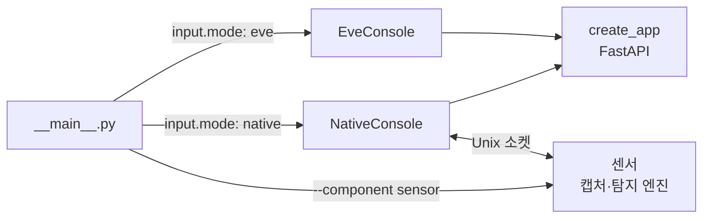

# 개발 가이드

## 저장소 구조

| 경로 | 내용 |
| --- | --- |
| `netwatcher/ingest/` | EVE 로그 수집 (기본 실행 경로) |
| `netwatcher/web/` | FastAPI 앱과 라우터, 정적 대시보드(`static/`, 빌드 단계 없는 ES 모듈) |
| `netwatcher/storage/` | PostgreSQL 저장소, 스키마 정의 |
| `netwatcher/detection/` | 직접 캡처용 탐지 엔진 22종과 레지스트리 |
| `netwatcher/services/` | 센서 제어, 주기 작업 |
| `alembic/versions/` | DB 마이그레이션 |
| `agent/` | Rust 호스트 에이전트 |
| `scripts/` | 설치 도구, 출시 검사(`gates.py`), 성능 측정 |
| `tests/` | pytest 시험, `tests/browser/`의 Playwright 시험 |



## 개발 환경

```bash
python3 -m venv .venv
.venv/bin/pip install --require-hashes -r requirements-dev.lock
```

개발·시험용 PostgreSQL을 따로 준비합니다. 운영 DB로 시험하거나 성능을 재현하지 않습니다.

## DB 마이그레이션

스키마 변경은 `alembic/versions/`에 새 파일로 추가하고, `netwatcher/storage/schemas.py`의 정의와 맞춥니다.

```bash
.venv/bin/python -m alembic upgrade head
.venv/bin/python -m alembic current
```

명령은 `.env`와 환경변수의 DB를 대상으로 합니다. 실행 전에 시험용 DB인지 확인합니다. 빈 DB에 처음부터 끝까지 적용되는지, 한 단계 내렸다가 다시 올려도 되는지 확인합니다.

## 시험

DB가 필요한 시험은 전용 접속 정보를 지정합니다.

```bash
export NETWATCHER_TEST_DB_HOST=127.0.0.1
export NETWATCHER_TEST_DB_PORT=5432
export NETWATCHER_TEST_DB_NAME=netwatcher_test
export NETWATCHER_TEST_DB_USER=netwatcher
export NETWATCHER_TEST_DB_PASSWORD='<시험 DB 비밀번호>'
export NETWATCHER_SKIP_DOTENV=1
.venv/bin/python -m pytest tests/ -q
```

DB 없이 도는 시험만 실행하려면:

```bash
.venv/bin/python -m pytest tests/test_detection tests/test_utils -q
```

- 각 시험은 독립된 PostgreSQL 스키마에서 돌아 서로 상태를 공유하지 않습니다.
- 여러 시험 디렉터리를 한 번에 돌리면 DB 연결 거부 오류가 나는 환경이 있습니다. 그럴 때는 디렉터리나 파일 단위로 나눠 실행합니다.
- 건너뛴 시험은 통과 수에 넣지 않습니다.
- 외부 서비스나 실제 네트워크가 필요한 검증은 격리 환경에서 하고 조건을 기록합니다.

## 정적 분석

```bash
.venv/bin/ruff check .
```

규칙은 `pyproject.toml`에 있습니다. 결함을 가리키는 규칙(E9, F, B 일부)만 켜 두었고, 남아 있는 부채 규칙은 건수가 늘면 출시 검사 G0-15가 실패합니다.

## 출시 검사

```bash
.venv/bin/python scripts/gates.py
```

DB 단계는 `NETWATCHER_DB_*`로 마이그레이션을 마친 전용 DB를, 회귀 시험은 `NETWATCHER_TEST_DB_*`를 씁니다. 로컬 `.env`는 읽지 않습니다.

| 검사 | 확인하는 것 |
| --- | --- |
| G0-1 | 지원 프로필 계약 |
| G0-2 | AI 제안 경로가 설정·런타임·방화벽을 바꾸지 않음 |
| G0-3 | 대시보드가 실행 가능한 HTML·JS를 만들지 않음 |
| G0-4 | 마이그레이션이 DB에 적용됨 |
| G0-5 | 회귀 시험 |
| G0-6 | 위협 피드 생애주기 |
| G0-7 | 탐지 결과 계약(요약 → 근거 → 원자료) |
| G0-8 | 승인이 유일한 설정 쓰기 경로 |
| G0-9, G0-10 | 관측 범위·승인 화면과 관측 범위 계약 |
| G0-11 | 리플레이가 운영 경로에 닿지 않음 |
| G0-12 | 차단 백엔드가 셸 없이 argv만 쓰고 배포 설정이 자동 차단을 켜지 않음 |
| G0-13 | 스키마 정의와 마이그레이션 일치 |
| G0-14 | 변경 라우트에 관리자 권한 검사 |
| G0-15 | 정적 분석 기준선 |

게이트는 실제 네트워크 처리량, OS 차단 효과, 장시간 안정성을 검증하지 않습니다. 이것들은 따로 시험합니다.

## 의존성

직접 의존성은 `requirements.txt`와 `requirements-dev.txt`에 버전을 고정합니다. 설치에는 전이 의존성과 해시까지 고정한 `.lock` 파일을 씁니다. 의존성을 바꾸면 두 잠금 파일을 함께 갱신하고 Python 3.12·3.13에서 확인합니다. 갱신 명령은 각 잠금 파일 첫머리에 있습니다.

## 변경 작성

- 탐지 엔진은 `DetectionEngine`을 상속하고, 읽는 설정 키를 모두 `config_schema`에 선언합니다. 선언하지 않은 키는 무시됩니다.
- 대시보드는 기존 ES 모듈 구조와 한국어·영어 번역 파일을 따릅니다.
- 코드 주석은 한국어, 식별자는 영어로 씁니다.
- 저장, 승인, 외부 전달에서는 실패와 미확정을 구분합니다.
- 사용법이 바뀌면 관련 가이드와 릴리스 노트를 함께 고칩니다.
- 비밀번호, 토큰, 원본 패킷, 특정 운영 환경의 자료는 커밋하지 않습니다.

PR 본문에는 해결하려는 문제, 바뀐 동작, 검증 결과, 알려진 제약을 적습니다. 검토 기준은 [기여 기준](GOVERNANCE.md), 성능 측정은 [합성 성능 시험](../tests/performance/README.md)을 봅니다.