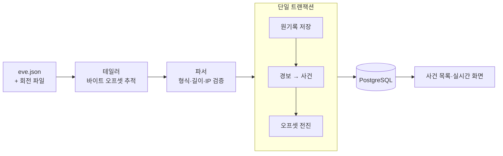

# Suricata EVE 연결

Suricata가 쓴 EVE 로그를 Panopticon이 읽어 사건으로 만드는 기본 구성입니다. Suricata 설정이나 방화벽은 건드리지 않습니다.

## 동작 방식



- 원기록 저장, 사건 생성, 오프셋 전진을 한 트랜잭션으로 묶습니다. DB 저장이 실패하면 오프셋도 그대로라서 다시 읽어도 사건이 중복되지 않습니다.
- 쓰는 중인 줄(줄바꿈 전)은 완성될 때까지 기다립니다.
- 로그가 회전하면 이전 파일을 끝까지 읽은 다음 새 파일로 넘어갑니다.

## 연결하기

Suricata의 `eve.json` 출력을 켭니다(한 줄에 JSON 객체 하나). Panopticon 실행 계정에는 로그 디렉터리 탐색 권한과 파일 읽기 권한만 있으면 됩니다. root나 캡처 권한은 필요 없습니다.

```yaml
netwatcher:
  input:
    mode: eve
    eve:
      sources:
      - sensor_id: suricata-1
        source_id: office-eve
        directory: /var/log/suricata
        filename: eve.json
  web:
    host: 127.0.0.1
    port: 38585
```

```bash
python -m alembic upgrade head
python -m netwatcher -c config/default.yaml
```

DB와 로그인 설정은 [설정 가이드](CONFIGURATION.md)를 따릅니다. 콘솔을 외부 인터페이스에 열 때는 인증을 켭니다.

### 입력 소스 규칙

| 항목 | 규칙 |
| --- | --- |
| 소스 수 | 최대 8개 |
| `sensor_id` + `source_id` | 소스마다 고유, 재시작 후에도 유지 |
| 허용 문자 | 영문·숫자·`_`·`.`·`-`, 각각 64자 이내 |
| `filename` | 파일 이름만 (경로 불가) |
| 파일 종류 | 일반 파일만 (심볼릭 링크 거절) |

### Docker Compose

`.env`에 DB 접속 정보, 로그인 자격증명, JWT 키를 넣습니다. 함께 띄우는 DB는 `NETWATCHER_DB_HOST=db`입니다. 로그 마운트는 두 변수로 지정합니다.

```dotenv
PANOPTICON_EVE_DIR=/var/log/suricata
PANOPTICON_EVE_GID=10001
```

`PANOPTICON_EVE_GID`는 호스트에서 로그를 읽을 수 있는 실제 그룹 번호로 바꿉니다. 그 그룹에 디렉터리 실행 권한과 파일 읽기 권한이 있어야 합니다. 컨테이너 안에서는 `/var/log/suricata`에 읽기 전용으로 마운트됩니다.

```bash
docker compose --profile db up -d db
docker compose --profile db --profile migrate run --rm db-migrate
docker compose --profile db up -d netwatcher
```

설치 도구를 쓰면 이 값들이 자동으로 채워집니다. [설치 가이드](INSTALL.md#docker-compose로-새로-설치하기)를 봅니다.

### systemd

`deploy/panopticon-eve.service`는 일반 계정 `panopticon`으로 실행하는 서비스 템플릿입니다.

| 항목 | 기본값 |
| --- | --- |
| 소스·가상환경 | `/opt/panopticon` |
| 설정 파일 | `/etc/panopticon/config.yaml` |
| 환경변수 파일 | `/etc/panopticon/panopticon.env` |
| 쓰기 가능 경로 | `/var/lib/panopticon` |
| 메모리 | 384MiB부터 회수 압력, 512MiB에서 종료 |
| CPU | 1코어 |

- `panopticon` 계정이 설정 파일과 EVE 로그를 읽을 수 있어야 합니다. 필요하면 유닛의 보조 그룹에 로그 그룹을 추가합니다.
- 원시 소켓은 막혀 있습니다. 작업 디렉터리의 `.env`는 읽지 않고 지정한 환경변수 파일만 씁니다.
- 비정상 종료되면 다시 시작하고, DB에 기록된 마지막 오프셋부터 이어 읽습니다.
- 메모리·CPU 한도는 트래픽과 하드웨어에 맞춰 `MemoryHigh`, `MemoryMax`, `CPUQuota`로 조정합니다. DB와 Suricata의 자원은 이 한도에 들어가지 않습니다.

## 저장하는 내용

| 이벤트 | 처리 |
| --- | --- |
| `alert` | 사건으로 만듦. 규칙 ID와 원래 심각도 유지 |
| `flow`, `dns`, `tls` | 정상 판정 근거와 첫 관측 집계에 사용. 사건은 만들지 않음 |

Suricata 심각도 1·2·3은 화면에서 `CRITICAL`·`WARNING`·`INFO`로 표시합니다.

로그 전문은 DB에 넣지 않습니다. 파일 세대, 바이트 오프셋, 해시로 원본 위치를 추적하고 분석에 필요한 필드만 저장합니다. DNS 질의 이름, TLS SNI·인증서 주체, HTTP 본문·헤더는 저장하지 않습니다. 원문이 필요한 조사를 하려면 Suricata 원본 로그를 따로 보관합니다.

사건 상세의 **원본 EVE 로그 근거**에서 센서, 입력 소스, 규칙 ID, 원래 심각도, flow ID, 원본 오프셋을 확인할 수 있습니다.

## 장치 역할과 MAC 주소

장치 역할은 등록한 IP와 MAC이 경보의 주소와 일치하고 관리자 확인이 유효할 때만 표시합니다.

- IP만 있는 경보에는 역할을 붙이지 않습니다.
- MAC 불일치, 공인 IP, 확인 만료, 주소 변경이 있으면 다시 확인해야 합니다.
- 역할이 확인돼도 Suricata 경보나 심각도는 바뀌지 않습니다.

MAC 주소를 받으려면 Suricata EVE 설정에서 `ethernet: yes`를 켭니다. 게이트웨이를 거친 패킷의 MAC은 실제 출발 장치와 다를 수 있습니다. 자세한 옵션은 [Suricata EVE 출력](https://docs.suricata.io/en/latest/output/eve/eve-json-output.html)을 봅니다.

## 보존 한도

```yaml
netwatcher:
  input:
    eve:
      retention:
        days: 30                    # 수신 시점 기준
        max_records: 250000         # 소스당
        max_bytes: 268435456        # 소스당 256MiB
        cleanup_interval_seconds: 60
```

- 한도를 넘는 배치는 저장하지 않고 오프셋도 멈춥니다. 기한이 지난 기록과 연결 사건을 지워 공간이 생기면 다시 읽습니다.
- 정리 한 번에 소스당 최대 1,000건을 지웁니다.
- 분석가가 남긴 판정·인계 기록은 용량 계산에서 빠지지만, 보존 기간이 지나 사건이 지워지면 함께 지워집니다.
- DB 테이블·인덱스·WAL이 차지하는 실제 디스크 용량은 서버에서 따로 감시합니다.

## 손실이 생길 수 있는 경우

다음 경우는 누락 가능성을 메타데이터에 기록하고 화면에 표시합니다. 복구는 할 수 없습니다.

- 이전 회전 파일을 다 읽기 전에 지워짐
- 파일 잘림
- 회전 직후 2초를 넘겨 들어온 지연 쓰기

파일시스템이 알려주지 않는 덮어쓰기나 Suricata 단계의 패킷 손실은 감지하지 못합니다.

## 수집 문제 해결

**운영 상태**에서 소스별 수집 현황, 대기량, 누락 징후, 거절 건수, 보존 사용량을 봅니다.

| 표시 | 의미 | 할 일 |
| --- | --- | --- |
| 수집 확인 필요 | 파일·권한·DB 문제 | 경로, 권한, DB 연결 확인. 멈춘 사이 로그가 회전으로 지워지지 않게 Suricata 보존 일수 확인 |
| 수집 대기량 증가 | 대기량이 배치 상한의 2배 초과 | DB 응답 시간, 보존 한도 확인 |
| 수집 상태 점검 필요 | 잘림, 깨진 JSON, 파일 상태 조회 실패 | 회전 설정 확인. 256KiB를 넘는 줄은 거절됨 |
| 저장 한도 도달 | 보존 한도 초과 | 보존 일수·용량 한도 조정 |
| 확인 불가 | 파일 상태를 읽지 못함 | 0이 아니라 모르는 상태. 파일 접근 확인 |

- 대기량은 지금 읽는 파일에서 아직 저장하지 않은 바이트 수입니다. 다른 회전 파일과 Suricata 손실은 포함하지 않습니다.
- 한 디렉터리에서 회전 파일은 최대 128개까지 탐색합니다. 오래된 회전 파일은 다른 디렉터리로 옮깁니다.

EVE 모드에서는 직접 캡처, NetFlow, HA, 방화벽 차단이 동작하지 않고 관련 메뉴도 보이지 않습니다. 직접 캡처가 필요하면 `input.mode: native`를 씁니다.
