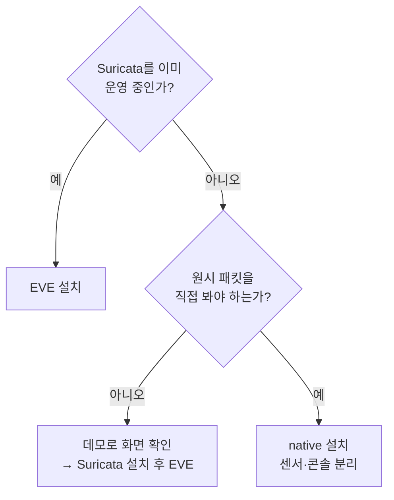
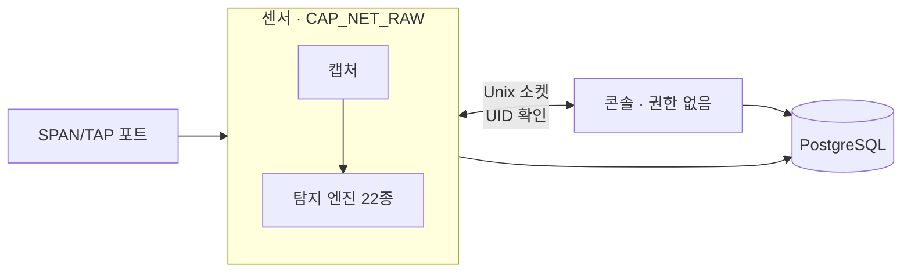
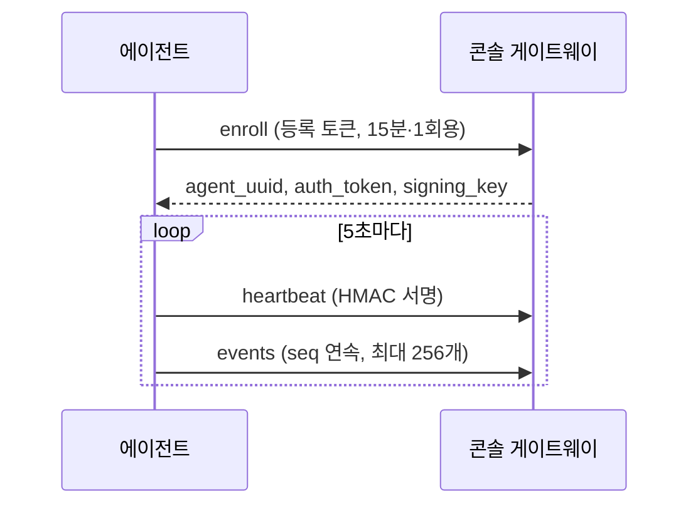

# 설치 가이드

릴리스 파일로 설치할 때는 먼저 [릴리스 검증](RELEASE-VERIFICATION.md)으로 파일 출처를 확인합니다.

## 설치 경로 고르기



| 경로 | 필요한 것 | 명령 |
| --- | --- | --- |
| 데모 | Docker Compose | `./install.sh demo` |
| EVE | Docker Compose, 읽을 수 있는 `eve.json` | `PANOPTICON_EVE_FILE=<경로> ./install.sh eve` |
| native | Docker Compose, SPAN/TAP 포트 | `PANOPTICON_INTERFACE=<인터페이스> ./install.sh native` |
| 조건 점검만 | Python 3.12 | `./install.sh preflight [demo\|eve\|native\|capture]` |

`preflight`는 Python 버전, Docker, 웹 포트(38585) 점유, 설정 디렉터리 쓰기 권한, 샘플 로그, 캡처 권한을 점검합니다. 실패한 항목마다 해결 방법을 함께 출력합니다. `./install.sh capture`는 캡처 권한 점검만 합니다.

설치 디렉터리는 기본값이 `./installation-demo`이고 `PANOPTICON_INSTALL_DIR`로 바꿀 수 있습니다. 같은 이름의 디렉터리가 이미 있으면 덮어쓰지 않고 멈춥니다.

## 데모

```bash
./install.sh demo
```

저장소에 들어 있는 `samples/eve.json`으로 DB, 마이그레이션, 콘솔을 띄우고 접속 주소와 로그인 정보를 출력합니다. Suricata나 추가 권한은 필요 없습니다.

데모는 화면 확인용입니다. 운영에는 아래 EVE 설치를 사용합니다.

```bash
# 정지
docker compose --env-file installation-demo/.env --profile demo down
# 데이터까지 삭제
docker compose --env-file installation-demo/.env --profile demo down -v
```

## Docker Compose로 새로 설치하기

Suricata `eve.json` 파일을 읽을 수 있어야 합니다. 한 번에 설치하려면:

```bash
PANOPTICON_EVE_FILE=/var/log/suricata/eve.json ./install.sh eve
```

단계를 나눠 실행하려면 설정을 먼저 만들고 컨테이너를 차례로 올립니다.

```bash
python3 scripts/install_eve.py --eve-file /var/log/suricata/eve.json
docker compose --env-file installation/.env --profile db up -d db
docker compose --env-file installation/.env --profile db --profile migrate run --rm --build db-migrate
docker compose --env-file installation/.env --profile db up -d --build netwatcher
```

`install_eve.py`가 하는 일:

- 로그 형식과 읽기 권한을 확인합니다.
- DB 비밀번호, 관리자 비밀번호, JWT 서명 키를 난수로 만듭니다.
- `installation/.env`(자격증명, 권한 0600)와 `installation/config/default.yaml`(설정)을 씁니다.

로그 파일을 다른 그룹 권한으로 읽어야 하면 `--log-gid <그룹번호>`를 붙입니다. 보존 기간과 수집 한도는 `installation/config/default.yaml`에서 바꿉니다. 자세한 값은 [EVE 연결](EVE.md)을 봅니다.

### 컨테이너 보안 설정

- 콘솔은 `127.0.0.1:38585`에만 열립니다.
- 모든 컨테이너는 일반 사용자로 실행되고 Linux capability를 모두 뺍니다.
- EVE 로그와 루트 파일시스템은 읽기 전용으로 마운트합니다.

### 외부 PostgreSQL 사용

`installation/.env`의 `NETWATCHER_DB_HOST`, `_PORT`, `_USER`, `_PASSWORD`를 대상 DB에 맞게 고칩니다. 주소는 컨테이너 안에서 닿는 주소여야 합니다(`127.0.0.1`은 컨테이너 자신을 가리킵니다). 명령에서 `--profile db`를 빼고 마이그레이션과 콘솔만 실행합니다.

## 로그인과 첫 확인

브라우저에서 `http://127.0.0.1:38585`에 접속하고 `installation/.env`의 `NETWATCHER_LOGIN_USERNAME`, `NETWATCHER_LOGIN_PASSWORD`로 로그인합니다. 원격에서는 SSH 터널을 씁니다.

```bash
ssh -L 38585:127.0.0.1:38585 user@server
```

LAN에 공개하거나 HTTPS를 쓰려면 [인증과 HTTPS](CONFIGURATION.md#인증과-https)를 따릅니다.

로그인 뒤 **운영 상태** 화면에서 확인할 것:

1. 입력 연결 상태
2. 누락 가능성 표시
3. 보존 공간 한도
4. Suricata 경보 한 건이 사건 목록에 나타나는지

```bash
curl --fail http://127.0.0.1:38585/ready
docker compose --env-file installation/.env logs --tail=100 netwatcher
```

| 주소 | 의미 |
| --- | --- |
| `/health` | 프로세스가 HTTP에 응답함 |
| `/ready` | DB 연결과 EVE 수집이 모두 정상일 때만 200 |

`/ready`가 200이어도 네트워크 전체를 빠짐없이 관측한다는 뜻은 아닙니다. 관측 범위는 Suricata가 보는 구간까지입니다.

## 직접 패킷을 캡처하기

센서와 콘솔을 별도 프로세스·별도 계정으로 실행합니다.



다른 장치 사이의 통신을 보려면 스위치 SPAN 포트나 TAP이 필요합니다. 일반 스위치 포트에는 다른 호스트끼리 주고받는 유니캐스트가 오지 않습니다.

```bash
PANOPTICON_INTERFACE=eth0 PANOPTICON_INSTALL_DIR=installation-native ./install.sh native
docker compose --env-file installation-native/.env -f docker-compose.yml -f docker-compose.native.yml \
  --profile db up -d --build netwatcher native-sensor
```

`install.sh native`는 설정과 자격증명 파일만 만듭니다. 컨테이너는 두 번째 명령으로 올립니다. `eth0`은 실제 캡처 인터페이스로 바꿉니다. 로그인 정보는 `installation-native/console.env`에 있습니다.

첫 기동 때 DB 역할 생성, 마이그레이션, 권한 부여가 순서대로 실행됩니다. 역할과 권한은 다음과 같이 나뉩니다.

| 역할 | 권한 |
| --- | --- |
| 마이그레이션 | 스키마 생성·변경. 설치와 업데이트 때만 사용 |
| 콘솔 | 조회와 판정 기록. 테이블 생성·감사 기록 수정 불가 |
| 센서 | 탐지 결과 저장. 테이블 생성·감사 기록 수정 불가 |

센서 컨테이너는 호스트 네트워크와 `NET_RAW`만 받습니다. 방화벽을 바꾸는 `NET_ADMIN`은 받지 않습니다. 생성된 `*.env` 파일에는 비밀번호가 들어 있으므로 저장소에 올리지 않습니다.

### Docker 없이 실행

센서와 콘솔 설정에 같은 센서 ID와 제어 소켓 경로를 적습니다.

| 파일 | 키 |
| --- | --- |
| 센서 | `native.sensor_id`, `native.control.enabled: true`, `native.control.socket_path`, `native.control.allowed_uid`(콘솔 UID) |
| 콘솔 | `native.sensor_id`, `native.control.socket_path`, `native.control.expected_uid`(센서 UID) |
| 둘 다 | `auth.multi_user: true` |

```bash
python -m netwatcher --component sensor -c sensor.yaml
python -m netwatcher --component console -c console.yaml
```

소켓 디렉터리는 센서 계정이 소유하고 다른 계정이 쓸 수 없어야 합니다. 두 계정이 다르면 공용 그룹 GID를 `native.control.socket_gid`에 적습니다. 콘솔과 센서를 한 프로세스로 합치는 구성은 지원하지 않습니다.

systemd로 운영하려면 [호스트 센서·콘솔 설치](NATIVE-SYSTEMD.md)를 따릅니다. 계정, 소켓 디렉터리, 저장 경로, DB 초기화를 유닛 파일로 처리합니다.

## 호스트에서 직접 실행하기

Python 3.12 이상과 PostgreSQL이 필요합니다. 설정 파일의 DB 주소와 로그 경로는 호스트 기준으로 적습니다. Compose용 값(`db` 호스트명, 컨테이너 마운트 경로)을 그대로 쓰면 연결되지 않습니다.

```bash
python3 -m venv .venv
.venv/bin/pip install --require-hashes -r requirements.lock
.venv/bin/python -m alembic upgrade head
.venv/bin/python -m netwatcher -c config/default.yaml
```

EVE 모드는 `sudo`가 필요 없습니다. systemd 등록은 [EVE systemd](EVE.md#systemd)와 `deploy/panopticon-eve.service` 템플릿을 사용합니다. 직접 캡처는 libpcap과 캡처 권한이 추가로 필요합니다.

## 호스트 에이전트 설치

Panopticon Agent는 Linux 호스트의 TCP 연결과 부하·메모리를 콘솔로 보내는 Rust 단일 바이너리입니다.



| 항목 | 값 |
| --- | --- |
| 수집 원천 | `/proc/net/tcp`, `/proc/net/tcp6`, `/proc/loadavg`, `/proc/meminfo` |
| 전송 주기 | 5초 |
| 샘플 상한 | 주기당 연결 256개, 리스닝 소켓 제외 |
| 대상 | x86_64·aarch64 Linux, systemd |
| 바이너리 크기 | 약 1.6MiB (빌드마다 다름) |

### 1. 콘솔에 등록 토큰 설정

콘솔 환경에 `PANOPTICON_ENROLLMENT_TOKEN`(URL-safe 16~512자)을 넣고 재시작합니다. 토큰은 처음 쓰인 뒤 15분간, 호스트 한 대에만 유효합니다. 다음 호스트는 새 토큰을 넣고 콘솔을 다시 시작합니다.

콘솔은 HTTPS로 접근할 수 있어야 합니다. HTTP는 개발용 loopback 주소만 허용합니다.

### 2. 대상 호스트에서 설치

저장소를 받은 디렉터리에서 root로 실행합니다.

```bash
sudo -i
cd <저장소 경로>
export PANOPTICON_CONSOLE_URL='https://console.example'
read -r -s -p 'Enrollment token: ' PANOPTICON_ENROLLMENT_TOKEN
export PANOPTICON_ENROLLMENT_TOKEN
export PANOPTICON_AGENT_BINARY_URL='https://artifacts.example/linux-x86_64/panopticon-agent'
export PANOPTICON_AGENT_SHA256='<신뢰된 경로로 받은 SHA-256>'
bash scripts/agent/install.sh
```

직접 빌드했다면 다운로드 변수 대신 실행 파일 경로를 지정합니다.

```bash
cargo build --release --manifest-path agent/Cargo.toml
export PANOPTICON_AGENT_BINARY=agent/target/release/panopticon-agent
```

설치 스크립트를 HTTPS로 따로 배포했다면 같은 환경변수로 `curl -fsSL https://<배포 호스트>/install.sh | bash`를 실행할 수 있습니다. 이 저장소는 스크립트·바이너리 배포 서버를 제공하지 않고, `--token` 같은 명령행 인자도 받지 않습니다.

### 3. 설치 결과

| 항목 | 위치·값 |
| --- | --- |
| 바이너리 | `/usr/local/bin/panopticon-agent` |
| 서비스 | `panopticon-agent` (DynamicUser) |
| 자격증명 | `/etc/panopticon-agent/agent.env` (0600) |
| 상태 디렉터리 | `/var/lib/panopticon-agent` |
| 메모리 압력 기준 | `MemoryHigh=15M` (강제 상한 아님) |

```bash
systemctl status panopticon-agent
journalctl -u panopticon-agent
```

재시작해도 같은 자격증명과 시퀀스를 이어 씁니다. 전송하지 못한 배치는 하나만 디스크에 보관하고, 그동안 새 샘플링을 멈춥니다. 오프라인 동안의 전체 연결 이력은 남지 않습니다. 서명 형식은 [에이전트 게이트웨이](API.md#에이전트-게이트웨이)를 봅니다.

## 기존 설치 업데이트하기

1. [백업](OPERATIONS-GUIDE.md#백업)으로 DB, 설정, 증거를 보관합니다.
2. [릴리스 노트](../CHANGELOG.md)에서 호환성 안내를 확인합니다.
3. 새 릴리스 디렉터리에서 서비스를 멈추고 마이그레이션을 적용합니다.

```bash
docker compose --env-file installation/.env stop netwatcher
docker compose --env-file installation/.env --profile migrate run --rm --build db-migrate
docker compose --env-file installation/.env up -d --build netwatcher
```

주의할 점:

- 설치 도구(`install_eve.py`, `install_native.py`)를 다시 실행해 기존 자격증명을 바꾸지 않습니다. 기존 `.env`, JWT 키, DB 볼륨을 그대로 씁니다.
- 기존 설정에 `input.mode`가 없으면 직접 캡처 모드로 동작합니다. 새 기본 템플릿은 EVE 모드이므로 기존 설정 파일을 템플릿으로 덮어쓰지 않습니다.
- 업데이트 뒤 사건 목록, 장치, 감사 기록이 보이는지 확인합니다. 정상 동작을 확인할 때까지 백업을 지우지 않습니다.
- 되돌릴 때 다운그레이드 마이그레이션이 없는 변경이면 백업을 복원합니다.

자동으로 업데이트하려면 [자동 업데이트](AUTO-UPDATE.md)를 봅니다.

### 분리 센서 설치 업데이트

`install_native.py`로 만든 설치는 역할 생성을 다시 하지 않고 마이그레이션과 권한 부여만 다시 실행합니다.

```bash
COMPOSE="docker compose --env-file installation-native/.env -f docker-compose.yml -f docker-compose.native.yml --profile db"
$COMPOSE stop netwatcher native-sensor
$COMPOSE run --rm --no-deps --build db-migrate
$COMPOSE run --rm --no-deps --build native-db-grants
$COMPOSE up -d --build netwatcher native-sensor
```

로그인, 센서 연결, 이전 사건, 감사 기록을 확인합니다. 이 절차는 `console.env`, `sensor.env`, `migrate.env`, `grants.env`가 분리된 설치 기준입니다. 단일 계정으로 설치한 이전 배포는 역할을 나누는 이전 작업이 따로 필요합니다.

## 설치 문제 해결

| 증상 | 확인할 것 |
| --- | --- |
| EVE 파일을 읽지 못함 | 경로, 일반 파일 여부(심볼릭 링크 불가), 그룹 읽기 권한, 상위 디렉터리 실행 권한 |
| DB 연결 실패 | 컨테이너에서 닿는 DB 주소·포트, 계정, `pg_hba.conf` |
| 저장 한도 도달 | **운영 상태**의 보존 사용량. 보존 기간·용량 한도 조정 |
| 로그인 실패 | `.env`의 관리자 자격증명, 연속 실패 차단 |
| 설정을 저장할 수 없음 | 설정 디렉터리가 읽기 전용임. [설정 쓰기 허용](CONFIGURATION.md#대시보드에서-설정-저장) |
| 포트 38585 사용 중 | `./install.sh preflight`로 점유 프로세스 확인 |
