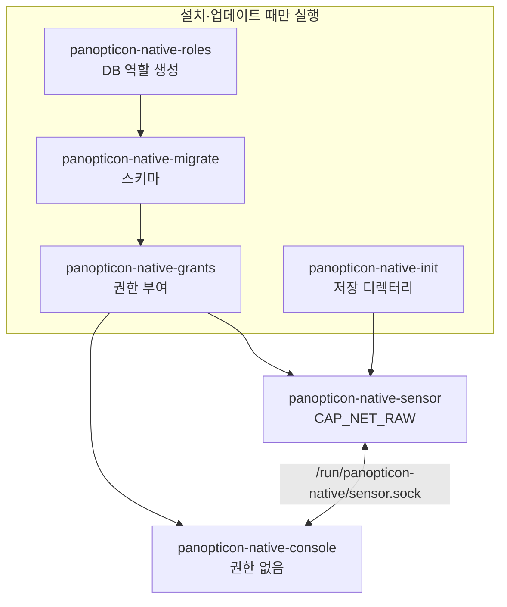

# 호스트에서 센서와 콘솔 실행하기

직접 패킷을 캡처하는 구성을 Docker 없이 systemd로 운영하는 방법입니다.

## 구성



| 서비스 | 실행 계정 | 권한 |
| --- | --- | --- |
| 센서 | `panopticon-sensor` | `CAP_NET_RAW`만 |
| 콘솔 | `panopticon-console` | capability 없음 |
| 역할·마이그레이션·권한 | 일회성 | DB 관리 계정 |

비밀번호는 systemd `LoadCredential`로 전달하고 서비스 파일에는 적지 않습니다.

## 준비물

- Linux, systemd (`LoadCredential` 지원)
- Python 3.12 이상, libpcap
- 접속 가능한 PostgreSQL과 역할을 만들 수 있는 관리 계정
- 관측할 트래픽이 들어오는 인터페이스 (다른 장치 간 통신은 SPAN 또는 TAP)

## 새 설치

### 1. 소스와 Python 환경

릴리스 소스를 `/opt/panopticon`에 풉니다. 일반 사용자가 소스를 고칠 수 없고, 서비스 계정은 읽고 들어갈 수 있게 권한을 맞춥니다.

```bash
sudo python3 -m venv /opt/panopticon/.venv
sudo /opt/panopticon/.venv/bin/pip install --require-hashes -r /opt/panopticon/requirements.lock
```

### 2. 서비스 계정

```bash
sudo useradd --system --user-group --home-dir /var/lib/panopticon-native-console --shell /usr/sbin/nologin panopticon-console
sudo useradd --system --user-group --home-dir /var/lib/panopticon-native-sensor --shell /usr/sbin/nologin panopticon-sensor
```

이미 계정이 있으면 UID가 0이 아니고 서로 다른지 확인합니다.

### 3. DB 관리 계정 정보

소유자만 읽을 수 있는 파일을 만들고 관리 계정 정보를 넣습니다. 이 계정은 역할과 스키마를 만들 때만 씁니다. 기존 스키마의 소유권은 가져오지 않으므로 새 DB나 비어 있는 스키마를 준비합니다.

```bash
install -m 0600 /dev/null db-bootstrap.env
```

```dotenv
NETWATCHER_DB_HOST='127.0.0.1'
NETWATCHER_DB_PORT='5432'
NETWATCHER_DB_NAME='panopticon'
NETWATCHER_DB_USER='<관리 계정>'
NETWATCHER_DB_PASSWORD='<관리 계정 비밀번호>'
```

### 4. 설치 파일 생성

`eth0`을 캡처 인터페이스로 바꿉니다. 다른 스키마를 쓰려면 `--schema <이름>`을 붙입니다. 출력 디렉터리가 이미 있으면 멈춥니다.

```bash
/opt/panopticon/.venv/bin/python /opt/panopticon/scripts/install_native_systemd.py \
  --interface eth0 --database-env db-bootstrap.env \
  --console-user panopticon-console --sensor-user panopticon-sensor \
  --output installation-native-systemd
```

이 도구는 파일만 만듭니다. 계정, DB, systemd는 직접 바꾸지 않습니다.

### 5. 설치와 시작

```bash
sudo install -d -m 0755 /etc/panopticon-native/config
sudo install -m 0600 installation-native-systemd/*.env /etc/panopticon-native/
sudo install -m 0644 installation-native-systemd/config/*.yaml /etc/panopticon-native/config/
sudo install -m 0644 installation-native-systemd/systemd/*.service /etc/systemd/system/
sudo systemctl daemon-reload
sudo systemctl enable --now panopticon-native-sensor panopticon-native-console
```

비밀 파일(`*.env`)은 root 소유 0600을 유지합니다. 서비스 계정이 읽는 YAML에는 비밀번호를 넣지 않습니다.

첫 시작 때 역할 생성 → 마이그레이션 → 권한 부여 → 저장 디렉터리 준비가 차례로 실행됩니다. 로그인 정보는 `installation-native-systemd/console.env`에 있습니다. `http://127.0.0.1:38585`에 로그인해 **운영 상태**에서 센서 연결과 관측 범위를 확인합니다. 원격 접속은 [SSH 터널](INSTALL.md#로그인과-첫-확인)이나 [HTTPS](CONFIGURATION.md#인증과-https)를 씁니다.

`db-bootstrap.env`와 생성된 자격증명 파일은 저장소에 올리지 않습니다.

## 저장 위치

| 경로 | 내용 | 소유 |
| --- | --- | --- |
| `/var/lib/panopticon-native-sensor` | 센서 설정·증거·로그 | 센서 |
| `/var/lib/panopticon-native-console` | 콘솔 로그 | 콘솔 |
| `/run/panopticon-native/sensor.sock` | 센서 제어 소켓 | 센서 |
| `/etc/panopticon-native` | 자격증명(0600)과 설정 | root |
| `/opt/panopticon` | 소스 (서비스에는 읽기 전용) | root |

- 콘솔은 센서 저장 디렉터리에 접근할 수 없고, 증거는 제어 소켓으로 요청합니다.
- 초기화 서비스를 다시 돌려도 이미 바뀐 센서 설정은 덮어쓰지 않습니다.
- 센서·콘솔 DB 계정은 테이블을 만들거나 감사 기록을 고칠 수 없습니다.
- 서비스의 작업 디렉터리(`/opt/panopticon`)는 읽기 전용입니다. 상대경로로 지정한 쓰기 경로(예: 복구 파일 `data/recovery`)는 `/var/lib/...` 아래 절대경로로 바꿔야 합니다.

## 상태 확인과 재시작

```bash
systemctl status panopticon-native-sensor panopticon-native-console
sudo journalctl -u panopticon-native-sensor -u panopticon-native-console --since '10 minutes ago'
sudo systemctl restart panopticon-native-sensor panopticon-native-console
```

센서가 비정상 종료되면 systemd가 5초 뒤 다시 띄웁니다. 강제 종료 직후에는 이전 실행의 DB 리스가 만료될 때까지 연결이 늦어질 수 있습니다. 반복 재시작 대응은 [분리 센서 재시작](OPERATIONS-GUIDE.md#분리-센서-재시작)을 봅니다.

연결이 돌아오면 엔진 설정과 마지막 변경의 감사 기록을 확인합니다. 소유를 모르는 소켓을 지우거나 결과가 미확정인 변경을 다시 실행하지 않습니다.

## 업데이트

[백업](OPERATIONS-GUIDE.md#백업)을 먼저 합니다. `/etc/panopticon-native`의 자격증명과 설정, `/var/lib` 저장 디렉터리는 그대로 둡니다. 설치 도구를 다시 돌려 비밀번호를 바꾸지 않습니다.

```bash
sudo systemctl stop panopticon-native-sensor panopticon-native-console
# /opt/panopticon 소스와 Python 의존성 교체
sudo systemctl restart panopticon-native-migrate
sudo systemctl restart panopticon-native-grants
sudo systemctl start panopticon-native-sensor panopticon-native-console
```

서비스 파일을 바꿨다면 시작 전에 `sudo systemctl daemon-reload`를 실행합니다. 로그인, 센서 연결, 기존 사건·설정·감사 기록을 확인합니다. 되돌릴 때는 [백업 복원](OPERATIONS-GUIDE.md#백업)을 따릅니다.

자동으로 업데이트하려면 [자동 업데이트](AUTO-UPDATE.md)의 `systemd-native` 모드를 씁니다.
