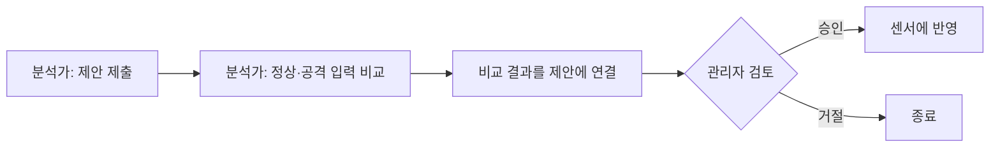

# 운영 가이드

설치 뒤의 상태 확인, 백업, 장애 대응, 증거 보존을 다룹니다. 설치는 [설치 가이드](INSTALL.md), 사건 조사는 [사용 가이드](USER-GUIDE.md)를 봅니다.

## 상태 확인

경보가 없다고 정상인 것은 아닙니다. 관측이나 저장이 멈춰도 경보는 오지 않습니다.

| 주소 | 확인하는 것 | 인증 |
| --- | --- | --- |
| `/health` | 프로세스가 HTTP에 응답함 | 불필요 |
| `/ready` | DB·센서·수집이 준비됨. 아니면 503 | 불필요 |
| `/api/health` | 구성요소별 상태와 실패 원인 | 필요 |
| `/api/observation` | 관측 구간, 단계별 수신·누락 수 | 필요 |
| `/api/support-profile` | 지원 범위와 구성 오류 | 필요 |
| `/metrics` | 이 프로세스의 Prometheus 지표. 분리 설치에서 콘솔의 `/metrics`에는 센서 지표가 없음 | 불필요 |

```bash
curl --fail http://127.0.0.1:38585/ready
docker compose --env-file installation/.env logs --tail=100 netwatcher
```

인증이 필요한 주소는 [API 가이드](API.md#로그인)의 Bearer 토큰을 씁니다.

### 위협 피드

**운영 상태 → 위협 피드**에서 피드별 마지막 성공 시각과 최근 결과(다운로드·캐시·실패)를 봅니다.

- **일부 피드 확인 필요:** 지연되거나 성공 시각을 모르는 피드가 있습니다. 해당 피드부터 확인합니다.
- **확인 불가:** 센서 연결을 먼저 확인합니다.
- 지표 수 `—`는 0개가 아니라 모르는 상태입니다.
- 다운로드에 실패해 캐시를 쓰면 마지막 성공 시각이 바뀌지 않습니다. 탐지는 계속되지만 내용이 오래되므로 실패 원인을 고칩니다.
- 피드 캐시 디렉터리에 쓸 수 없어도 다운로드 실패로 표시됩니다. 서비스 계정이 캐시 경로(`threatfeeds.cache_dir`, 없으면 `XDG_CACHE_HOME/threatfeeds`)에 쓸 수 있는지 확인합니다.
- EVE 콘솔도 피드를 받습니다. EVE 모드에서는 기록과 대조만 하고 차단하지 않습니다. [위협 피드 대조](EVE.md#위협-피드-대조)를 봅니다.

## 분리 센서의 설정 제안

센서와 콘솔을 분리한 구성에서는 **운영 상태 → 설정 제안 승인**에서 포트 스캔 임계값을 바꿀 수 있습니다.



1. 현재 값을 확인하고 제안 값과 이유를 입력해 **제안 제출**을 누릅니다.
2. **검증**에서 정상·공격 특징값 JSON을 각각 올리고 **정상·공격 입력 비교**를 실행합니다. 파일 형식은 [비교 입력](API.md#비교-입력)에 있습니다.
3. 조건을 충족하면 **제안에 검증 결과 연결**을 누릅니다.
4. 관리자가 근거를 보고 **승인** 또는 **거절**합니다.

제안·검증 단계에서는 운영 설정이 바뀌지 않습니다. 조회자는 목록만 봅니다.

"현재 설정이 이미 변경되었다"는 안내가 나오면 새 설정 기준으로 처음부터 다시 제안합니다. 센서 재시작 전에 만든 제안도 마찬가지입니다. 결과를 바로 확인할 수 없으면 같은 변경을 반복하지 말고 **상태 다시 확인**을 누릅니다.

## AI 분석 상태

**AI 분석기** 메뉴에서 실행 상태, 주기, 기록을 봅니다.

| 표시 | 의미 |
| --- | --- |
| 정지 | 구성은 있지만 분석이 돌지 않음 |
| 사용 안 함 | 센서에 AI 분석이 구성되지 않음 |
| 상태 확인 불가 | 센서 연결 확인 후 **새로고침** |

실행 중이어도 분석이 계속 실패할 수 있습니다. **마지막 성공**과 **연속 실패**를 함께 봅니다.

| 실패 종류 | 확인할 것 |
| --- | --- |
| CLI 미설치, 종료 코드 오류, 빈 응답 | 센서 서비스 계정으로 CLI가 실행·로그인되는지 |
| 시간 초과 | `ai_analyzer.copilot_timeout_seconds`, 공급자 상태 |
| 인증 실패, API 키 미설정 | `api_key_env`가 가리키는 환경변수 |
| 호출 한도 초과, 공급자 오류 | 공급자 요금제·상태. 다음 주기에 다시 시도 |
| 응답 형식 불일치 | 모델이 JSON 계약을 따르지 않음. 다른 모델 검토 |
| 일일 호출 상한 도달 | `ai_analyzer.daily_call_limit`. UTC 자정에 초기화 |
| 분석 계정 사용 불가 | `ai_analyzer.service_account` 계정이 있고 활성이며 분석가 이상인지 |

HTTP 공급자는 공급자 옆에 키 설정 여부만 표시하고 키 값은 보여 주지 않습니다.

AI 판정은 참고 자료입니다. AI가 만든 설정 제안도 검증과 관리자 승인을 거쳐야 반영됩니다.

## 백업

업데이트나 중요한 설정 변경 전에 다음을 함께 백업합니다. 같은 시점의 묶음이어야 복원 후 서로 맞습니다.

| 대상 | 비고 |
| --- | --- |
| PostgreSQL DB | 사건, 판정, 계정, 감사 기록 |
| 설정 디렉터리와 `.env` | 비밀값 포함, 접근 제한 |
| Suricata 원본 로그 | EVE 모드에서 원문 조사가 필요할 때 |
| 패킷 증거와 `review-pins.json` | 직접 캡처 모드 |
| `data/recovery` | 복구 파일 기능을 켰을 때 |

Compose 설치의 DB 백업:

```bash
umask 077
docker compose --env-file installation/.env --profile db exec -T db sh -c \
  'pg_dump -U "$POSTGRES_USER" -d "$POSTGRES_DB" -Fc' > panopticon-backup.dump
```

백업 파일에는 사건과 장치 정보가 들어 있으므로 접근을 제한합니다.

### 별도 DB에서 복원 확인하기

운영 DB에 바로 복원하지 않고 임시 DB로 먼저 확인합니다. 백업할 때와 같은 PostgreSQL 버전의 도구를 씁니다.

```bash
export PANOPTICON_RESTORE_DB="panopticon_restore_$(date +%Y%m%d%H%M%S)_$$"
docker compose --env-file installation/.env --profile db exec -T \
  -e PANOPTICON_RESTORE_DB db sh -ceu '
    createdb -U "$POSTGRES_USER" "$PANOPTICON_RESTORE_DB"
    pg_restore -U "$POSTGRES_USER" -d "$PANOPTICON_RESTORE_DB" \
      --exit-on-error --single-transaction --no-owner --no-acl
  ' < panopticon-backup.dump
```

1. 복원한 DB의 사건, 장치 정보, 증거 참조, 감사 기록을 백업 시점과 비교합니다.
2. 새 버전 마이그레이션을 이 DB에 먼저 적용해 봅니다.
3. 문제가 없을 때만 운영 DB를 업데이트합니다.

DB 복원은 원본 EVE 로그나 패킷 파일을 되살리지 않습니다. 이전 버전으로 되돌릴 때는 업데이트 직전 백업, 그 버전의 설정, 증거를 한 묶음으로 씁니다. 새 버전에서 쌓인 데이터는 이 백업에 없으므로 따로 보관합니다. 스키마 다운그레이드 명령만으로 백업 복원을 대신하지 않습니다.

### 보관된 변경 요청

처리가 끝난 센서 변경 요청은 감사 기록만 남기고 정리합니다. 정리된 요청 ID는 다시 쓸 수 없습니다. 재사용이 거절되면 감사 기록의 결과와 현재 센서 설정을 비교하고, 필요하면 새 요청을 만듭니다.

감사 조회 결과가 **미확정**인 요청은 실제 적용 여부를 확인하기 전까지 적용 완료로 바꾸지 않습니다.

## DB 장애와 복구

DB 연결이 끊기면 저장을 재시도합니다. 메모리 대기열과 보존 시간에 상한이 있어서 장애가 길어지면 일부 사건은 잃을 수 있습니다.

복구 파일 기능을 켜면 저장하지 못한 사건을 디스크에 남겨 두고, DB 복구나 재시작 때 같은 사건 ID로 다시 저장합니다. 저장 응답만 잃은 경우에도 중복 행은 생기지 않고, 외부 알림이나 차단은 다시 실행하지 않습니다.

1. DB 연결과 디스크 여유를 확인합니다.
2. `/api/health`의 `components.alert_queue.recovery_spool`에서 대기·거부·만료 수를 봅니다.
3. DB가 돌아온 뒤 대기 파일이 줄고 새 사건이 저장되는지 확인합니다.
4. 손상 파일이 있으면 앱을 멈추고 디렉터리를 통째로 보관합니다. 삭제하거나 빈 파일로 바꾸지 않습니다.
5. 형식, 사건 ID, 크기, 만료 정보를 확인한 뒤 복구합니다.

설정 방법은 [DB 장애 복구 파일](CONFIGURATION.md#db-장애-복구-파일)에 있습니다. 정전이나 디스크 쓰기 실패까지 무손실을 보장하지는 않습니다.

## 패킷 증거 보존

원시 증거는 링 버퍼 크기와 수집 정책에 따라 일부만 남습니다. 사건 상세에서 저장 이력과 현재 파일 상태를 함께 봅니다.

- 관리자가 사유를 입력하면 증거를 최대 24시간 보존할 수 있습니다.
- 전체 보존 상한은 64파일·32MiB이고, 넘으면 새 보존 요청을 거절합니다.
- 보존 파일이 디스크를 채우면 새 증거 기록이 실패할 수 있습니다.
- 보존 상태는 `review-pins.json`에 기록되어 재시작 후에도 유지됩니다. 이 파일이 손상되면 정리와 새 기록이 모두 멈춥니다. 원본을 복사해 둔 뒤 실제 파일과 만료 시각을 대조해 복구합니다.

보존을 일찍 해제하려면 관리자가 호출합니다.

```http
POST /api/events/{event_id}/evidence/pin
Authorization: Bearer <token>
Content-Type: application/json

{"enabled": false, "reason": "조사 종료, 일반 보존으로 전환"}
```

증거 파일은 `GET /api/events/{event_id}/evidence/file`로 내려받습니다. 패킷에는 민감한 내용이 있을 수 있으므로 접근 계정과 반출 범위를 제한합니다.

## 설정 변경 실패

- 대시보드에서 설정을 저장하려면 쓰기 가능한 설정 디렉터리가 필요합니다. Docker 기본 구성은 읽기 전용이라 실패합니다.
- HTTP 200이어도 응답에 `applied=false`와 오류가 있으면 반영되지 않았습니다.
- 제안을 만든 뒤 기반 설정이 바뀌었으면 예전 제안을 승인하지 않고 다시 제안합니다.
- 반영 뒤에는 실제 파라미터와 탐지 동작을 확인합니다.

## 관측 장애

| 증상 | 확인할 것 |
| --- | --- |
| 장치나 통신이 안 보임 | 인터페이스, SPAN 범위, BPF 필터, 실제 통신 발생 여부 |
| 대기열이 계속 늘어남 | DB 지연, 입력 부하, 디스크 지연. 필요하면 수집 범위 축소 |
| 관측 누락 표시 | 같은 단계·같은 시간의 수신 수와 누락 수 |
| 알림 비활성 | 채널 접속 정보와 활성화 설정 |
| 알림 실패·미확정 | 원격 채널의 수신 여부. 중복 가능성을 본 뒤 재전송 |
| 패킷 저장 실패 | 디스크 용량, 파일 상한, 권한, 보존 파일, 저장 대기열 |
| 센서가 주기적으로 재시작 | 아래 [분리 센서 재시작](#분리-센서-재시작) |

누락은 앱, 커널, 스위치 단계별로 따로 봅니다. 측정할 수 없는 구간의 손실을 비율로 추정하지 않습니다.

## 종료와 재시작

```bash
docker compose --env-file installation/.env stop netwatcher
docker compose --env-file installation/.env up -d netwatcher
```

EVE systemd 구성은 `sudo systemctl stop panopticon-eve`, `sudo systemctl start panopticon-eve`를 씁니다.

종료 시간에는 상한이 있어서 디스크가 느리면 저장을 다 끝내지 못할 수 있습니다. 재시작 뒤 `/ready`와 복구 대기열을 확인합니다. 강제 종료됐다면 DB, 증거 파일, 복구 파일 상태를 다시 점검합니다.

### 분리 센서 재시작

콘솔과 센서는 함께 멈추고 함께 올립니다. 데이터 볼륨은 지우지 않습니다.

```bash
COMPOSE="docker compose --env-file installation-native/.env -f docker-compose.yml -f docker-compose.native.yml --profile db"
$COMPOSE stop netwatcher native-sensor
$COMPOSE up -d netwatcher native-sensor
```

센서는 DB에 실행 소유권(리스)을 주기적으로 갱신합니다. 갱신을 확인하지 못하면 이중 실행을 막으려고 입력을 멈추고 종료하며, 오케스트레이터가 다시 띄웁니다.

- 재시작 직후에는 이전 실행의 리스가 만료될 때까지 연결이 늦어질 수 있습니다.
- 재시작이 반복되면 센서 로그에서 `Sensor lease unconfirmed`를 찾습니다. 같은 시각의 DB 응답 시간, 센서의 CPU 스로틀링과 메모리 압력을 함께 확인합니다.
- 재시작 직전에 이벤트 루프 지연이 수십 초로 치솟고 메모리가 일정 값에 붙어 있으면 센서의 메모리 상한이 작은 것입니다. 상한에 닿으면 커널이 회수를 반복하며 프로세스를 멈추고, 그동안 리스가 만료됩니다. 엔진과 위협 피드를 모두 올린 센서는 600~700MiB를 씁니다. systemd 설치는 센서 유닛에 `MemoryHigh=1536M`, `MemoryMax=2G`를 둡니다. 이전 설치 파일로 만든 유닛은 drop-in(`/etc/systemd/system/<센서 유닛>.d/memory.conf`)으로 올립니다.
- **관측** 탭의 센서 패널(이벤트 루프 지연, 리스 갱신 시간, 메모리, CPU 스로틀링)에서 재시작 직전의 값을 봅니다. 센서가 30초마다 남기는 표본이며 `sensor_samples` 테이블에 7일 보관합니다. 표본 주기는 `native.sample_seconds`(5~300초)로 바꿉니다.
- 연결이 돌아오면 관측 상태, 엔진 설정, 마지막 변경의 감사 기록을 확인합니다. 결과를 모르는 변경은 반복하지 않습니다.

재기동할 때는 이전 센서가 만든 것으로 확인된 소켓 파일만 정리합니다. 실행 중인 프로세스가 있거나 소유를 확인할 수 없는 파일이 있으면 시작을 멈춥니다. 소켓 오류가 계속되면 센서 PID, 소켓 경로, 파일 소유권을 확인합니다. 소켓 디렉터리를 통째로 지우지 않습니다.
