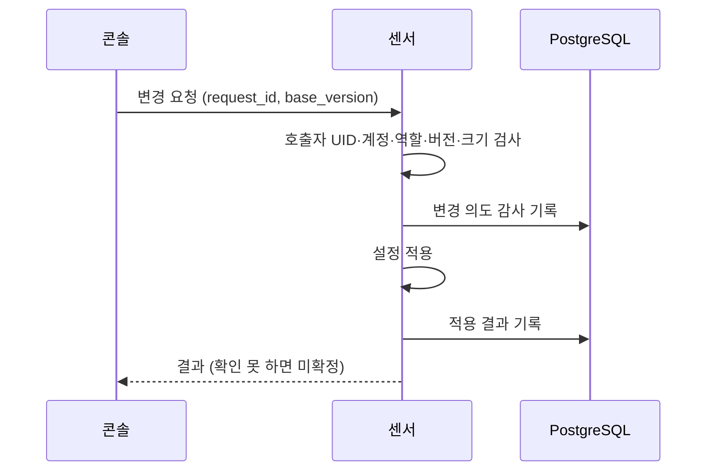

# 실행 권한과 분리 배포

기본 구성은 Suricata EVE 로그를 읽는 콘솔 하나이고 특별한 권한이 필요 없습니다. 패킷을 직접 캡처할 때는 콘솔과 센서를 다른 프로세스·다른 계정으로 나눕니다.

## 구성별 권한

| 구성 | 하는 일 | 권한 |
| --- | --- | --- |
| EVE 콘솔 | 로그를 읽고 사건 저장·조사 | 일반 사용자. 캡처·방화벽 권한 없음 |
| 직접 캡처 콘솔 | 조회, 판정, 승인 | 일반 사용자. 패킷 소켓·방화벽 명령 없음 |
| 직접 캡처 센서 | 지정 인터페이스 캡처·탐지 | `NET_RAW`만. `NET_ADMIN` 없음 |
| 독립 실행기 | 승인된 조치의 의도와 결과 기록 | `shadow` 모드만 제공. OS 방화벽을 바꾸지 않음 |

설치 방법은 [설치 가이드](INSTALL.md)(Docker Compose), [호스트 센서·콘솔 설치](NATIVE-SYSTEMD.md)(systemd), [EVE 연결](EVE.md)을 봅니다.

## 콘솔과 센서 사이

- 콘솔은 미리 정해진 조회와 설정 변경만 요청할 수 있습니다.
- 센서는 감사 기록을 남긴 뒤에 변경하고, 적용을 확인하지 못하면 성공으로 응답하지 않습니다.
- 콘솔·센서·마이그레이션은 각각 다른 DB 계정을 씁니다. 마이그레이션 계정은 설치와 업데이트 때만 씁니다.
- 센서의 설정과 증거 저장 공간은 콘솔과 분리돼 있습니다.

설치 도구가 만든 비밀번호와 `*.env` 파일은 공개하거나 저장소에 올리지 않습니다.

## 접속과 차단

- 콘솔은 기본적으로 루프백 주소에만 열립니다. 외부에서 접속하려면 인증, HTTPS, 관리망 접근 제한을 먼저 설정합니다.
- 센서는 패킷을 보려고 호스트 네트워크를 씁니다. 캡처 인터페이스와 호스트 접근 범위를 함께 검토합니다.
- SPAN은 트래픽 복사본입니다. 센서의 방화벽 규칙을 바꿔도 다른 장치 사이의 통신은 막히지 않습니다.
- 실제 차단은 트래픽이 지나는 경로, 대상, 만료, 재시작 후 복구를 검증한 구성에서만 판단합니다. `shadow` 모드 결과는 차단이 됐다는 증거가 아닙니다.
