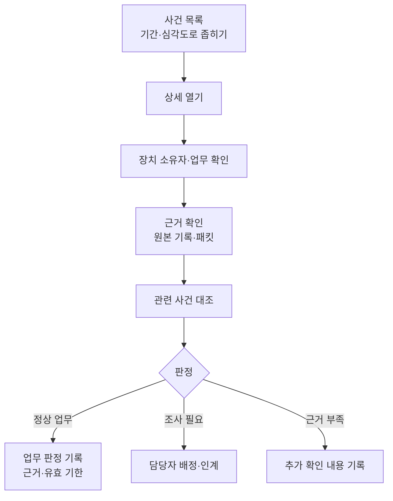
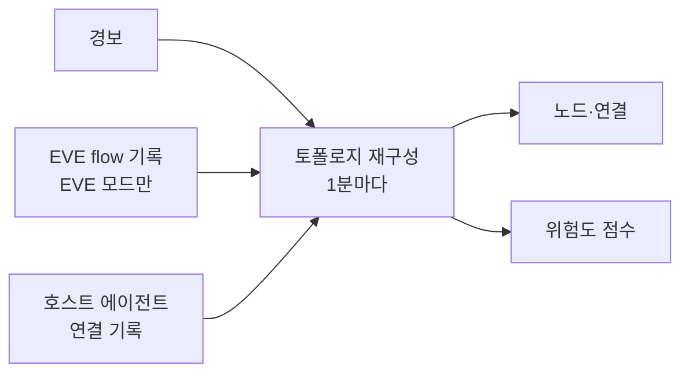

# 사용 가이드

경보가 오면 탐지 이름만 보고 조치하지 말고 실제 통신과 업무 목적을 먼저 확인합니다. 이 가이드는 그 조사에 쓰는 화면을 설명합니다.

## 처음 접속했을 때

설치 점검에서 인터페이스·관측 범위·저장소·인증을 확인합니다. 첫 화면에서는 관측 상태, 최근 통신 변화, 검토할 사건을 볼 수 있습니다. 요약은 최근 사건 일부를 사용하므로 전체 이력이 필요하면 사건 목록에서 기간과 필터를 지정하세요.

`Ctrl+K` 또는 `Cmd+K`로 화면을 검색해 이동할 수 있습니다. 사건·자산 상세는 `Escape`로 닫고, `Tab`으로 조작 항목을 이동합니다. 상세를 열어 둔 동안 도착한 새 경보는 알림 표시를 확인한 뒤 목록을 갱신하세요.

## 사건 조사 순서

1. **기간과 장치를 좁힙니다.** 사건 목록에서 심각도·엔진·검색어·기간을 지정합니다.
2. **상세를 엽니다.** 출발 장치와 상대, 관측 신호, 발생 횟수와 시간을 확인합니다. 집계된 횟수는 같은 유형의 반복 관측 수이며, 각각의 원본 패킷이 보존됐다는 뜻은 아닙니다.
3. **장치 소유자와 업무를 확인합니다.** IP가 여러 장치에 공유되거나 소유 관계가 바뀌었다면 현재 장치인지부터 확인합니다.
4. **근거를 확인합니다.** 패킷이 저장돼 있는지, 현재 파일을 열 수 있는지, 원자료가 누락됐는지 봅니다.
5. **관련 사건을 함께 봅니다.** 인시던트 화면에서 같은 장치와 시점의 다른 경보를 확인합니다.
6. **조치와 확인 결과를 기록합니다.** 업무 정상 여부, 조사 결과, 설정 변경이나 네트워크 조치 내용을 남깁니다.

대표적인 조사 절차는 [포트 스캔](playbooks/port-scan.md), [ARP 위조](playbooks/arp-spoof.md), [의심스러운 내부 이동](playbooks/ransomware-lateral.md)에서 확인할 수 있습니다.

## 먼저 처리할 사건 확인

사건 화면의 **처리 우선순위**는 보존 중인 전체 사건을 집계합니다. 최근 24시간 요약이나 개별 목록의 검색 조건에 제한되지 않습니다. 분류를 선택해 사건을 열고 근거와 담당자를 확인하세요. 심각도가 높은 사건부터, 같은 심각도에서는 최근 발생 순으로 표시합니다.

- **미종결**: 처리 상태가 종결이 아닌 사건입니다.
- **미배정·미종결**: 미종결 사건 중 담당자가 없는 사건입니다.
- **판정 기록 없음·미종결**: 미종결 사건 중 업무 판정을 저장하지 않은 사건입니다.
- **정상 판정 기한 만료**: 정상 백업 또는 승인 작업으로 판정했지만 유효 기한이 지난 사건입니다. 이미 종결한 사건도 포함합니다.

한 사건이 여러 분류에 포함될 수 있으므로 각 수를 더해 전체 사건 수로 사용하지 마세요. 기한 만료 외에도 장치 변경, 통신량 증가, 작업 취소로 정상 판정이 재검토 대상이 될 수 있습니다. 현재 유효 여부는 사건 상세의 **업무 판정**에서 확인합니다.

탐지 설정 제안 기능을 사용하는 경우 승인 대기 건수와 운영 화면 이동 버튼을 보여 줍니다. 승인 대기는 제안의 저장 상태이며 적용 가능 여부는 제안의 검증 결과를 확인해야 합니다. 기능을 사용하지 않거나 조회에 실패한 경우를 0건으로 표시하지 않습니다. **새로고침**을 눌러 최신 처리 상태를 확인하세요.

**정상 판정 재검토**를 선택하면 보존 중인 정상 판정을 현재 근거와 다시 대조합니다. 기한 만료뿐 아니라 장치 소유 관계 변경, 통신 상대 변경, 흐름 근거 누락·변경, 통신량 한도 초과, 작업 일정 취소·연결 변경으로 유효하지 않은 판정을 표시합니다. 종결된 사건도 포함하며, 사건 버튼 아래에 재검토 사유를 보여 줍니다.

조회는 기존 판정을 덮어쓰지 않습니다. 사건 상세에서 현재 증거를 확인한 뒤 새 판정을 기록하세요. 조회 한 번에 평가할 수 있는 보존 정상 판정은 최대 1,000건입니다. 그보다 많거나 전체 평가가 제한 시간 안에 끝나지 않으면 일부만 평가한 건수를 반환하지 않습니다. 다른 처리 분류와 개별 사건 조회는 계속 사용할 수 있습니다.

## 반복 경보 조사

EVE 경보 상세의 **반복 경보**에서 같은 센서·입력 파일·규칙·출발지·목적지·서비스의 경보를 함께 볼 수 있습니다. 묶음은 UTC 기준 정시부터 다음 정시 직전까지 1시간입니다. 규칙 개정, 심각도, 차단 동작, MAC 정보가 다르면 별도로 표시합니다. 출발 포트와 흐름 ID는 묶음 기준에서 제외하므로 같은 서비스로 연결을 반복한 경우도 함께 볼 수 있습니다.

**판정 기록 없음**은 아직 업무 판정을 저장하지 않은 경보 수이고, **미종결**은 처리 상태가 종결이 아닌 경보 수입니다. 판정 기록이 있다는 표시만으로 현재 정상 통신이라고 판단하지 마세요. 경보를 열면 판정의 만료, 장치 변경, 작업 취소 등 재검토 사유를 확인할 수 있습니다.

경보 버튼을 눌러 개별 증거와 담당자를 확인하세요. 한 경보를 정상으로 판정하거나 종결해도 다른 경보에 적용되지 않습니다. 새 경보는 별도로 조사해야 합니다. 묶음은 보존 중인 경보만 보여 주며, 원본 경보를 합치거나 기간 보고서의 발생 수를 바꾸지 않습니다. 주소가 빠진 경보는 다른 미확인 장치와 묶지 않습니다. MAC 정보가 없는 경보는 같은 주소의 통신을 함께 표시할 뿐, 같은 장치에서 발생했다고 보장하지 않습니다.

사건 목록의 **반복 경보 묶음**을 펼치면 여러 묶음을 한꺼번에 확인할 수 있습니다. 기본은 최근 24시간이고 최대 7일까지 선택할 수 있습니다. 날짜와 시각은 브라우저의 현지 시간으로 입력합니다. 심각도가 높은 묶음, 판정 기록이 없는 경보가 많은 묶음, 미종결 경보가 많은 묶음 순으로 표시합니다. 같은 조건이면 최근 발생 순입니다.

묶음 버튼은 가장 최근 경보를 엽니다. 그 상세의 **반복 경보**에서 다른 발생 건으로 이동하세요. 목록 건수는 선택한 기간 기준이고, 상세는 해당 1시간 전체를 보여 주므로 기간이 정시 중간에서 시작하거나 끝나면 두 건수가 다를 수 있습니다. 개별 목록의 필터는 묶음 조회에 적용되지 않습니다. 50,000건을 넘는 기간은 조회를 거절하므로 기간을 줄여 다시 조회하세요. 묶음 조회를 다시 누르면 새 경보와 변경된 처리 상태를 반영합니다.

## 이전 경보와 비교

EVE 사건 상세에서 **같은 조건의 이전 경보**를 펼치세요. 현재 UTC 1시간 묶음보다 앞선 최대 30일 동안 보존된 기록 중 센서·입력·규칙·IP/MAC 정보·프로토콜·목적지 포트가 같은 경보를 보여 줍니다. 현재 시간대의 반복은 **반복 경보**에서 확인합니다. 출발 포트와 흐름 ID는 비교 기준에서 제외합니다.

이전 담당자, 처리 상태, 저장된 판정과 근거, 판정 당시의 장치 역할, 마지막 인계 메모를 비교할 수 있습니다. 경보 버튼을 누르면 그 사건의 전체 근거와 이력을 엽니다. 표시된 판정은 저장 당시의 기록이며 현재도 유효한 정상 판정이라는 뜻이 아닙니다. 과거에 정상으로 처리한 경보가 있어도 현재 경보는 별도로 조사해야 합니다.

주소가 빠진 경보는 비교하지 않습니다. MAC 정보가 없는 경보는 같은 주소의 기록만 비교하며 동일 장치라고 확정하지 않습니다. 보존 기간이 지나 삭제된 경보는 검색할 수 없습니다.

## 보존 기록의 첫 관측

EVE 모드의 첫 화면에서 **보존 기록의 첫 관측**을 확인하세요. 최신 경보 몇 건이 아니라 보존 중인 전체 경보·흐름·DNS·TLS 기록을 비교해 최근 24시간에 처음 나타난 주소·MAC 정보와 통신 상대·서비스를 보여 줍니다. **첫 관측 분류**를 바꾸고 관련 경보를 열어 근거를 조사할 수 있습니다. 흐름만 있고 경보가 없는 항목도 표시하지만 새 경보를 만들지는 않습니다.

주소는 센서·입력·IP·단일 MAC 정보로, 통신은 센서·입력·출발지/목적지 IP와 단일 MAC 정보·프로토콜·목적지 포트로 구분합니다. 같은 IP의 MAC 정보나 상대 서비스가 달라지면 별도 항목입니다. 로그의 정보만으로 장치 소유 관계를 확정하지 않습니다.

이 화면의 “처음”은 **현재 보존 기록 안에서 처음**이라는 뜻입니다. 망에 새로 들어온 장치이거나 과거에 한 번도 통신하지 않았다는 뜻이 아닙니다. 과거 로그가 삭제되면 비교 기준도 달라집니다. 가장 오래된 보존 관측 시각과 조회 기준 시각을 함께 확인하세요. 미래 시각의 로그는 최근 첫 관측에서 제외하고 건수를 별도로 알려 줍니다.

집계 대상 기록이 250,000건을 넘거나 조회에 실패하면 결과를 알 수 없다고 표시합니다. 최신 기록 일부만 읽어 처음 관측된 것처럼 보여 주지 않습니다. **첫 관측 새로고침**으로 다시 조회할 수 있습니다.

## 사건별 업무 판정

사건 상세의 **업무 판정**에서 관리자는 조사 필요·근거 부족·확인한 백업 작업·승인된 점검 중 하나를 선택하고 근거를 기록합니다. 판정은 해당 사건에만 적용하며 원래 경보·심각도·탐지 설정은 바꾸지 않습니다.

EVE 사건을 정상 업무로 확인하려면 장치의 IP·MAC 소유 관계와 상대·프로토콜·포트가 확인돼야 합니다. 같은 센서·입력에서 해당 흐름의 전송량 근거도 있어야 합니다. 확인할 전송량 상한과 유효 시간을 입력하세요. 유효 시간은 최대 168시간이며 장치 역할 확인이 먼저 만료되면 그 시각까지만 적용됩니다.

흐름 ID·주소·프로토콜·포트가 일치하고 경보 시각이 흐름의 시작부터 마지막 패킷 시각 사이에 있으면 로그 파일이 회전해도 연결합니다. 시작·마지막 패킷 시각이 모두 없는 기록은 같은 파일 세대에서 경보 시각 전후 5분 안의 자료만 사용합니다. 조건에 맞는 근거가 없으면 **근거 부족**을 선택하고 추가로 확인할 내용을 기록하세요.

같은 통신의 누적량이 늘어도 승인한 전송량 한도 안이면 정상 판정을 유지합니다. 확인 만료, 소유 관계·통신 범위 변경, 근거 누락·충돌, 카운터 감소, 전송량 상한 초과는 **재검토 필요**로 표시합니다.

**판정 변경 이력**에는 기록 당시 판정·근거·만료 시각과 통신 범위를 남깁니다. 새로 저장한 정상 판정의 전송량 상한과 당시 확인한 장치 역할도 보존합니다. 과거의 정상 확인이 지금도 유효하다는 뜻은 아니므로 현재 상태는 위의 **업무 판정**에서 확인하세요. 이력은 최대 1,000건이며 **이전 판정 더 보기**로 과거 기록을 조회합니다. 업그레이드 전 자료는 남아 있는 최신 판정부터 보존합니다.

다른 판정이 먼저 저장됐거나 저장 결과를 확인하지 못하면 **판정 다시 조회**로 현재 상태를 확인한 뒤 수정합니다. 보존 기간이 지난 EVE 사건을 삭제할 때 해당 업무 판정도 정리하므로 오래 유지할 조사 근거는 백업에 포함하세요.

## 사건 담당자와 인계

사건 상세의 **담당자와 인계**에서 관리자는 담당자, 처리 상태, 다음 사람이 확인할 내용을 기록합니다. 상태는 **미처리**, **조사 중**, **처리 완료**입니다. 관리 계정 모드에서는 **담당 계정**을 선택해 개인에게 배정할 수 있습니다. 선택한 계정의 사용자 이름이 자동으로 입력됩니다.

이름이나 팀명만 남기려면 **표시 이름 직접 입력 또는 미배정**을 선택합니다. 이전 기록의 표시 이름이 계정 이름과 같아도 개인에게 배정된 것으로 취급하지 않습니다. 담당 계정이 비활성화되면 사건에 안내가 표시되므로 업무를 이어갈 담당자를 확인해 재배정하세요. 이전 배정과 인계 기록은 유지됩니다.

**인계 저장**을 누를 때마다 담당자·상태·메모·기록한 사람·시각이 이력에 추가됩니다. 기존 메모는 화면에서 수정하거나 삭제할 수 없습니다. 같은 담당자와 상태로 메모만 추가할 수도 있습니다. 처리 완료로 바꿔도 원래 경보와 업무 판정은 유지되므로 정상 여부는 **업무 판정**에 따로 기록하세요.

다른 사람이 먼저 변경했거나 저장 결과를 확인하지 못하면 **인계 다시 조회**를 눌러 현재 기록을 확인합니다. **이전 기록 더 보기**로 과거 이력을 조회할 수 있습니다. 메모는 3~1,024자, 사건별 이력은 최대 1,000건입니다. 사건이 보존 기간에 따라 삭제되면 인계 기록도 삭제되므로 보관할 자료는 DB 백업에 포함하세요.

## 담당자별 목록과 주간 보고서

관리 계정으로 로그인하면 **내 담당 사건만**으로 자신에게 배정된 사건을 조회할 수 있습니다. 이 선택은 계정에 연결된 사건만 포함합니다. 이름만 같은 기록은 포함하지 않으며, 개별 사건 내보내기에도 같은 선택이 적용됩니다.

사건 목록에서 **목록 처리 상태**를 미처리·조사 중·처리 완료로 선택하고 **담당자 이름·팀명**에 저장한 이름을 입력하면 해당 담당자의 사건을 찾을 수 있습니다. 이름은 정확히 일치해야 합니다. **담당자 미지정만**을 선택하면 아직 배정되지 않은 사건만 표시합니다. 인계 기록이 없는 사건은 미처리·담당자 미지정으로 취급합니다. 목록의 **담당자 · 상태** 열에서 현재 배정을 확인하세요.

**최근 7일 CSV**는 다운로드 시점부터 지난 7일 동안 발생한 보존 사건의 현재 담당자·처리 상태와 마지막 인계 메모를 담습니다. 목록의 검색·필터와는 별개입니다. CSV는 UTF-8이며 각 행에 조회 기간과 조회 시각이 포함됩니다. 사건이 10,000건을 넘으면 일부만 내려받지 않고 거절합니다. 이때는 API에서 더 짧은 기간을 지정하세요.

`occurrence_count`는 사건에 기록된 반복 발생 횟수입니다. 반복 집계가 없는 사건은 1, 횟수를 확인할 수 없는 집계 사건은 빈칸입니다. 처리 완료는 경보가 정상이라는 뜻이 아닙니다. 일반 **CSV/JSON 내보내기**는 현재 목록의 검색·담당자·처리 상태 필터를 적용합니다.

## 승인 작업 일정 등록과 사건 연결

EVE 사건 상세의 **등록한 승인 작업**에서 백업·취약점 검사·배포·점검 일정을 기록합니다. **작업 일정 수동 등록**을 열고 작업명, 담당자, 변경 번호, 승인 근거, 장치·상대 IP, 프로토콜, 시간과 흐름별 전송량 상한을 입력하세요. 화면의 시작·종료 시각은 브라우저 시간대를 사용합니다. MAC을 입력하면 IP·MAC이 모두 맞아야 하며, 상대 포트를 비우면 해당 상대의 모든 포트를 작업 범위로 기록합니다.

**이 사건에 일치하는 작업**은 경보 시각이 작업 시작 이상·종료 미만이고 통신 범위가 맞는 일정을 보여줍니다. **이 작업 연결**을 누르면 담당자와 변경 번호를 사건에 연결합니다. 작업 시작 후 등록한 일정은 그 사실을 표시합니다. 일정은 담당자가 등록한 조사 근거이며, 업무 판정은 따로 기록합니다.

연결한 일정이 있는 사건을 정상으로 판정하면 그 일정의 근거도 판정 이력에 남습니다. 판정의 전송량 상한은 작업의 흐름별 한도를 넘을 수 없습니다. 나중에 일정을 취소하거나 연결을 바꾸면 해당 일정에 근거한 정상 판정은 **재검토 필요**가 됩니다. MAC·소유 관계·흐름 근거 확인은 기존 정상 판정 조건을 따릅니다.

여러 일정을 등록하려면 **CSV 작업 일정 가져오기**에서 양식을 내려받고 열 이름을 유지해 UTF-8로 저장하세요. 최대 128KiB·100행이며 시각은 시간대가 있는 ISO 8601 형식입니다. 한 행이라도 잘못됐거나 저장이 실패하면 전체를 저장하지 않습니다. 같은 내용은 다시 등록하지 않으며 결과에서 신규·기존·파일 내 중복 건수를 확인할 수 있습니다.

**등록 일정 전체 목록**에서 다른 사건·미래 작업의 일정도 조회하고 취소할 수 있습니다. 작업 내용은 수정하지 않으므로 변경이 필요하면 취소 사유를 기록하고 새 일정을 등록합니다. 작업 기간은 최대 31일, 보관 한도는 2,000건입니다. 새 일정 등록 시 종료 후 90일이 지난 미연결 일정을 정리하며, 사건에 연결된 일정은 사건 보존 정리로 연결이 해제될 때까지 남습니다.

## 장치 역할과 정상 업무 확인

장치 상세에서 관리자는 NAS·백업 서버·DB 등 역할과 소유 관계를 확인할 수 있습니다. 근거와 유효기간을 입력한 뒤 현재 IP/MAC이 해당 장치의 것인지 확인해 저장합니다.

정상 백업처럼 반복되는 업무는 **기대 업무 통신**에 등록합니다.

- 상대 IP와 MAC, TCP/UDP, 서비스 포트
- 업무 시간대와 요일
- 한 탐지 주기에서 허용할 최대 전송량
- 업무 목적과 확인 근거

규칙을 추가한 뒤 소유 관계 확인과 함께 저장해야 반영됩니다. 고급 JSON 편집도 제공합니다. 자정을 넘는 일정은 날짜별로 나눠 등록하세요.

확인된 NAS·백업·DB의 트래픽 변화가 모든 조건과 일치하면 업무 활동으로 표시하고 심각도를 낮춥니다. 새 상대, 소유 관계 변경, 만료, 관측 정보 부족, 전송량 초과에는 적용하지 않습니다. 스캔·주소 위조 등 다른 공격 탐지는 그대로 유지됩니다.

## 패킷 증거 보존

사건 상세에서 저장 이력과 현재 파일 상태를 확인합니다. 조사 중인 증거는 관리자가 사유를 입력해 최대 24시간 보존할 수 있습니다. 보존된 파일은 일반 정리 대상에서 제외됩니다.

파일이 없거나 기록이 실패했다면 해당 사건의 패킷을 조회할 수 없습니다. 저장 이력만 보고 파일이 남아 있다고 판단하지 마세요. 파일 다운로드에는 조회 권한이 필요하며, 패킷에 포함된 주소와 내용을 다룰 때는 조직의 자료 취급 기준을 따릅니다.

분리 Native 콘솔에서는 사건 상세에서 **상태 다시 조회**로 현재 파일 상태를 확인하고 **PCAP 내려받기**로 파일을 저장합니다. 관리자는 **검토 중 24시간 보존** 또는 **검토 보존 해제**를 선택하고 사유를 입력합니다. 보존 상한은 64파일·32MiB입니다. 변경 결과가 불확실하면 버튼이 잠깁니다. 상태와 변경 감사 기록을 확인한 뒤 다시 검토하세요.

Native 콘솔의 다운로드는 파일당 최대 32MiB, 동시 2개로 제한합니다. 저장 기록에 해시가 있으면 실제 파일과 대조합니다. 전송 중 파일이나 로그인 권한이 바뀌면 다운로드를 중단합니다. 내려받지 못했다면 현재 파일 상태를 다시 확인하세요.

## 관련 사건 해결하기

**인시던트** 화면에서 관련 경보와 공격 진행 단계를 함께 확인합니다. 조사를 마친 관리자는 **해결 처리**를 누릅니다. 해결된 사건을 다시 보려면 **해결된 항목 포함**을 선택하세요. 조회자와 분석가는 사건을 볼 수 있지만 해결 처리할 수는 없습니다.

해결 결과를 확인하지 못했다는 안내가 나오면 **새로고침**으로 현재 상태를 확인하세요. 확인 전에는 추가 해결 요청을 막습니다. 사건을 불러오지 못했다는 안내는 조회 실패를 뜻하며, 사건이 없다는 뜻이 아닙니다.

## 상태를 읽는 방법

| 표시 | 의미와 다음 행동 |
| --- | --- |
| 준비되지 않음 | DB·센서·저장소 등 실패한 구성요소를 확인 |
| 관측 없음 | 인터페이스·관측 위치·실제 통신 발생 여부를 확인 |
| 정보 없음·확인 불가 | 해당 범위의 결론을 보류하고 추가 근거 확보 |
| 기준선 학습 중 | 정상 업무가 충분히 관측됐는지 확인 |
| 기준선 동결 | 이상 입력이 학습에 반영되지 않는 상태. 관련 사건 조사 |
| 알림 비활성·전달 실패 | 채널 설정과 전달 상태를 확인 |
| 증거 누락·저장 미확정 | 다른 기록을 확보하고 [운영 가이드](OPERATIONS-GUIDE.md)에서 저장 장애 확인 |

AI 분석을 켜면 사건 설명과 설정 후보를 검토할 수 있습니다. AI가 승인과 차단을 수행하지는 않습니다.

## 탐지 설정 변경

정책·검증 화면에서 제안을 선택하고 변경 전후 값을 확인합니다. 일반적인 승인 흐름은 다음과 같습니다.

1. 정상 업무와 공격을 대표하는 특징값 JSON 파일을 각각 준비합니다. 업로드 파일은 패킷 파일이 아니며, 필요한 형식은 [API 가이드](API.md#비교-입력)를 참고하세요.
2. 두 입력의 분류를 확인하고 비교를 실행합니다.
3. 정상 입력에서 줄어든 관측과 공격 입력에서 유지된 관측을 확인합니다.
4. 비교 결과를 제안에 연결합니다.
5. 관리자가 변경 내용과 근거를 검토해 승인합니다.

제안 승인에 연결할 수 있는 변경은 현재 `port_scan.threshold`입니다. 공격 입력에 기존 관측이 없거나 변경 후 관측이 사라지거나 달라지면 연결할 수 없습니다. 현재 설정과 제안의 기준값이 다르거나 비교할 수 없는 변경도 승인되지 않습니다.

특징값 비교는 샘플에 기록된 IP/MAC 연결 관계, 접근 포트와 전송량을 비교합니다. 운영 엔진의 모든 조건을 재현하거나 전체 네트워크의 공격 탐지를 보증하는 검사는 아닙니다.

승인 후에는 적용 결과를 확인하세요. `failed`나 `applied=false`라면 설정이 반영된 상태가 아닙니다. 읽기 전용 배포에서는 [설정 쓰기 허용](CONFIGURATION.md#대시보드에서-설정-저장)이 필요합니다.

## 특징값 리플레이

리플레이는 같은 통신 특징값에 두 설정을 적용해 관측 차이를 비교하는 기능입니다. Native 콘솔에서 사용할 수 있습니다. 포트 스캔·ARP 위조·데이터 유출의 지원 항목과 상한은 비교 화면에서 확인하세요. 분석가와 관리자는 비교를 실행하고, 조회자는 저장된 결과를 볼 수 있습니다.

비교는 운영 사건과 센서 설정을 바꾸지 않습니다. 실제 패킷을 센서에 다시 통과시키는 시험과는 다르므로 경보가 줄었다는 결과만으로 오탐 감소나 탐지 성능 개선을 확정하지 마세요. 입력의 정상·공격 구분과 비교 불가 사유를 함께 검토하세요.

## 탐지 예외 목록 관리

직접 캡처 모드의 **탐지 예외** 화면에서 IP·IP 대역·MAC·도메인·도메인 접미사를 조회합니다. 관리자는 **항목 추가**로 등록하고 각 행의 **제거**로 삭제합니다. 도메인 접미사는 `.example.com`처럼 점으로 시작합니다. 장치나 경보 상세에서도 해당 주소를 예외에 추가하거나 제거할 수 있습니다.

변경 중에는 다른 예외 변경을 할 수 없습니다. 변경이 거절되거나 결과를 확인하지 못했다면 **목록 다시 조회**로 현재 내용을 확인한 뒤 진행하세요. 버튼을 반복해서 눌러 재실행하지 마세요. 조회 계정은 목록만 확인할 수 있습니다.

탐지 예외는 한 사건의 판정과 별개로 이후 탐지에도 적용됩니다. 특정 업무 시간이나 상대와의 통신만 정상으로 인정하려면 장치 역할·업무 판정을 사용하세요.

## 시그니처 규칙 관리

직접 캡처 모드에서는 **방어** 메뉴에서 현재 적용된 시그니처 규칙을 확인합니다. 관리자는 규칙의 활성 상태를 바꾸고 **규칙 다시 읽기**로 센서의 규칙 파일을 불러올 수 있습니다. 외부 Suricata를 사용하는 EVE 모드에서는 Suricata에서 규칙을 관리하세요.

활성 상태 변경은 현재 센서 실행에 적용됩니다. 재로드·재시작 후에도 유지하려면 규칙 파일의 설정을 함께 수정하세요. 파일을 읽거나 검증하지 못하면 기존 규칙을 유지합니다.

변경이 거절되거나 결과를 확인하지 못하면 **다시 조회**로 현재 상태를 확인한 뒤 조작합니다. 조회도 실패하면 센서 상태를 먼저 확인하세요. 조회 권한으로 로그인한 사용자는 규칙을 변경할 수 없습니다.

## 위협 지표 목록 관리

**차단 목록**에는 탐지에 사용할 IP·CIDR 대역·도메인을 등록합니다. 목록 등록만으로 방화벽이 트래픽을 차단하지는 않습니다.

관리자는 **항목 추가**에서 유형·주소·등록 근거를 입력합니다. 사용자 항목의 **등록 근거**를 누르면 저장된 근거와 실제 등록 시각을 확인할 수 있습니다. 조회자도 근거를 볼 수 있지만 추가·삭제는 할 수 없습니다. 긴 기존 근거는 앞부분만 표시합니다.

**삭제**는 사용자 항목을 제거합니다. 같은 지표가 외부 피드에도 있으면 탐지를 유지합니다. 변경 거절이나 결과 미확정 안내가 나오면 요청을 반복하지 말고 **새로고침**으로 현재 목록을 확인하세요. 조회가 실패하면 추가·삭제를 잠근 상태로 유지합니다.

## 방어 화면에서 조치 검토

독립 실행기를 사용하는 구성에서는 **방어 → 조치 검토**에서 제안과 승인된 조치를 확인합니다. 현재 지원하는 Shadow 모드는 검토와 실행 요청을 기록하며 실제 트래픽을 차단하지 않습니다.

1. 제안의 대상 장치, 소유 관계 확인 시각과 **영향 범위 확인**을 검토합니다. 관측된 관련 자산과 확인되지 않은 관련 자산을 구분해 읽으세요.
2. 관리자가 승인 사유를 입력하고 **승인 기록**을 누릅니다. 승인만으로 실행되지 않습니다. 대상 소유 관계나 지원 범위를 확인할 수 없으면 승인 버튼이 표시되지 않습니다.
3. 승인된 조치에서 유효기간을 확인한 뒤 **실행 의도 기록**을 누릅니다. Shadow 모드의 결과는 실제 적용을 확인한 상태가 아니므로 **미확정**으로 표시합니다.
4. **결과 영수증**에서 요청과 조회 결과를 확인합니다. **실제 상태 대조**와 **해제 요청**도 Shadow 모드에서는 방화벽을 변경하지 않습니다.

요청 결과를 받지 못하면 화면은 자동으로 다시 요청하지 않습니다. **새로고침**으로 승인·조치 기록을 확인하세요. 조회자와 분석가는 기록과 영향 범위를 읽을 수 있으며, 승인·실행·상태 대조·해제 요청은 관리자만 할 수 있습니다.

## 개인 계정 관리

관리 계정 모드를 사용하면 관리자에게 **계정** 메뉴가 보입니다. **계정 만들기**에서 사용자 이름·초기 비밀번호·역할을 입력합니다. 조회자는 자료를 조회하고 내보낼 수 있으며, 분석가는 제공되는 분석·제안 기능을 함께 사용합니다. 관리자는 계정·설정·승인과 차단을 관리합니다.

조직 계정을 연결하려면 해당 사용자의 **조직 계정 연결**을 열고 공급자의 발급자 주소(`iss`)와 사용자 식별자(`sub`)를 입력합니다. OIDC가 설정된 콘솔에서는 로그인 화면의 **조직 계정으로 로그인**을 사용할 수 있습니다. 연결·해제는 해당 계정의 기존 로그인을 해제합니다. 조직 계정의 권한도 이 화면에 지정한 역할을 따릅니다.

계정별 **역할·상태 저장**으로 역할과 로그인 허용 여부를 변경합니다. **비밀번호 재설정**에 새 비밀번호를 입력하면 해당 계정의 이전 로그인은 해제됩니다. 마지막 활성 관리자 계정은 유지해야 합니다. 사용 중인 자기 계정을 변경하면 다시 로그인하세요.

다른 변경이 먼저 저장되면 현재 목록을 확인한 뒤 다시 입력합니다. 결과를 확인할 수 없다는 안내가 나오면 요청을 반복하지 말고 **변경 기록 확인**과 현재 계정 상태를 먼저 확인하세요. 계정 관리 메뉴가 없다면 관리자에게 역할을 확인하거나 [관리 계정 설정](CONFIGURATION.md#인증과-https)을 확인하세요.

## 운영 테마 선택

헤더의 테마 선택에서 **Operator**, **Auditor**, **Cinematic**을 전환합니다. Operator는 기본 고대비 녹색 계열 다크 테마, Auditor는 모노크롬과 큰 글씨 중심 테마, Cinematic은 네온 앰버 HUD 테마입니다. 선택은 현재 브라우저에 저장됩니다. 저장을 허용하지 않는 브라우저에서도 현재 화면에는 적용됩니다.

스캔라인과 효과음은 기본 OFF이며 Cinematic에서 헤더 토글로 켭니다. 다른 테마로 바꾸면 효과가 해제됩니다. 효과음은 사용자가 토글을 클릭할 때 짧게 재생하며 페이지를 처음 열 때 자동 재생하지 않습니다. 효과 설정도 브라우저에 저장됩니다. 장시간 조사에는 Operator 또는 Auditor를 사용하고, 위험 상태는 색상과 함께 표시된 라벨로 확인합니다.

## 토폴로지 맵

**토폴로지** 탭은 Canvas2D로 노드와 연결을 표시합니다. **새로고침**으로 현재 API 자료를 불러오고 노드·연결 수와 출처 배지를 확인합니다. `SNAPSHOT`은 조회 시점 자료이며 `LIVE`가 명시된 응답만 실시간 출처로 표시합니다.

맵은 최근 24시간 기록으로 1분마다 다시 만듭니다.

출발지와 목적지가 함께 있는 경보, EVE 모드의 flow 기록, 호스트 에이전트가 보낸 연결이 연결선이 됩니다. 위험도는 같은 기간의 경보로 계산합니다. 해당 기간에 이런 기록이 없으면 빈 맵입니다.

맵 아래의 **게이트웨이 후보**는 연결이 가장 많은 노드입니다. 실제 라우터인지는 확인하지 않은 추정입니다.

노드를 클릭하면 장치 정보·이웃·위험도 상세를 엽니다. 키보드는 캔버스에 초점을 둔 뒤 방향키로 노드를 선택하고 `Enter`로 상세를 엽니다. 노드가 많을 때는 겹침을 줄이기 위해 일부 라벨을 생략하며 키보드로 선택한 노드는 라벨을 표시합니다.

빈 자료와 조회 실패는 별도 상태로 표시됩니다. 조회 실패 시에는 이전 자료를 현재 결과로 사용하지 말고 API·로그인 상태를 확인한 뒤 새로고침합니다.

## 컴플라이언스 패널

**컴플라이언스** 탭에서 **NIST CSF** 또는 **PCI DSS** 프레임워크를 선택합니다. 패널은 활성 엔진과 통제 항목의 매핑에 따른 커버리지, 최근 30일 경보량, 평균 경보 간격을 표시합니다. 프레임워크를 바꾸거나 새로고침하면 관련 자료를 다시 조회합니다. 출처는 조회 시점의 `SNAPSHOT`입니다. 콘솔과 센서를 나눈 설치에서는 센서에서 켜져 있는 엔진으로 계산합니다. 센서에 연결할 수 없으면 0%로 표시하지 않고 조회 실패로 표시합니다.

**켜진 엔진이 없는 통제 항목**을 펼치면 커버리지에서 빠진 항목과 그 항목을 다루는 엔진을 봅니다. **보고서 내려받기**는 최근 30일 기준 HTML 보고서를 파일로 저장합니다.

커버리지는 엔진 매핑의 가중 점수이며 규정 준수 인증이나 통제의 실제 운영 효과를 뜻하지 않습니다. 평균 경보 간격은 최근 CRITICAL(없으면 WARNING) 경보 사이의 평균 시간입니다. 공격 시작부터 탐지까지의 시간(MTTD)이 아닙니다. 경보가 두 건 미만이면 자료 부족으로 표시합니다. 빈 값·조회 실패를 경보 0건이나 커버리지 0%로 해석하지 마세요.

## MITRE ATT&CK 매트릭스

**MITRE ATT&CK** 탭에서 **1시간**, **24시간**, **7일** 조회 범위를 선택합니다. `/api/hunting/navigator`에서 받은 기법을 전술별로 묶고 탐지 빈도에 따라 Heatmap 농도를 표시합니다. 전술이 없는 기법은 미분류 그룹에서 확인합니다. 해당 기간의 이벤트 전체를 기법별로 집계합니다.

매트릭스 아래 **이 기간에 탐지가 없는 네트워크 기법**은 네트워크 관측으로 잡을 수 있는 기법 중 이 기간의 경보에 한 번도 연결되지 않은 기법입니다. 탐지가 없다는 뜻이지 그 공격이 없었다는 뜻은 아닙니다.

검색창에 기법 ID나 이름을 입력해 카드를 좁힙니다. 카드를 클릭하거나 키보드로 선택하면 기법명·전술·탐지 횟수·점수·설명을 확인할 수 있습니다. 점수는 탐지 빈도 구간의 0~100 표현이며 탐지율이 아닙니다. 탐지 없음은 해당 조회에서 기법이 집계되지 않았다는 뜻으로, 위협이 없거나 모든 기법을 탐지할 수 있다는 뜻이 아닙니다.

**Layer JSON 내보내기**는 마지막으로 불러온 레이어 전체를 `mitre-layer-24h.json` 같은 파일로 저장합니다. 검색으로 숨긴 카드도 파일에 포함됩니다. 이 JSON을 MITRE ATT&CK Navigator에 가져와 비교 자료로 사용합니다. 조회 중이거나 실패한 상태에서는 내보내기가 비활성화되므로 새로고침으로 정상 결과를 확보합니다.

## 관측 대시보드

**관측** 탭은 경보, EVE 수집, 트래픽, 사건 처리, 센서 상태를 그래프로 보여 줍니다. 모든 패널은 같은 기간과 같은 기준 시각으로 조회합니다.

1. 위쪽에서 기간(15분~30일)과 자동 갱신 주기를 고릅니다. 고른 값은 브라우저에 남습니다.
2. **패널 선택**을 펼쳐 볼 패널을 고릅니다. 이 설치에서 쓸 수 없는 패널은 선택할 수 없습니다.
3. 그래프의 점이나 막대를 누르면 같은 기간과 조건으로 사건 목록을 엽니다. 사건 목록의 기간 필터는 UTC 날짜 단위입니다.
4. 패널마다 **표 보기**를 펼치면 같은 값을 표로 봅니다.

| 표시 | 뜻 |
| --- | --- |
| 선택한 기간에 기록이 없습니다 | 조회는 성공했고 기록이 0건 |
| 이 구성에서 지원하지 않는 패널입니다 | 이 설치 방식에서는 원천 자료가 없음(예: EVE 모드의 트래픽) |
| 집계 시간이 초과됐습니다 | 기간을 줄여 다시 조회 |
| 갱신 실패 | 이전 그래프를 남기고 그 그래프의 기준 시각을 함께 표시 |

기록이 없는 구간은 0으로 채우지 않고 끊어서 그립니다. 기간이 길수록 한 점이 묶는 시간(버킷)이 커지며 상태 줄에 표시합니다.

센서 패널(이벤트 루프 지연, 메모리, CPU 스로틀링)은 분리 센서가 30초마다 남기는 표본입니다. 센서가 반복해서 재시작할 때 원인을 찾는 데 씁니다. 표본은 7일 보관합니다.

## 호스트 에이전트

**에이전트** 탭에서 등록된 에이전트의 호스트 이름, 마지막 연락 시각, 지연, 부하, 메모리를 봅니다. 마지막 연락이 30초를 넘으면 **끊김**으로 표시합니다. 행을 누르면 최근 연결 기록을 보고 **이전 기록 더 보기**로 이어서 봅니다.

에이전트가 `anomaly` 이벤트를 보내면 `host_agent` 엔진의 WARNING 사건이 됩니다. 같은 배치를 다시 받아도 사건은 한 번만 생깁니다. 일반 연결 기록은 사건이 아니라 토폴로지 자료로만 씁니다.

## 화면이 비어 있을 때

장치, 토폴로지, 에이전트, 위협 지표 화면은 비어 있는 이유를 위쪽에 글로 표시합니다.

| 상태 | 뜻 |
| --- | --- |
| 이 구성에서 지원하지 않음 | 설치 방식 때문에 자료가 없음. 예: EVE 모드에는 MAC 기반 장치 목록이 없음 |
| 설정되지 않음 | 기능을 켜지 않음. 예: 에이전트 등록 토큰 없음 |
| 제한됨 | 일부만 동작. 예: EVE 모드의 위협 피드는 대조만 하고 차단하지 않음 |
| 상태 확인 불가 | 상태를 읽지 못함. 0건으로 해석하지 않음 |

EVE 모드의 **장치** 탭에는 대신 **Suricata가 관측한 주소**를 표시합니다. 자세한 내용은 [Suricata EVE 연결](EVE.md#관측한-내부-주소)을 봅니다.

