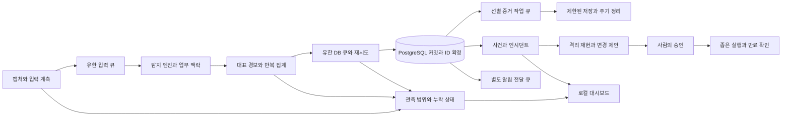

# Panopticon 안정화·성능 개선 및 소규모 LAN 제품 전략

- 작성일: 2026-10-07
- 분석 기준: `ec8436e` 및 같은 날짜의 실환경 운영 피드백
- 목표: 업무 서버의 자원을 고갈시키지 않으면서, 소규모 LAN 관리자가 근거 있는 경보와 안전한 대응을 운용할 수 있게 한다.
- 구조: 기존 Scapy·탐지 엔진·FastAPI·PostgreSQL을 유지하고, 경보 집계·증거 저장·DB 영속화를 유한한 큐와 자원 예산으로 분리한다. 그 위에 자산별 정상 업무 맥락, 관측 한계, 설정 변경의 재현 검증을 연결한다.
- 기술: Python, asyncio, Scapy, FastAPI, asyncpg, PostgreSQL, Alembic, 선택적 Redis·nftables.
- 범위: 구현과 검증의 실행계획. 아래 수치와 제품 성과는 별도 표시가 없는 한 목표이며, 달성된 성능이나 경쟁 우위를 뜻하지 않는다.

## 1. 판단과 우선순위

먼저 운영 안정성을 확보하고, 인증·상태 조회의 실제 연결을 고친다. 이어 정상 업무 트래픽을 구분하고, 설정 변경의 효과와 탐지 손실을 함께 보여준다. 제품의 중심은 **“우리 사무실의 정상 업무를 이해하고, 보이는 범위와 근거를 밝히며, 업무 중단 없이 대응하는 로컬 보안 모니터”**로 정한다.

탐지 엔진 수, AI 설명, 대시보드 기능만으로 우위를 주장하지 않는다. 방어 가능한 차별점은 현장별 자산 맥락과 검증 데이터의 축적, HDD·공유 서버에서의 예측 가능한 자원 사용, 오탐 조정 전후의 공격 재현 결과, 승인과 만료 확인이 연결된 운용 경험이다.

실행 순서는 `T00 계측 → T01 실제 보호·상태 연결 → T02 경보 집계 → T03 증거 I/O → T04 DB 영속화 → T05 종료·배포 → T06 업무 기준선 → T07 제품 운용 경험 → T08 선택적 고속 입력`이다. T09 사이버네틱 콘솔 디자인은 T01의 실제 상태 계약을 확정한 뒤 토큰·기본 셸부터 적용하고, T07의 사건·승인 흐름과 함께 완성한다. 같은 경로를 바꾸는 T02~T04는 순서대로 통합한다. 장애 부하 재현은 격리 환경에서만 수행한다.

## 2. 분석 근거와 미확정 사항

### 2.1 현재 코드에서 확인한 상태

- Git 추적 파일 437개. 애플리케이션 Python 207개·33,004줄, 테스트 Python 149개·28,436줄.
- 패킷 탐지 엔진 22개가 중복 없이 등록된다. 과거 TLS 중복 등록과 blocks 라우터 인자 오류는 수정됐다.
- 관련 시험 137개 및 DB·전체 회귀를 제외한 출시 게이트 11개가 통과했다. 전체 시험 2,110개를 수집했으며 전부 실행한 결과는 아니다. 사용한 로컬 환경은 `.venv-new`의 Python 3.13.13이고 CI 기준은 Python 3.12다.
- `require_role()`은 정확한 역할 일치만 허용한다. 로그인은 admin만 발급하지만 observation·response 조회 등은 viewer만 허용해 실제 admin 요청이 403을 받는다.
- `/api/support-profile`은 `app.state.__dict__.get()`으로 객체를 조회해 observation·feeds를 누락한다. 객체를 주입한 실제 앱 요청으로 재현했다.
- `Database.connect()`는 `postgresql.ssl_mode`를 연결 인자로 전달하지 않는다. `verify-full` 설정에서도 SSL 인자 부재를 확인했다.
- API 속도 제한과 AuditLogger는 구현돼 있지만 실행 애플리케이션에 연결되지 않았다. 대응 적용 횟수 제한과 일반 HTTP 요청 제한은 서로 다른 장치다.
- `/health`는 구성 요소 상태를 검사하지 않고 항상 healthy를 반환한다. 기존 HealthChecker도 운영 경로에 연결되지 않았으므로 단순 연결 전에 엔진 목록·스니퍼 인터페이스와 맞춰야 한다.
- `capture_for_alert()`는 디스패처에서 동기 호출되고, `wrpcap()` 뒤마다 디렉터리 전체 파일 조회·stat·정렬·삭제를 수행한다.
- `BatchWriter`는 운영 디스패처에 연결되지 않았다. 현재 `insert_batch()`는 한 트랜잭션 안에서 건별 SQL을 반복하고 ID 매핑을 반환하지 않는다. BatchWriter는 실패한 배치를 복구하지 않고 버리므로 그대로 연결하면 안 된다.
- `StatsFlushService`는 기본 분 단위 통계와 디바이스 배치를 저장한다. 피드백의 traffic_stats 초당 쓰기 설명은 현재 코드만으로 확인되지 않는다. 실제 장애 당시 버전·SQL·로그를 대조해야 한다.
- 키별 경보 속도 제한과 이상 탐지 학습·EWMA/MAD 기준선은 이미 있다. 전체 부하 상한, 업무별 기대 트래픽, 재시작 후 기준선 수명, 고유 키 폭증을 다루는 정책이 부족하다.
- Compose의 설정 디렉터리는 읽기 전용인데 웹 설정 변경은 YAML 쓰기를 요구한다. README의 AI 자동 임계값 조정 설명 일부도 현재 승인 기반 구현과 맞지 않는다.

### 2.2 실환경 피드백에서 보존한 관측

출처는 최진호 작성 「NetWatcher (Panopticon) 실환경 운영 피드백 및 성능 장애 분석 보고서」, 2026-10-07이다. 원본 SHA-256은 `ebc8821d64b6a30287909d9f239c163e4739e66b7fe99e75dea63b7f9b27912d`이다.

- 환경: nerdvana235, Ubuntu, 64-core Xeon E5-2683 v4, RAM 48GB, PERC H730 Mini HDD RAID, `netwatcher.service`, 로컬 PostgreSQL 18의 `bee_db`와 자원 공유.
- 호스트 증상: Load Average 33+, iowait 22%+, D-state 프로세스 약 20개, 물리 메모리·스왑 고갈.
- 프로세스 PID 3502205의 단일 코어 100% 점유, systemd 누적 CPU 시간 `1w 6h 25min 17s`, 정지 로그의 누적 dropped packets 360146.
- `traffic_anomaly`, `behavior_profile`, `port_scan`에서 매초 경보와 confidence 0.7~1.0이 관찰됐다. 주요 대상은 게이트웨이 `192.168.0.1`, 스토리지 호스트 `192.168.0.235`, `192.168.0.225`, 외부 정상 통신이었다.
- `event_*.pcap` 생성과 최근 수분 내 파일 삭제가 반복됐다. DB INSERT/UPDATE와 PostgreSQL I/O 대기 적체도 보고됐다.
- webhook URL이 없는 Discord 채널의 경고가 수천 줄 발생했다.
- SIGTERM 뒤 90초 내 종료되지 않아 systemd stop-sigterm timeout과 SIGKILL이 발생했다.

위 관측은 장애 당시 보고를 인계한 것이며 이번 작업에서 서버 로그를 다시 수집한 결과는 아니다. 누적 드롭의 분모·기간이 없어 손실률을 계산할 수 없다. confidence는 정답 확률이 아니며 0.7~1.0만으로 악성·오탐을 확정하지 않는다. 해당 IP는 사건 근거로 보존하되 기본 설정에 하드코딩하지 않는다.

### 2.3 원인 가설과 확인 방법

| 가설 | 현재 근거 | 확인 방법 |
|---|---|---|
| 동기 PCAP 기록·전체 파일 정리가 이벤트 루프를 막는다 | 호출 경로 확인 | PCAP on/off의 loop lag, 프로세스 I/O, 파일 작업 횟수 비교 |
| 다수 키의 경보가 키별 제한을 우회해 전체 부하를 만든다 | 키별 제한은 있지만 전체 예산은 없음 | 고정 키와 고유 키 증가 부하를 분리 |
| Scapy 디코딩·다수 엔진 실행이 CPU 병목이다 | 단일 코어 포화 보고, 실제 프로파일 미수집 | 캡처·디코딩·엔진별 CPU 시간과 IPC 비용 측정 |
| 정상 백업·VM·DB 작업이 기준선 경보를 반복 유발한다 | 운영 보고, 기준선은 코드에 존재 | 업무 시각표와 이벤트·학습 상태·키 구성을 대조 |
| PostgreSQL 쓰기와 스왑이 HDD 경합을 증폭한다 | 공유 서버에서 적체 보고 | Panopticon 증분 SQL/WAL/I/O와 다른 서비스 부하를 분리 |

GIL만으로 전체 장애를 설명하지 않는다. NIC 입력량, 패킷 크기, 작업자 수, 장애 당시 설정과 코드 버전을 확보해 각 단계의 기여를 측정한다. VM 종료·스왑 변경 등 호스트 조치는 이 프로젝트 구현 범위에 포함하지 않는다.

## 3. 자원과 데이터 계약



모든 큐의 상한·나이·실패가 관측 상태로 이어진다. 증거 경로는 DB 확정 ID를 받은 뒤 비동기로 실행하며, 승인 경로와 재현 경로는 운영 입력·강제 실행에서 분리한다.

### 3.1 입력·탐지·증거·알림의 계약

1. 입력 큐, 경보 큐, 증거 작업 큐, DB 재시도 큐는 건수와 바이트 상한을 모두 갖는다. 바이트는 raw payload뿐 아니라 Python 객체·인덱스·직렬화 복사 비용을 고려하고 RSS로 검증한다.
2. 패킷 처리와 TickService는 파일 쓰기·삭제·압축을 기다리지 않는다. 느린 외부 채널도 영속화 소비자를 장시간 막지 않는다.
3. 반복 경보는 대표 이벤트와 집계 카운터로 남긴다. 최초 발생, 심각도 상승, 새로운 공격 단계, 새 대상은 별도 대표 이벤트가 될 수 있다.
4. 억제·집계·샘플링·저장 실패를 각각 집계한다. 이 중 어느 것도 탐지가 없었다는 의미로 표시하지 않는다.
5. `event_id`는 DB 커밋 뒤 확정한다. PCAP 참조·인시던트·대응·영속 이벤트 WebSocket은 이 ID를 사용한다. 빠른 미영속 알림이 필요하면 별도 상태와 상관키를 사용한다.
6. 저장되지 않은 경보에 따른 강제 조치는 금지한다. 장애 중에는 원인과 조치 제한을 표시하고, 별도 건강 상태 스트림으로 알린다.
7. 자원 부족 시 저우선 증거·중복 전달부터 줄인다. 핵심 탐지의 변경도 영향 범위와 버전을 남기며 조용히 전체 엔진을 끄지 않는다.
8. 경보 저장량만 줄어든 것을 오탐률 개선으로 계산하지 않는다. 레이블된 정상·공격 재현 결과와 관측 손실을 함께 비교한다.

### 3.2 초기 성능 목표와 측정 조건

아래는 출시 전 검증할 초안이다. T00에서 기준 실측과 메모리 계산 뒤 확정하며 초과 비용이나 미달 결과를 숨기지 않는다.

| 항목 | 초기 목표 | 조건·분모 |
|---|---|---|
| 기본 대상 | 10~100개 자산, 확장 파일럿 250개 | VLAN·관측 인터페이스별 자산을 구분 |
| 최소 검증 장비 | 4 CPU 코어·RAM 8GiB·HDD, PostgreSQL 포함 | 먼저 이 범위를 지원하고 2코어·4GiB는 별도 검증 후 추가 |
| 정상 입력 | 지속 2,000pps, 24시간 | 고정 PCAP·패킷 크기 분포·활성 엔진·설정 버전 기록 |
| 순간 과부하 | 20,000pps, 60초 | 무손실 보장 대신 상한 유지·손실 노출·5분 내 회복 |
| 정상 앱 손실 | 입력 단계 수신 대비 앱 drop 0.1% 이하 | 커널 손실·송신기 미전송·링크 손실과 분리 |
| 응답성 | loop lag p99 50ms 이하, 조회 API p95 500ms 이하 | 같은 부하에서 측정, DB·PCAP 병목도 포함 |
| 영속화 지연 | 승인된 대표 경보의 커밋 p95 2초 이하 | 후보 생성부터 DB 커밋까지, 외부 채널 전달은 별도 |
| 메모리 | 앱 프로세스 합계 RSS 1.5GiB 이하 | 워커·증거 저장 프로세스 포함, DB와 tmpfs는 별도 예산 |
| CPU | 정상 부하 앱 합계 1.5코어 이하 | 100%=1코어 기준. pps와 활성 엔진을 함께 표기 |
| 증거 파일 작업 | 정리당 조회 1회, 반복 경보 증거 기록 90% 이상 감소 | 동일 정상 업무 재현 대비, 최초 증거는 보존 |
| DB 효과 | commit 횟수 80% 이상 감소 | 동일 대표 이벤트 수 기준, 정상·폭풍 부하를 각각 비교 |
| 종료 | 정상 저장장치에서 5초 목표, 앱 단계별 총 예산 10초 | 완료·미저장·미확인 건수와 회복 가능성 기록 |

1Gbps NIC가 1Gbps 전수 분석 성능을 뜻하지 않는다. 평균 대역폭만으로 지원 범위를 정하지 않고 pps·패킷 크기·flow 수·고유 자산 수·엔진 조합을 공개한다. 호스트 전체 iowait를 Panopticon 단독 원인으로 해석하지 않는다.

### 3.3 운영 성능 프로필

기존 `limited/general/extended`는 기능 지원 계약으로 유지한다. 다음 이름은 신설할 **성능·저장 프로필**이며 별도 설정 축으로 둔다.

- `shared-hdd`: 기본 후보. PCAP은 제한된 RAM 링과 선별 증거, 디스크 저장 작업자 1개, 정리 60초 간격, 보존 재고는 증분 관리. 워커 1개에서 시작해 실측으로 2개까지 선택한다.
- `dedicated-ssd`: 증거·분석 예산을 늘릴 수 있으나 큐 상한과 집계는 동일하게 유지한다.
- `flow-only`: SPAN 없이 수신한 NetFlow의 가시성만 명시한다. ARP/DHCP·payload 분석 가능처럼 표시하지 않는다.

tmpfs는 필수가 아니다. 선택 시 기본 상한 후보는 128MiB이고 호스트 여유 메모리·컨테이너 메모리 상한 안에서 줄인다. tmpfs는 RAM과 스왑을 사용할 수 있어 HDD 스왑을 다시 유발할 수 있다. 전체 PCAP을 옮기는 대신 선택된 짧은 증거를 임시 저장하고, 재시작 시 유실될 자료는 `volatile`로 표시한다. tmpfs도 부족하면 무제한 디스크 fallback을 하지 않는다.

## 4. 구현 작업

각 작업은 재현 시험 → 최소 구현 → 관련 시험 → 통합 확인 → 해당 변경 커밋 순서로 수행한다. 문구·문서 변경에는 구현을 복제한 시험을 만들지 않는다. 운영 반영은 별도 배포 지시를 받은 뒤 진행한다.

### T00. 계측과 장애 재현 기준선 — P0, 3~4일

**수정:** `netwatcher/web/metrics.py`, `netwatcher/observability/observation.py`, `netwatcher/capture/sniffer.py`, `netwatcher/alerts/dispatcher.py`, `netwatcher/services/stats_flush.py`.

**신설:** `scripts/perf_replay.py`, `tests/performance/README.md`, `tests/performance/test_resource_bounds.py`. 기존 `replay/service.py`는 설정 비교용 격리 계약을 유지하며 실제 운영 파이프라인 부하 재현기로 재사용하지 않는다.

1. 캡처 수신·app drop·kernel drop·큐 나이·바이트·엔진 실행 시간·loop lag·DB commit 지연·증거 쓰기/삭제 횟수·억제 이유·채널 상태를 계측한다.
2. 정상 백업/SMB·DB 클라이언트·VM·DNS, 반복 단일 경보, 고유 키 폭풍, 공격 혼합 입력을 고정 시드로 만든다. 실제 개인정보·payload는 제거하거나 합성한다.
3. 장애 환경의 버전·workers·엔진 설정·pps·PCAP 보존량·DB 쿼리 통계를 확보할 절차를 문서화한다. 기본 장애 부하는 격리 DB와 파일 경로로만 재현한다.
4. 동일 입력에서 PCAP on/off, workers 1/2/4, 채널 on/off를 한 변수씩 비교한다. 같은 DB·출력 경로의 검사는 순차 실행한다.

**완료 조건:** 입력과 손실의 단계별 분모가 일치하고, 30분 정상·10분 폭풍의 기준 실측 JSON이 나온다. 결과에는 실행 환경, 해시, 설정, 미지원 측정, 외부 부하를 기록한다. 이후 24시간 시험의 기준으로 사용한다.

### T01. 인증·상태·TLS·실행 경로 연결 — P0, 3~4일

**수정:** `netwatcher/web/rbac.py`, `netwatcher/web/server.py`, `netwatcher/web/routes/auth.py`, `netwatcher/web/api_rate_limiter.py`, `netwatcher/web/audit_log.py`, `netwatcher/storage/database.py`, `netwatcher/utils/config.py`, `netwatcher/support.py`.

**시험:** 기존 `test_rbac.py`, `test_router_registration.py`, `test_auth.py`, `test_api_rate_limiter.py`, `test_audit_log.py`를 확장하고 `tests/test_web/test_support_profile_api.py`, `tests/test_storage/test_database_tls.py`를 신설한다.

1. `require_role`을 최소 역할 계약으로 통일한다: admin은 analyst·viewer 동작을, analyst는 viewer 동작을 허용한다. 모든 호출부를 감사하고 viewer의 쓰기는 계속 거부한다. 다중 사용자 지원은 별도 과제로 남긴다.
2. `getattr(app.state, name, None)`으로 상태를 읽고 실제 feed·observation 값을 반영한다. 조회 실패는 unknown과 이유를 반환한다.
3. `/health`는 단순 liveness로 명명·문서화하고 실제 DB·관측·큐 상태를 검사하는 readiness를 추가한다. 스니퍼의 `is_running`, 레지스트리의 리스트 자료형과 맞추며 readiness 실패 상태코드를 정한다.
4. 로그인 IP별 시도 제한과 인증된 API 사용자별 제한을 연결한다. JWT 문자열 접두사를 버킷 키로 쓰지 않는다. 로그인 제한의 Redis 장애 시 유한한 로컬 폴백을 사용한다.
5. 변경·승인·적용·거절 감사 기록을 실행 경로에 연결한다. 비밀번호·토큰·payload는 기록하지 않는다. 필수 승인 감사가 저장되지 않으면 적용을 거부하고, 일반 조회 감사 때문에 서비스가 멈추지 않게 구분한다.
6. DB ssl_mode를 실제 asyncpg SSL 설정으로 변환한다. verify-ca/verify-full은 CA·hostname 검증을 실제 시험하고 인증서 오류 시 평문으로 내려가지 않는다. 로컬 disable은 명시 설정으로 유지한다.

**완료 조건:** 실제 로그인 admin으로 observation·replay·response 조회/제안이 의도대로 동작하고, 역할별 거부·상태 누락·TLS 실패를 심으면 시험이 실패한다. 정적 게이트 통과만으로 완료하지 않는다.

### T02. 경보 집계와 전체 부하 상한 — P0, 4~5일

**수정:** `netwatcher/alerts/dispatcher.py`, `netwatcher/alerts/rate_limiter.py`, `netwatcher/detection/models.py`, `netwatcher/web/metrics.py`, `netwatcher/observability/observation.py`.

**신설:** `netwatcher/alerts/aggregation.py`, `tests/test_alerts/test_aggregation.py`. **확장:** `tests/test_alerts/test_dispatcher.py`, `test_dispatcher_durability.py`.

1. 현재 키별 제한을 유지하고 `(engine, 자산 식별자, 대상, 탐지 종류, 정책 버전)`의 안정적 집계 키를 정의한다. 현재 키에 들어가는 title의 동적 숫자·문구가 같은 사건을 다른 키로 만드는지도 재현한다. IP 재할당·NAT·공유 게이트웨이는 자산 불확실성을 보존한다.
2. 최초 경보를 대표 이벤트로 남기고 기본 후보 60초 창의 반복 경보는 count·first_seen·last_seen·최대 심각도·대표 근거로 집계한다. 60초 동안 새로운 공격 단계를 묻지 않는다.
3. 전체 대표 이벤트 예산과 고위험 예약 몫을 둔다. 시작 후보는 보통 이벤트 120건/분, 고위험 예약 30건/분이며 T00 결과로 조정한다. 예산을 넘긴 고위험 경보도 유한 집계·손실 사유를 남긴다.
4. 집계 flush는 이벤트마다 UPDATE하지 않는다. 만료 창당 배치 갱신하며 메타 경보는 집계 파이프라인에 재진입해 증식하지 않는다.
5. 억제 count를 API·일일 보고·관측 상태에 노출한다. DB 중단 중에도 제한된 건강 상태 스트림으로 backlog를 알린다.

**완료 조건:** 10분간 단일 키 100건/초와 고유 키 폭풍에서도 RAM·큐가 상한을 지키고, 최초 경보·새 공격 단계가 보존되며 count가 입력과 일치한다. 키 수 초과가 기존 제한을 초기화해 저장 폭풍을 만드는지 검사한다.

### T03. 증거 I/O 분리·선별·보존 — P0, 4~5일

**수정:** `netwatcher/capture/pcap_writer.py`, `netwatcher/alerts/dispatcher.py`, `netwatcher/app.py`, `netwatcher/detection/evidence.py`, `config/default.yaml`.

**신설:** `netwatcher/services/evidence_writer.py`, `tests/test_capture/test_pcap_policy.py`, `tests/test_services/test_evidence_writer.py`.

1. 현재 writer를 정책 결정·불변 raw 패킷 스냅샷·백그라운드 기록으로 분리한다. 단순 `to_thread`만으로 충분한지 측정하고 GIL 영향이 크면 제한된 별도 프로세스를 선택한다.
2. 증거 큐는 RAM 바이트·건수 상한을 갖고 최초 고위험·심각도 상승·명시적 수집 요청을 우선한다. 동일 자산/유형의 PCAP은 60초 쿨다운을 초기값으로 둔다.
3. 현재 전역 1,000개 패킷 링을 바이트 제한과 자산/flow별 공정 할당으로 보완한다. 한 대의 파일 전송이 다른 자산의 증거를 모두 밀어내지 않게 한다. 전·후 문맥은 future 패킷을 실제로 기다려 수집할 때만 있다고 표시한다.
4. 저장 재고를 증분 관리하고 정리는 60초 기본 주기와 삭제 파일 수/초 상한으로 분리한다. 시작 시 1회 재구축하고 stat·정렬을 이벤트마다 반복하지 않는다.
5. 증거 상태를 pending/persisted/volatile/omitted/failed로 구분하고 이유·해시·정책 버전·event_id 참조를 기록한다. 중복 참조된 증거와 승인 검토 중 보존 대상의 삭제 규칙을 정한다.
6. tmpfs 옵션은 3.3의 한도와 유실 표시를 따른다. spool 경로·개인정보 보존·원본 읽기 권한을 문서화한다.

**완료 조건:** 느린 파일 쓰기·디스크 부족을 주입해도 API와 입력 루프가 정해진 목표를 지킨다. 동일 재현 대비 파일 생성/삭제 작업 90% 이상 감소를 측정하되 실제 최초 증거 보존률을 함께 보고한다. PCAP 기록 실패를 증거가 있다는 상태로 표시하지 않는다.

### T04. DB 배치 영속화와 복구 — P0, 5~6일

**수정:** `netwatcher/storage/batch_writer.py`, `netwatcher/storage/repositories.py`, `netwatcher/alerts/dispatcher.py`, `netwatcher/services/stats_flush.py`, `netwatcher/app.py`.

**시험:** `tests/test_storage/test_batch_writer.py`, `test_repositories.py`, `tests/test_alerts/test_dispatcher_durability.py`. **신설 후보:** `tests/test_storage/test_stats_flush_durability.py`.

1. BatchWriter는 유한 enqueue와 단일 소비자로 바꾼다. 초기 후보는 100건 또는 500ms flush, 재시도·대기 상한은 프로필 예산 안에서 정한다. 호출자가 락을 잡은 채 DB 완료를 기다리는 구조는 제거한다.
2. EventRepository에 진짜 다중행 INSERT 또는 임시 staging+COPY 방식을 추가한다. 대표 경보에는 DB가 반환한 ID가 필요하므로 INSERT RETURNING을 우선 비교한다. 건별 execute 루프의 트랜잭션 묶기만으로 완료하지 않는다.
3. 각 이벤트에 안정적 ingest 식별자를 부여해 `(ingest_id, event_id)` 매핑을 반환한다. 반환 순서를 가정하지 않는다. 응답 유실 후 재시도에서도 중복 저장·중복 알림이 없도록 unique 제약과 조회 복구를 설계한다.
4. 배치 실패 시 즉시 버리지 않고 메모리 한도 내 재시도한다. 영속 spool은 선택 기능으로 분리하고 용량·파일 회전·디스크 쓰기 예산을 제한한다. 장애 때 무한 로컬 WAL을 만들어 HDD를 다시 고갈시키지 않는다.
5. 정상 큐에도 age 상한을 둔다. 최종 포기 건수·이유·유실 구간은 저장 회복 뒤 요약하고 운영 상태에 즉시 노출한다.
6. traffic_stats 실패로 주기 태스크가 종료되거나 snapshot_reset 데이터가 조용히 사라지지 않게 한다. 임시 스냅샷의 확정/재병합과 중복 방지를 검증하고 이미 존재하는 디바이스 배치를 재사용한다.
7. 인시던트·라벨·증거 참조 갱신도 왕복 횟수를 측정해 묶는다. webhook은 별도 제한 큐로 분리하고 원격 채널 지연이 이벤트 커밋을 막지 않게 한다.

**스키마:** 실제 필요한 ingest_id·집계 count·증거 상태 컬럼을 설계한 뒤 `alembic/versions/015_event_ingest_and_aggregation.py`와 `storage/schemas.py`를 함께 갱신한다. 기존 014 다음 번호는 구현 시작 시 재확인한다.

**완료 조건:** 실제 격리 PostgreSQL에서 배치 rollback·연결 단절·commit 후 응답 유실·재시도·재시작을 시험한다. 정상 및 폭풍 입력에서 커밋 감소 목표와 지연을 함께 검증하고, 확정 ID를 사용하는 인시던트·PCAP·UI가 모두 동일 행을 가리킨다.

### T05. 채널·종료·배포 계약 — P0, 3~4일

**수정:** `netwatcher/alerts/dispatcher.py`, `netwatcher/alerts/channels/base.py`, `discord.py`, `slack.py`, `telegram.py`, `netwatcher/app.py`, `netwatcher/capture/sniffer.py`, `netwatcher/capture/pool.py`, `netwatcher.service`, `docker-compose.yml`, `Dockerfile`.

**시험:** 기존 dispatcher 종료 시험과 `tests/test_capture/test_worker_pool.py`를 확장하고 `tests/test_services/test_shutdown_budget.py`를 신설한다.

1. 기동 시 각 채널의 필수 URL/토큰·대상 값을 검사한다. 누락 채널은 등록하지 않고 한 번의 경고와 API disabled_reason을 남긴다. 값을 로그에 출력하지 않는다. 전송 재시도·오류 로그·일일 리포트도 같은 유효 채널 목록을 사용한다.
2. SIGTERM 즉시 신규 입력을 멈추고 전체 monotonic deadline을 공유한다. 캡처/워커 종료, 경보 커밋, 증거 작업, DB·웹 종료 순으로 잔여 예산을 배분한다. 기존 디스패처의 5초 drain만으로 전체 종료가 제한되지는 않는다.
3. 동기 sniffer.stop·worker join·파일 작업을 이벤트 루프 밖으로 옮기고 각 대기 시간을 제한한다. 취소한 coroutine이 실제 파일 쓰기를 중단했다는 가정은 금지한다. pending·미확인 작업을 기록한다.
4. 정상 저장장치에서 5초 목표·앱 총 10초 예산을 검증한다. Linux D-state I/O를 앱에서 강제 해제할 수 없으므로 커널 장애에서 5초 종료를 보장하지 않는다. 마지막 systemd 경계는 별도 유예를 둔다.
5. 설정 변경을 지원하는 Compose에는 검증된 별도 writable 설정 볼륨과 원자적 쓰기 경로를 제공한다. read-only 배포는 변경 API를 명시적으로 거부한다. 변경 실패 시 런타임/YAML 버전이 갈라지지 않게 한다.
6. systemd의 CPU·메모리·태스크·I/O 제한은 문서상 후보와 시험을 먼저 제시하고 공유 호스트에 자동 적용하지 않는다. 웹/센서 권한 분리와 최소 capability를 다음 단계 설계로 연결한다.
7. README·운영 가이드의 AI 직접 변경, 무손실 캡처, healthy 표현, Docker 설정 편집 설명을 실제 지원 범위와 일치시킨다.

**완료 조건:** 미설정 Discord의 경보 10,000건에서도 설정 경고는 기동당 1회다. 정상 I/O·느린 DB·불응답 webhook·포화 큐의 종료 시한과 미저장 수를 기록한다. 컨테이너 설정 수정/재시작과 read-only 거부 동작을 각각 확인한다.

### T06. 자산 역할과 정상 업무 기준선 — P1, 5~6일

**수정:** `netwatcher/inventory/device_classifier.py`, `risk_scorer.py`, `change_detector.py`, `netwatcher/detection/engines/traffic_anomaly.py`, `behavior_profile.py`, `port_scan.py`, `netwatcher/detection/proposals.py`, `netwatcher/utils/yaml_editor.py`.

**신설:** `netwatcher/detection/context_policy.py`, `tests/test_detection/test_context_policy.py`. 기존 해당 엔진 시험을 확장한다.

1. NAS·백업·DB·프린터·게이트웨이·일반 PC의 역할은 수동 확인과 근거를 갖는다. 자동 추정은 confidence·확인 시각을 표시하고 MAC/IP 변경·공유 IP 시 재확인한다.
2. 기대 통신을 역할·peer/서비스·시간대·방향·volume 범위로 표현한다. 예: 승인된 NAS↔백업 호스트 야간 SMB는 볼륨 판단을 완화하되 ARP 위조·새 목적지·횡이동 탐지는 유지한다.
3. 피드백의 내부 IP 전체를 전역 whitelist에 넣지 않는다. 현재 전역 whitelist는 해당 source의 탐지를 통째로 건너뛸 수 있으므로 엔진·업무 범위의 예외를 만들고 만료·승인·감사를 요구한다.
4. cold-start, 학습 중, 충분한 표본, drift, 재시작 복원 상태를 구분한다. 시간대·업무일별 기준선은 표본이 부족하면 unknown으로 남기고 한 번의 공격/백업 폭주로 정상 기준이 오염되지 않게 한다.
5. “정상 업무” 표시는 사람이 확정한 관측 사실로만 학습한다. 학습 중에도 강한 ARP/DHCP 위조·시그니처 등 독립 탐지를 유지한다. AI는 예외 후보 설명만 한다.
6. 새 자산·새 목적지·새 포트 관계와 볼륨 변화를 함께 묶어 업무 변화 카드로 설명한다. 예외 조정은 버전·검토일·되돌리기를 갖는다.

**완료 조건:** 레이블된 정상 백업·DB·VM 입력의 불필요 대표 경보 70% 감소를 목표로 하되, ARP spoof·DHCP rogue·scan·lateral·exfil 공격 시나리오 중 기존 검출 성공 사례를 잃지 않는다. 검출 결과·지연·관측 손실을 함께 비교한다. 공격을 놓치면 조정안을 승인하지 않는다.

### T07. 차별화 제품 경험과 현장 검증 — P1, 7~9일

**수정:** `netwatcher/replay/service.py`, `contract.py`, `netwatcher/detection/proposals.py`, `netwatcher/response/proposals.py`, `netwatcher/web/static/js/modules/governance.js`, `defense.js`, `incidents.js`, `netwatcher/web/static/locales/ko/translation.json`, `en/translation.json`, `docs/OPERATIONS-GUIDE.md`.

**신설 후보:** `netwatcher/services/onboarding.py`, `tests/test_services/test_onboarding.py`, `docs/PILOT-PROTOCOL.md`. 프론트엔드 변경은 기존 모듈 구조와 번역 방식을 따른다.

1. 설치 마법사는 감시 인터페이스·SPAN/NetFlow·관리 경로·스토리지·메모리 예산·인증을 검사한다. 관측 범위가 부족하면 그 범위만 표시하고 운용 가능한 대안을 제시한다.
2. 첫 화면은 “관측 가능한 구역 / 오늘 달라진 업무 관계 / 확인할 상위 사건 / 누락·과부하”를 보여준다. 보안 전문가용 통계는 상세로 이동한다.
3. 사건 카드에 자산 역할, 기대 업무와의 차이, 근거·원자료 상태, 누락, 가장 좁은 확인/조치, TTL·업무 영향·되돌리기를 연결한다. IP 소유자를 확인하지 못하면 대상 이름을 추정해서 채우지 않는다.
4. 설정 조정 제안에 이전/새 버전, 정상·공격 replay 결과, 비교 불가 사유를 묶는다. 현재 검증된 arp_spoof·port_scan·data_exfil 3종부터 연결하고 지원 밖 엔진을 재현 가능이라고 표시하지 않는다.
5. 승인된 설정의 원자적 적용·버전 불일치 거부·rollback을 유지한다. 근거 없는 “AI가 해결함” 메시지와 무승인 반영은 없다.
6. 웹/API와 캡처 권한을 분리하고 강제 실행기는 고정된 좁은 IPC 계약으로 접근하게 설계한다. NFT 적용은 관측 위치에서 실제 트래픽을 제어할 수 있는지 확인한 뒤 제공한다. SPAN 센서의 input 차단이 다른 호스트 간 트래픽을 막는다고 주장하지 않는다.
7. 서로 다른 소규모 LAN 3곳의 동의된 파일럿을 설계한다. 연락·배포·데이터 반출은 별도 승인 범위에서만 한다. 14일간 담당자의 운영 시간을 측정하고 7일 후 1차 조정을 거친다.

**완료 조건:** 설치 시작→첫 유효 자산 지도 30분 이내, 주간 검토 30분 이내를 파일럿 목표로 검증한다. 설치 실패·관측 부족·소요 시간을 포함해 공개 가능한 익명 결과를 만든다. 로그를 읽을 수 있는 개발자만 성공하는 흐름이면 제품 목표 미달로 판정한다.

### T08. 선택적 고속 캡처·외부 분석기 연결 — P2, 조건부 4~6일

**수정:** `netwatcher/capture/sniffer.py`, `pool.py`, `worker.py`, `netwatcher/services/packet_processor.py`, `netwatcher/detection/registry.py`, `netwatcher/support.py`.

**신설 후보:** `netwatcher/capture/source.py`, `netwatcher/integrations/suricata_input.py`, `tests/test_capture/test_source_contract.py`, `tests/test_integrations/test_suricata_input.py`.

진입 조건은 T02~T04 완료 후에도 프로파일에서 디코딩/엔진 CPU가 주병목이고 기본 목표를 만족하지 못하는 경우다. 우선 packet_info 공통 파싱·불필요 payload 분석 축소·BPF 입력 선택을 측정한다. BPF로 제외된 범위도 화면에 표시한다.

워커 1/2/4를 검증하고 64코어의 CPU-1 자동 워커를 공유 서버 기본으로 쓰지 않는다. src_ip 파티션에서 분산 스캔·목적지 전체 기준선·양방향 flow 상태가 깨지는지 검사하고 자산/flow별로 적합한 키를 선택한다. 프로세스 IPC·패킷 복사·워커별 baseline 메모리 증가까지 합산한다.

그 뒤 libpcap/AF_PACKET 기반 별도 센서 또는 Suricata EVE 입력 어댑터를 비교한다. 공통 사건 계약으로 외부 이벤트를 정규화하고 탐지 출처·엔진 버전·중복 사건·payload 가시성을 기록한다. 초기부터 Scapy 전체 재작성이나 eBPF 도입을 전제하지 않는다.

**완료 조건:** 동일 하드웨어·정확도 조건에서 개선이 측정되고, 외부 입력 단절·순서 변경·중복·schema 변경을 시험한다. 새 입력 경로는 기본 제품의 필수 의존성으로 만들지 않는다.

### T09. 근미래 사이버네틱 터미널 콘솔 — P1, 5~7일

**콘셉트:** 기계식 눈이 네트워크를 관측하는 정밀 제어 콘솔. 기준 에셋은
`netwatcher/web/static/img/panopticon.png`다. 로고의 동심원 렌즈, 청록색 금속,
짙은 남색 장갑, 주황색 회로와 노드 구조를 UI의 구조와 상호작용으로 번역한다.
로고의 원본·문구·비율을 보존하고 장식용 HUD가 실제 상태로 오인되지 않게 한다.

**수정:** `netwatcher/web/static/index.html`, `css/style.css`, `js/app.js`,
`js/core/constants.js`, `js/core/utils.js`, `js/modules/events.js`, `incidents.js`,
`devices.js`, `stats.js`, `defense.js`, `governance.js`, `engines.js`, 한국어·영어
`locales/*/translation.json`. 경로는 모두 `netwatcher/web/static/` 기준이다.
기존 ID·data-tab·API 함수·esc/escAttr·Chart.js·ES 모듈·번역 체계를 재사용한다.

**신설 후보:** `netwatcher/web/static/css/tokens.css`,
`netwatcher/web/static/js/modules/command_palette.js`,
`tests/test_web/test_console_navigation.py`. 기존 UI 출력 안전성과 governance
시험은 해당 흐름의 회귀 기준으로 유지한다. CSS만 바꾸는 부분에 스타일 문자열을
복제한 시험을 만들지 않는다.

#### 시각 언어와 토큰

| 요소 | 방향 | 쓰임 |
|---|---|---|
| 베이스 | ink `#070C12`, panel `#0C1622`, raised `#132333` | 검은 금속과 얇은 층위, 본문 아래에는 무늬를 깔지 않음 |
| 관측 강조 | cyan `#63DAE8`, cyan-dim `#238A9A` | 활성 위치·관측 범위·선택 관계, 위험 등급과 분리 |
| 조작 강조 | copper `#FF9A62` | 승인 검토·주요 실행 버튼·렌즈 테두리, 빨간 경고와 분리 |
| 본문 | text `#E6EFF5`, muted `#A6B7C7` | 작고 빽빽한 콘솔에서도 밝기·대비 유지 |
| 상태 | danger `#FF727B`, warning `#F3C969`, valid `#80DBB0`, unknown `#A4B3C3` | 색과 문구·아이콘·이유를 함께 표시 |
| 글꼴 | 기존 Manrope + JetBrains Mono, 읽기 좋은 한글 폴백 | 문장과 숫자/IP/시간의 역할 분리, 기존 로컬 폰트 사용 |
| 형태 | 1px 구조선, 4~8px 모서리, 제한적 절삭 모서리 | 패널 헤더·배지의 계기판 느낌, 버튼 hit area는 온전하게 유지 |
| 간격 | 4px 기준, 12/16/24px 패널 여백 | 밀도는 높은 편이되 그룹 사이 경계는 선명하게 |

색은 초기 후보이며 실제 텍스트·배경 조합으로 대비를 확인한 뒤 확정한다.
일반 본문 4.5:1, 큰 글자·필수 그래픽 3:1을 인수 기준으로 둔다. 한국어 본문은
14px 기본, 표 13px 기본, 보조 정보도 12px 아래로 줄이지 않는다. IP·시간·수치에는
tabular numerals와 mono를 사용하고 모든 본문을 터미널 영문체로 강제하지 않는다.

렌즈의 동심원은 연결 관계의 선택·범위·드릴다운에, 회로선은 단계와 사건 근거의
연결에 사용한다. 패널 바깥 구조선·모서리 표식에 제한적 glow를 쓰고 본문·표에는
텍스트 glow를 쓰지 않는다. 화면 전체 scanline, CRT flicker, 과도한 노이즈·블러,
끝없는 회전 레이더는 적용하지 않는다. 경보 없음·통신 단절·미관측의 화면도
충분한 시각 완성도를 갖추되 안전하다는 인상을 꾸며내지 않는다.

#### 콘솔 구조와 주요 화면

1. **상단 상태 레일:** 원본 로고의 소형 표식과 PANOPTICON 브랜드, 센서·관측 범위,
   데이터 최신 시각, 연결 상태, 언어·사용자. WebSocket 연결과 실제 센서/DB 준비
   상태를 분리한다. 센서 ID는 기능상 필요한 정보만 노출한다.
2. **좌측 기능 레일:** Overview / 사건 / 자산 / 트래픽 / 대응 / 정책·검증을 업무
   흐름대로 그룹화한다. 기존 탭의 기능을 없애지 않고 엔진·목록·AI 제안·거버넌스는
   관련 그룹의 상세로 연결한다. 위치와 선택 상태는 문자·윤곽·강조선으로 함께 표시한다.
3. **중앙 관측 공간:** 첫 화면의 큰 위젯은 “관측 범위와 누락”, “오늘 달라진 자산
   관계”, “검토할 상위 사건”이다. 원시 수치 카드 나열 대신 업무 우선순위를 표현한다.
   지도가 빈 경우 가시성 제약과 설치/확인 행동을 안내하며 가짜 노드를 채우지 않는다.
4. **우측 사건 문맥:** 선택 자산·사건의 기대 업무, 새 관계, 요약→근거→원자료,
   미확인 정보, 좁은 조치 제안을 순서대로 보여준다. 메인 목록의 스크롤·필터·선택은
   상세를 닫아도 유지한다.
5. **하단 타임라인:** 수신·관측·경보·억제·승인·적용·만료를 구분하고 세부 시각·
   출처를 확인할 수 있게 한다. 장식용 heartbeat 파형을 실제 통신처럼 표시하지 않는다.
6. **로그인:** 로고를 렌즈 앵커로 사용한 차분한 인증 콘솔. 입력 초점·오류·로그인
   대기·속도 제한을 명확히 표현한다. 불필요한 부팅 연출로 로그인 시간을 늘리지 않는다.

사건 목록은 정보 밀도 높은 표와 선택 상세로 구성한다. 심각도·자산·새 관계·
근거 상태·발생 시각을 먼저 보여주고 PCAP·replay·업무 영향은 상세에서 연결한다.
정책 검증 화면은 이전/새 정책을 양쪽에 두고 그 사이에 정상·공격 재현 결과,
관측 손실·비교 불가 사유를 표시한다. 승인 버튼 주변에는 대상·범위·TTL·변경점이
항상 보이며 요청 중에는 중복 실행을 막고 완료·거절·unknown을 구분한다.

#### 조작과 반응

- Ctrl/Cmd+K 명령 팔레트는 자산/사건 검색과 화면 이동으로 시작한다. 차단·승인·
  설정 저장은 팔레트에서 바로 실행하지 않고 검토 화면으로 이동한다.
- 리스트 탐색·필터·상세 닫기·탭 이동은 키보드로 가능하다. Escape는 가장 위의
  임시 UI만 닫고, 모달/드로어는 focus를 가두며 닫을 때 원래 조작 위치로 돌린다.
- 실제 상태 전이에 120~180ms의 강조·패널 전환을 사용한다. 로딩 지연은 진행
  상태로 보이고 타이핑 연출은 하지 않는다. `prefers-reduced-motion`과 숨겨진 탭에서
  애니메이션·불필요 렌더를 중단한다.
- 실시간 수신은 기존 행을 최소 갱신하고 정렬·선택이 갑자기 이동하지 않게 한다.
  새 경보가 들어왔다는 표식과 사용자가 갱신할 시점을 분리할 수 있게 한다.
- 입력·선택·오류·disabled·pending·empty·stale·unknown 상태를 같은 토큰과 컴포넌트로
  표현한다. 숨은 hover만으로 중요한 조작을 노출하지 않는다.
- 1440/1280px에서는 3영역 콘솔, 1024/768px에서는 문맥 드로어, 390px에서는
  탐색 레일을 접고 단일 흐름으로 전환한다. 작은 화면에서 요약 텍스트를 지우거나
  승인 내용을 가로 스크롤 뒤에 숨기지 않는다. 표의 국소 가로 스크롤은 허용한다.

#### 구현 순서와 인수 조건

1. 로고 모티프와 시맨틱 토큰을 정리하고 기존 CSS 변수에 매핑한다. 로고와 심각도
   색을 혼용하지 않는다. 추가 프레임워크·원격 폰트·Storybook 설치를 전제하지 않는다.
2. 로그인·기본 셸·탐색·상태 레일을 적용한다. T01의 실제 관측/피드/readiness 결과가
   디자인의 상태 모델로 연결돼야 한다. 이 단계에서는 기존 데이터 선택자를 유지한다.
3. 사건 목록·상세·자산 관계·트래픽 차트를 같은 구조에 맞춘다. 링·노드 선택을
   실제 근거와 연결하며 불확실한 관계는 unknown으로 표시한다.
4. T07과 함께 정책 비교·승인·만료 확인·명령 팔레트를 연결한다. 대시보드에서
   기존 기능으로 도달할 수 있는지 탐색 회귀를 확인한다.
5. 실제 앱의 로그인·데이터 있음/없음·오류·단절·stale·unknown·조회 전용 역할로
   브라우저 검증한다. UI만의 fixture 화면은 예시라고 표시하고 운영 화면으로 보고하지 않는다.

**완료 조건:** 네트워크 가시성 확인→사건 선택→근거 조회→정책 비교→승인 검토를
키보드와 포인터로 완료할 수 있다. viewport 390/768/1280/1440px, 한국어·영어,
200% 확대, reduced-motion에서 확인한다. 대비·focus·타깃 크기·모달 focus 복원을
검증하고 기존 XSS/라우터/승인 계약 회귀를 통과한다. 필터·선택 보존과 단절 상태
표시는 실제 API 응답을 사용해 확인한다. 사용자가 현재 열 수 있는 브라우저 미리보기
링크로 시각 결과를 제공한다.

장시간 수신 중 DOM 수가 무제한으로 늘지 않고 메인 스레드 장기 작업과 주기적인
재렌더 비용이 기존 화면보다 악화되지 않는지 비교한다. 접속 직후의 패널 연출은
한 번만 사용하고, 시각 효과를 위해 T00~T05의 자원 예산을 소비하지 않는다.

**일정 영향:** 기존 핵심 34~43 작업일에 5~7일을 더한 39~50 작업일 초안이다.
통합·파일럿 여유를 포함해 전체 일정을 11~14주로 갱신한다. T09는 T01 이후 기본
셸부터 착수할 수 있으나 디자인 변경과 T07이 동일 UI 파일을 동시에 수정하지 않는다.

## 5. 경쟁 환경과 독보적 위치를 만드는 방안

### 5.1 경쟁 제품의 확인된 강점

2026-10-07 공식 문서 기준이다. 이 비교는 제품 전체 성능 벤치마크나 기능 부재 증명이 아니다.

| 제품 | 공식 자료에서 확인한 강점 | Panopticon의 제품 판단 |
|---|---|---|
| Security Onion | SOC 도구 통합, Standalone 최소 4코어·24GB·200GB | 공용 HDD 서버와 관리 인력이 적은 현장을 우선 목표로 삼는다. 기능 규모 경쟁 대신 운용 비용을 실측한다 |
| ntopng | 소규모망 가시성·L7 분석·행동 경보, Small Network 안내 2코어·2GB | “가볍다”만으로 차별화되지 않는다. 업무별 기대 관계와 조정 전 공격 검증을 제품 중심으로 만든다 |
| Suricata | 다중 스레드·고속 캡처·flow/규칙 경보 제한·PCAP 처리 | 고속 캡처·시그니처를 전부 다시 구현하기보다 선택적 입력으로 활용하고 업무 맥락·운용 판단을 보강한다 |
| Zenarmor | 로컬/edge 검사와 SMB 대상 보호, Zenconsole 중심 관리 | 클라우드 계정 없이 로컬에서 관리·근거 확인·승인 가능한 경험을 검증할 틈새로 삼는다 |

출처: [Security Onion hardware](https://docs.securityonion.net/en/3/main/hardware/), [ntopng product](https://www.ntop.org/products/traffic-analysis/ntopng/), [ntopng behavioural checks](https://ntop.org/guides/ntopng/user_interface/shared/alerts/others/available_alerts.html), [Suricata features](https://suricata.io/features/all-features/), [Zenarmor guide](https://www.zenarmor.com/docs).

### 5.2 전략 후보와 선택

평가는 시장 실측 점수가 아니라 현재 코드 재사용성·고객 문제·차별화 가능성에 대한 의사결정이다.

| 후보 | 가치·재사용성 | 주요 부담 | 선택 |
|---|---|---|---|
| 자원 예산을 지키는 공유 HDD 운용 | 장애 재발 방지, 바로 필요한 가치 | I/O·정확도 동시 측정 | 핵심 |
| NAS/DB/백업/프린터 업무 맥락 | 실제 오탐 원인과 직접 연결, inventory 활용 | IP/역할 확인·기준선 오염 | 핵심 |
| 정상·공격 replay가 붙는 설정 승인 | 기존 replay/proposals 활용, 조정 신뢰 확보 | 원자료·지원 엔진 한계 | 핵심 |
| 첫 설치에서 관측 범위와 누락 설명 | SPAN 없는 소규모망의 기대 관리 | 장비별 연결 지원 | 핵심 |
| 업무 영향이 표시되는 TTL 대응 | 기존 response lifecycle 활용 | 센서 위치·권한 분리 | 인접 확장 |
| DHCP/syslog/라우터 자산 연동 | SPAN 없는 가시성 보완 | 어댑터 유지 비용·권한 | 파일럿 수요 순으로 |
| MSP 여러 지점 관리·보고 | 반복 운용 수익 가능 | 테넌트 격리·인증·지원 부담 | 단일 사이트 검증 뒤 |
| AI 자율 설정·차단 | 설명 시연은 쉬움 | 승인 우회·업무 중단 | 채택하지 않음 |
| 전면 패킷 엔진 재작성·광범위 SIEM | 장기 확장 가능 | 검증과 유지 비용 과다 | 병목·고객 근거가 생길 때만 |

### 5.3 우선 투자 1: 현장 업무를 이해하는 자산 관계 지도

**사용자 문제:** 전담 보안 담당자가 없는 개발 사무실에서 정상 백업과 데이터 유출 경보를 구분하기 어렵다.

**제품:** “평소 이 NAS는 야간에 이 백업 호스트와 SMB로 통신하지만, 오늘은 처음 보는 PC 8대로 연결했다”처럼 역할·시간·서비스·새 관계를 하나의 사건으로 설명한다. 단순 트래픽 상위 목록을 업무 판단으로 연결한다.

**구조:** inventory 확인 정보 + 기대 관계 정책 + 엔진 경보 + 변경 탐지 → 사건 카드. 정책별 만료·버전·승인을 유지하며 이름이 바뀐 IP를 같은 자산으로 단정하지 않는다.

**축적 자산:** NAS/백업/DB/프린터 환경별 합성 정상·공격 재현 묶음, 예외 조정 후의 공격 회귀 결과, 익명 운영 시간 측정. 템플릿은 실제 검증한 지원 버전을 붙이고 site 원자료 없이 공유한다.

**검증:** 파일럿 3곳에서 백업·DB 오탐을 레이블링하고 T06의 목표와 공격 회귀를 함께 확인한다. 현장 정상 패턴 템플릿이 반복 설치 시간을 줄이는지 측정한다.

### 5.4 우선 투자 2: 근거와 탐지 손실이 붙는 설정 변경 검증

**사용자 문제:** 민감도를 낮추면 조용해지지만 실제 공격을 놓치는지 알 수 없다.

**제품:** 제안 카드 하나에 정상 경보 변화, 공격별 검출/지연 변화, 원자료 부족·관측 누락, 적용·되돌리기를 표시한다. 비교할 수 없는 경우 승인자가 확인할 한계를 명시한다.

**구조:** versioned policy → 격리 replay → 비교 결과 → 사람이 승인 → 원자적 적용 → 실제 관측 비교. 승인은 AI 점수나 경보 건수만으로 자동화하지 않는다.

**축적 자산:** 엔진별 재현 지원 계약, 데이터·정책 버전이 있는 검증 기록, 현장 정상 작업/공격 회귀 묶음. 핵심은 고객이 자기 환경에서 결과를 다시 확인할 수 있다는 점이다.

**검증:** 현재 3종에서 시작해 공격 회귀를 통과한 엔진만 확대한다. 정상 경보 70% 감소와 기존 공격 검출 유지가 동시에 성립해야 성공으로 표시한다. competitors에 이 기능이 없다고 단정하지 않고 동일 시나리오의 설치·조정 시간과 검증 가능성을 비교한다.

### 5.5 우선 투자 3: 업무 서버를 해치지 않는 운용과 좁은 대응

**사용자 문제:** 모니터링 도구가 파일 서버를 느리게 만들거나, 자동 IP 차단이 정상 업무를 중단한다.

**제품:** 설치에서 자원 예산과 관측 범위를 선택하고, 과부하 시 무엇을 덜 기록했는지 밝힌다. 대응은 확인된 자산·서비스·시간 범위에서 제안하며 불확실하면 확인 작업을 먼저 제시한다.

**구조:** 측정된 resource profile → bounded queues → evidence policy → readiness/관측 한계 → 자산 매핑 → 승인·TTL·적용 조회·만료 확인. capture/UI/executor 권한을 분리한다.

**검증:** HDD 포함 저사양 기준 장비에서 24시간 정상+폭풍 시험, 실제 파일럿에서 업무 지연 증분과 운영 시간을 측정한다. 모니터링 서버의 input 방화벽과 LAN 전체 차단 효과를 구분한다.

### 5.6 배포·사업화와 경쟁 우위 검증

첫 대상은 자산 10~100개, NAS/백업/DB/VM이 공존하고 보안 담당자가 따로 없는 개발 사무실·소규모 사업장이다. 외부 연결이 제한된 실험실도 보조 대상으로 검증한다.

기본 로컬 제품과 핵심 보호는 현재 라이선스 범위를 유지한다. 수익 가설은 설치·정상 업무 조정·검증된 정책 팩·정기 점검 지원이며, 가격·전환율은 인터뷰와 파일럿 전에는 확정하지 않는다. MSP 제품은 고객 3곳 이상에서 반복 운용 문제가 확인된 뒤 테넌트 분리·권한·업데이트 계약을 별도 계획한다.

홍보 문구보다 검증 자료를 먼저 만든다: 동일 하드웨어·동일 PCAP·동일 엔진 범위의 자원 비교, 처음 설치까지 걸린 시간, 주간 관리 시간, 정상 업무 경보의 정답 레이블, 공격 재현의 검출과 지연. 공식 문서의 메모리 요구량을 직접 성능 비교로 사용하지 않는다.

독보적 위치는 현재 달성 사실이 아니라 검증할 가설이다. 파일럿에서 운영 시간이 줄지 않거나 공격 재현이 약해지면 기능 확장보다 기본 가설을 수정한다. raw PCAP의 중앙 수집이나 무단 텔레메트리를 성장 수단으로 삼지 않는다.

## 6. 실행 일정과 의존성

실무자 1명 기준 핵심 T00~T07은 34~43 작업일의 초안이다. T09 콘솔 디자인 5~7일을 포함해 39~50 작업일, 문서·통합·파일럿 대응 여유를 더해 11~14주를 잡는다. 현장 14일 관측은 개발 후반과 겹쳐 진행할 수 있다. T08은 조건부 4~6일이며 핵심 출시 일정에 포함하지 않는다. 성능 실측·스키마 이행·파일럿 접근성에 따라 재산정한다.

| 단계 | 목표 기간 | 산출물 | 다음 단계 조건 |
|---|---|---|---|
| A: 장애 재발 차단 | 1~3주 | T00~T03, 실제 인증·관측·폭풍 제한 | 입력·API 응답성·첫 증거·상한 시험 통과 |
| B: 영속성과 종료 | 4~5주 | T04~T05, 배치·재시도·채널·배포 | 실제 DB 복구·ID 일관성·종료 시험 통과 |
| C: 업무 맥락 | 6~7주 | T06, 역할별 기준선·좁은 예외 | 정상·공격 회귀를 함께 통과 |
| D: 제품·콘솔 검증 | 8~14주 | T07·T09, 설치·사건·승인 흐름·콘솔 디자인·파일럿 결과 | 3곳의 반복 운용과 자원 목표·UI/UX 검증 |

T01은 계측 초기와 독립적으로 착수할 수 있지만 시험용 앱·DB 변경은 동시에 실행하지 않는다. 각 PR은 기능 변경과 관련 시험·운영 문서로 묶고, 별도 권한 프로세스나 외부 입력은 독립적으로 검토한다.

## 7. 검증·출시·복구

### 7.1 관련 검증 명령

로컬의 동작 가능한 Python은 현재 `.venv-new/bin/python`이다. CI Python 3.12에서도 아래 계약을 검증한다. 구현에서 신설하는 시험 경로는 4장의 작업별 목록에 따른다.

```bash
# T01: 기존 인증/라우터 관련 회귀. 신규 재현 시험도 같은 단계에 포함한다.
NETWATCHER_SKIP_DOTENV=1 .venv-new/bin/python -m pytest tests/test_web/test_rbac.py tests/test_web/test_router_registration.py tests/test_web/test_auth.py -q -p no:cacheprovider

# T02/T04: 경보와 저장 경로. DB 시험은 격리 PostgreSQL 접속 설정을 선행한다.
NETWATCHER_SKIP_DOTENV=1 .venv-new/bin/python -m pytest tests/test_alerts tests/test_storage -q -p no:cacheprovider

# T06: 업무 맥락 변경에 직접 관련된 엔진 회귀
NETWATCHER_SKIP_DOTENV=1 .venv-new/bin/python -m pytest tests/test_detection/test_traffic_anomaly.py tests/test_detection/test_behavior_profile.py tests/test_detection/test_port_scan.py -q -p no:cacheprovider

# T00에서 만들 재현 도구의 예정 CLI 계약
NETWATCHER_SKIP_DOTENV=1 .venv-new/bin/python scripts/perf_replay.py --scenario alert-storm --duration-seconds 600 --db-name netwatcher_perf_local --db-user netwatcher --output-dir /tmp/panopticon-perf-isolated

# 통합 종료 후 전체 출시 게이트. G0-4는 DB, G0-5는 전체 회귀가 필요하다.
NETWATCHER_SKIP_DOTENV=1 .venv-new/bin/python scripts/gates.py
```

기존 fixtures는 테스트별 스키마를 만들고 삭제한다. CI는 일반 `NETWATCHER_DB_*`를 Config에 덮어쓰므로 테스트 접속값을 맞춘다. 운영 bee_db에 부하 시험·마이그레이션·스키마 삭제 검증을 실행하지 않는다. 스키마 변경은 깨끗한 전용 DB의 upgrade·downgrade·재upgrade와 ALL_SCHEMAS 정합을 확인한다.

### 7.2 출시 조건

- 실제 create_app·AuthManager·라우터를 잇는 요청에서 admin 조회와 최소 역할 쓰기 거부가 함께 통과한다.
- DB와 파일 시스템 장애를 주입해도 무제한 큐·무제한 로그·성공처럼 보이는 상태가 생기지 않는다.
- 동일 정상/공격 재현에서 자원·탐지·영속화·증거 상태를 함께 비교하고 결과 JSON을 보존한다.
- 승인·멱등성·TTL·대상 매핑 신선도·만료 조회의 기존 계약을 유지한다. 기능을 꺼서 시험을 통과시키지 않는다.
- 정적 게이트 외에 24시간 기준 부하와 10분 경보 폭풍, 종료·복구를 확인한다. 커널 nftables 시험은 별도 격리 namespace에서만 실행한다.
- 관련 시험 통과 후 새 변경·실패·미해결 위험 없이 같은 검사를 반복하지 않는다. 브라우저 화면 변경은 실제 로그인 화면 흐름과 현재 열 수 있는 미리보기에서 확인한다.

### 7.3 롤아웃과 롤백

배포 지시가 있을 때만 커밋·지정 환경 배포·확인까지 수행한다. 첫 단계는 그림자 집계와 새 증거 정책의 비교, 다음은 배치 영속화, 마지막은 업무 정책 적용으로 나눈다. 그림자 경로가 DB/디스크 쓰기를 두 배로 만들지 않도록 제한된 메모리 카운터 비교를 사용한다.

정책·코드·DB 리비전을 각각 기록한다. 집계 실패 시 검증된 제한 정책으로 복귀하되 PCAP 무제한 생성으로 돌아가지 않는다. DB 확장은 먼저 additive migration으로 도입하고 기존 reader 호환을 유지한다. 되돌릴 때 처리 중 배치·확정 ID·증거 참조를 확인하고 데이터 손실 없는 경로가 없으면 자동 rollback 대신 중지·복구 절차를 사용한다.

## 8. 주요 위험과 의사결정 기준

- **무조건 whitelist로 오탐 제거:** NAS·게이트웨이가 침해됐을 때 탐지를 잃는다. 역할/업무/엔진 범위의 만료 예외만 허용한다.
- **tmpfs로 모든 PCAP 이동:** 메모리·스왑 고갈을 다시 만든다. 바이트 상한·증거 선별·volatile 표시를 먼저 구현한다.
- **큰 배치를 그대로 연결:** ID·커밋 순서·상관분석이 깨지고 실패 배치를 잃는다. ID 매핑·멱등성·장애 복구가 선행 조건이다.
- **워커 대량 증설:** IPC·복사·메모리와 상태 분할 비용으로 악화될 수 있다. 실측한 1/2/4 조합과 전역 판단 계약을 비교한다.
- **5초 종료 절대 보장:** D-state는 취소할 수 없다. 정상 I/O 목표와 커널 장애 한계를 구분한다.
- **경보 건수 감소를 정확도 개선으로 발표:** 집계와 샘플링 효과를 분리하고 레이블·공격 회귀·손실을 함께 제시한다.
- **센서 방화벽을 LAN 대응으로 표시:** 실제 제어 위치와 scope를 검증한다. 관측만 가능한 위치에서는 확인·대응 제안을 제공한다.
- **AI·MSP·고속 캡처부터 확대:** 안정성·업무 맥락 검증이 지연된다. T00~T07의 현장 결과와 수요가 있을 때만 확장한다.

## 9. 피드백 반영 대조표

원본 보고서의 사건 근거는 2.2에 보존하고, 권고는 안전성과 현재 구현을 고려해 다음 작업으로 연결했다.

| 원본 항목 | 계획 반영 | 조정 이유 |
|---|---|---|
| 1: 공유 HDD 호스트의 load/iowait/메모리 장애 | 2.2~2.3, T00, 3.2~3.3 | Panopticon 증분과 다른 서비스 영향을 분리 |
| 2.1: 단일 코어 100%, 누적 CPU, 360146 drop | 2.2, T00, T08 | 기간·분모 확보 전 손실률·GIL 원인 확정 금지 |
| 2.2: traffic/behavior/scan 경보 폭풍·대상 IP | 2.2, T02, T06 | 원본 IP 근거 보존, 기본 whitelist 하드코딩 금지 |
| 2.3: PCAP 생성/삭제·DB I/O 적체 | 2.1~2.3, T03~T04 | 동기 I/O 확인, stats 초당 쓰기는 재확인 |
| 2.4: 미설정 Discord 경고 수천 줄 | T05 | 기동 검사·1회 경고·disabled_reason |
| 2.5: 90초 stop timeout·SIGKILL | 2.2, T05 | 전체 종료 deadline·D-state 한계 명시 |
| 3.1: 스니핑 한계·Scapy/GIL | T00, T08 | 먼저 단계별 프로파일, 조건부 캡처 변경 |
| 3.2: 기준선 부재·민감도 과다 | 2.1, T06 | 기존 학습·EWMA/MAD 위에 업무 맥락·수명 보강 |
| 3.3: HDD에 부적합한 I/O | 3.3, T03~T04 | 자원 예산·선별·배치·정리 분리 |
| 4.1: tmpfs·60초 PCAP 쿨다운·배치 삭제 | 3.3, T03 | tmpfs 선택적 상한, 최초 증거 보존 |
| 4.2: 인프라 예외·dedup/aggregate/meta-alert | T02, T06 | 현 코드는 키별 제한 단계. 집계 신설·좁은 예외 |
| 4.3: 미설정 채널 초기화 제외 | T05 | 모든 채널·일일 보고에 동일 검사 적용 |
| 4.4: 수백 개 DB 청크 최적화 | T04 | 미연결·실패 유실·건별 쿼리·ID 반환을 먼저 해결 |
| 4.5: 5초 내 안전 종료 | 3.2, T05 | 정상 I/O 목표, 전체 예산·미저장 이력·커널 한계 |

이 문서가 운영 피드백과 개선 계획의 인계본이다. 기존 2026-10-05 구현 결정 기록은 그대로 유지하며, 향후 구현 결과는 해당 작업의 시험·실측 근거와 함께 별도 기록한다.

## 10. 구현 상태 — 2026-10-07

T00의 입력·경보 큐 대기, 이벤트 루프 지연, 이벤트/통계 DB 쓰기, PCAP 파일
작업 계측과 격리 재현 도구를 구현했다. 입력 큐의 수신 시도와 진입 성공을
구분하며, drop 분모 오류(5개 중 3개 거절을 150%로 계산)를 60%로 수정했다.

실제 PostgreSQL과 PCAP을 사용한 10초 재현에서 normal은 패킷 1,000개와
이벤트 139개, unique-key는 패킷 500개와 이벤트 342개를 저장했다.
이 결과는 도구와 영속화 경로의 단기 확인이다.

T00의 workers 2/4 비교, 채널별 상태·외부 전달 비교, stats flush를 포함한
전체 부하 재현, 정상·공격 정답 세트, 30분 정상·10분 폭풍 기준 실측은 남아
있다. HDD·저사양 성능 목표와 24시간 운용도 아직 검증하지 않았다.
T01의 첫 수정으로 최소 역할 계층(admin ≥ analyst ≥ viewer)을 연결했다.
실제 로그인 토큰으로 관리자가 관측 API를 읽을 수 있으며, viewer의 상위 역할
접근과 잘못된 역할은 계속 거절한다. 지원 상태 API의 Starlette State 조회를
수정해 실제 관측 상태와 위협 피드 신선도·위반을 응답에 포함했다.
수정 전 회귀 시험에서 관리자/analyst 접근과 관측 상태 누락 4건을 재현했고,
수정 후 런타임 계약·RBAC·라우터 등록·기존 인증 시험 48건이 통과했다.
T01의 추가 구현으로 `/ready`와 인증된 `/api/health`를 실제 DB·스니퍼·엔진·
관측·큐 상태에 연결했다. DB/Redis 검사와 필수 승인 감사는 2초 대기 상한을 둔다.
상태 조회 실패는 unknown과 비밀값 없는 이유를 반환한다.
DB ssl_mode를 asyncpg에 전달하고 실제 TLS 연결에서 CA·호스트명 검증과
TLS 미지원 서버의 평문 재접속 거부를 확인했다.
로그인 직접 IP 제한, 검증된 JWT 사용자별 API 제한, 최대 10,000키 로컬 상한,
토큰 갱신으로 한도 초기화 불가, Redis 장애 시 유한 폴백을 구현했다.
운영 API는 현재 단일 프로세스 로컬 제한을 사용하며 여러 웹 프로세스 간
Redis 공유 한도 연결은 남아 있다. 비밀번호 검사는 이벤트 루프 밖에서 실행한다.
역할 의존성이 없던 변경 API도 중앙 가드에서 viewer 쓰기를 거부하며
자산·엔진·규칙·목록 설정 변경은 admin만 허용한다.
운영 앱에서 변경·접근 거절 감사와 승인/적용 전 필수 감사 저장을 연결했다.
실제 격리 PostgreSQL에서 저장과 감사 테이블 부재 시 적용 전 503을 확인했다.
관련 시험 97건 통과 후 중앙 쓰기 권한 및 실제 DB readiness 전이 검사를
추가했으며, 영향받은 런타임 계약·감사 시험 20건이 통과했다(앞선 시험과 중복).
T01 주요 실행 경로는 구현했다. 모든 실제 response/replay 경로의 인증 회귀와
원격 PostgreSQL TLS 전체 연결 조합의 장시간 검증은 아직 완료하지 않았다.
T02~T08의 구현은 시작하지 않았다.
T09 디자인 방향·작업·인수 조건은 계획에 추가했으며 UI 적용은 아직 시작하지 않았다.

재현 방법과 해석: [성능 검증 안내](../../tests/performance/README.md).
단기 실측: [2026-10-07 기준 기록](../../tests/performance/BASELINE-20261007.md).
